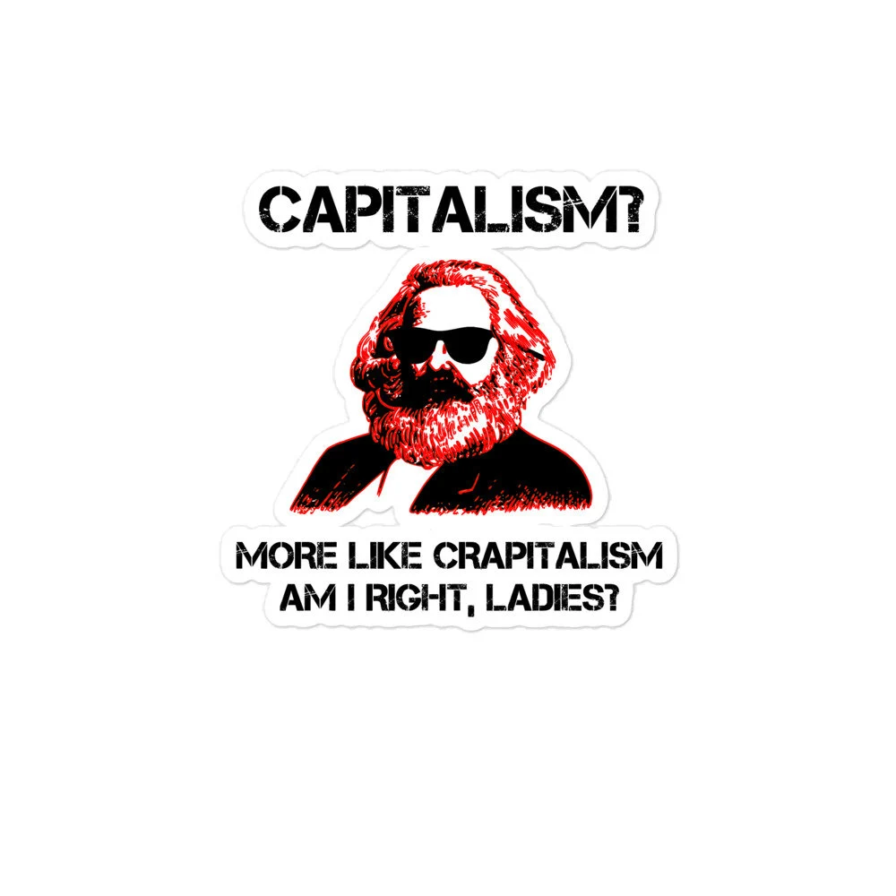
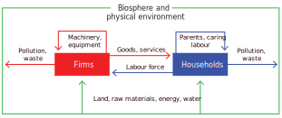
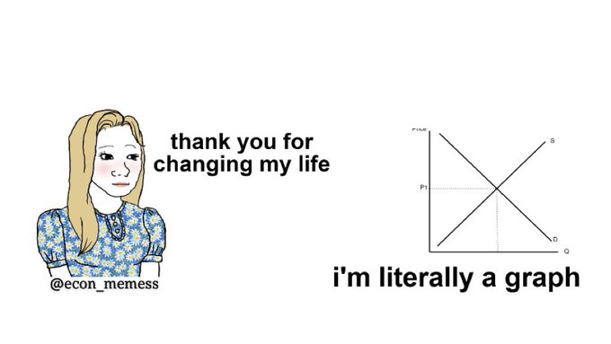
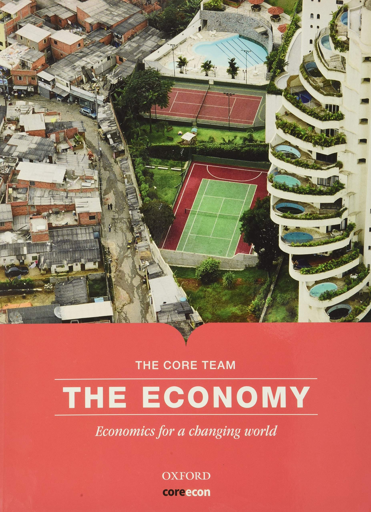
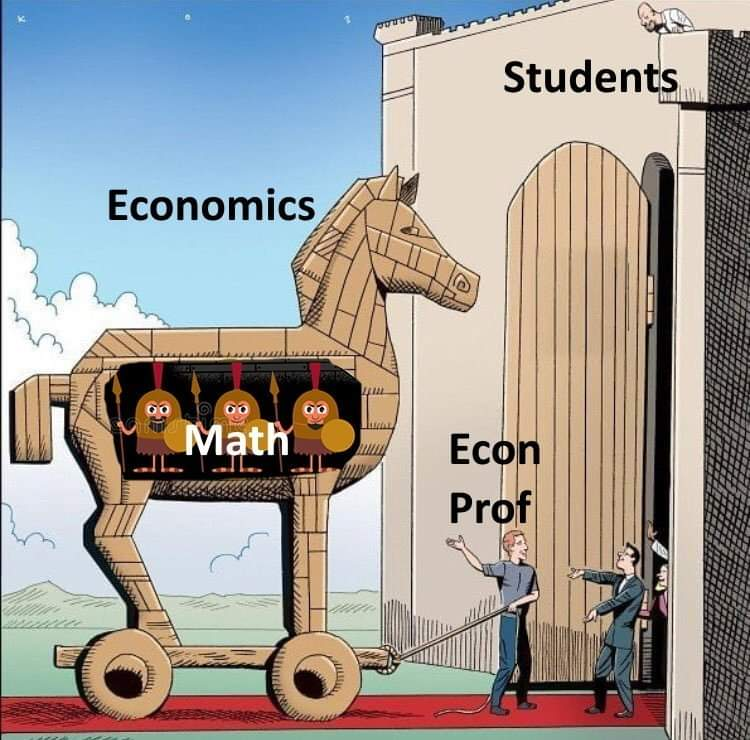

<style>

.center2 {
  margin: 0;
  position: absolute;
  top: 50%;
  left: 50%;
  -ms-transform: translate(-50%, -50%);
  transform: translate(-50%, -50%);
}

</style>

```{r meta, echo=FALSE}
library(metathis)
meta() %>%
  meta_general(
    description = "An Introduction to xaringan for Presentations: The Basics",
    generator = "xaringan and remark.js"
  ) %>% 
  meta_name("github-repo" = "spcanelon/xaringan-basics-and-beyond")
  # meta_social(
  #   title = "Sharing Your Work with xaringan &#8212; Day 1",
  #   url = "https://spcanelon.github.io/xaringan-basics-and-beyond/slides/day-01-basics.html#1",
  #   image = "https://raw.githubusercontent.com/spcanelon/xaringan-basics-and-beyond/main/slides/day-01-cover-image.png",
  #   image_alt = "Title slide for the day 1 slides of the Sharing Your Work with xaringan workshop series",
  #   og_type = "website",
  #   og_author = "Silvia Canelon",
  #   twitter_card_type = "summary_large_image",
  #   twitter_creator = "@spcanelon"
  # )
```

```{r setup, include = FALSE}
knitr::opts_chunk$set(echo = FALSE)
knitr::opts_chunk$set(out.width = "90%")
knitr::opts_chunk$set(fig.align="center")

options(htmltools.dir.version = FALSE)
library(knitr)
library(tidyverse)
library(xaringanExtra)
library(tweetrmd)
# set default options
opts_chunk$set(echo=FALSE,
               collapse = TRUE,
               fig.width = 7.252,
               fig.height = 4,
               dpi = 300)
# set engines
knitr::knit_engines$set("markdown")
xaringanExtra::use_tile_view()
xaringanExtra::use_panelset()
xaringanExtra::use_clipboard()
xaringanExtra::use_webcam()
xaringanExtra::use_broadcast()
xaringanExtra::use_share_again()
xaringanExtra::style_share_again(
  share_buttons = c("twitter", "linkedin", "pocket")
)
# uncomment the following lines if you want to use the NHS-R theme colours by default
# scale_fill_continuous <- partial(scale_fill_nhs, discrete = FALSE)
# scale_fill_discrete <- partial(scale_fill_nhs, discrete = TRUE)
# scale_colour_continuous <- partial(scale_colour_nhs, discrete = FALSE)
# scale_colour_discrete <- partial(scale_colour_nhs, discrete = TRUE)
```


.center2[
# Welcome! (back)
]

---

.center2[
```{r, out.width="150%"}

```
]

---

.center2[
```{r, out.width="150%"}
knitr::include_graphics("imgs/montorgueil2.png")
```
]

---

.center2[
```{r, out.width="150%"}

```
]

---

```{r, out.width="57.5%"}
knitr::include_graphics("imgs/montorgueil.jpeg")
```


---

.center[
# Welcome! (back)
]

--

.center[
### Today is an introductory session (again)
]


--

  - Name something useful you have learned from the previous semester
  - Which was your favorite topic?
  - What other things you would like to understand and study?
  
```{r, out.width = "50%"}
knitr::include_graphics("https://media.giphy.com/media/3o6gDXiDha2xShtvZm/giphy.gif")
```

---

.center[
### Example: Second-hand Econ 101 textbooks
]

```{r out.width="40%", fig.align='center'}
knitr::include_graphics("https://m.media-amazon.com/images/I/81UPJjLHp8L.jpg")
```

---

.center[
### Econ 101 textbooks (parenthesis)
]

```{r out.width="80%", fig.align='center'}
knitr::include_graphics("https://cdn.vox-cdn.com/thumbor/ikZAG7js3wyxMZ6CSL2KbwkZcNY=/0x0:775x416/1720x0/filters:focal(0x0:775x416):format(webp):no_upscale()/cdn.vox-cdn.com/uploads/chorus_asset/file/16204569/Screenshot_2019_05_01_11.56.59.png")
```

---

.center[
### Econ 101 textbooks (parenthesis)
]

- [Core Econ](https://cepr.org/voxeu/columns/new-paradigm-introductory-course-economics)
- [Raj Chetty's intro course at Harvard](https://www.vox.com/the-highlight/2019/5/14/18520783/harvard-economics-chetty)

```{r out.width="40%", fig.align='center'}
knitr::include_graphics("https://cepr.org/sites/default/files/styles/flexible_wysiwyg/public/image/FromMay2014/COREtable1.png?itok=W_OYRPGq")
```


---

.center2[

# (After one semester) What is economics?

]

---

```{r, out.width="60%"}
knitr::include_graphics("imgs/economix.png")
```

---

```{r, out.width="60%"}

```

---
.center[
## Again: What is Economics?
]

- **How we come to acquire the things that make up our livelihood**: Things like food, clothing, shelter, or free time.

- **How we interact with each other**: Either as buyers and sellers, employees or employers, citizens and public officials, parents, children and other family members.

- **How we interact with our natural environment**: From breathing, to extracting raw materials from the earth.

- **How each of these changes over time.**


```{r out.width="60%"}

```


---

.center[
## What is (Macro)Economics?
]

.center2[

#### Economics:

> *The study of how people interact with each other and with their natural surroundings in producing their livelihoods, and how this changes over time*

#### Macroeconomics:

> *concerned with the aggregate sum of spending decisions of [...] groups, and the consequences of those decisions for economy—wide outcomes such as the rate of unemployment or inflation* 
(Carlin and Soskice)

]

---

.center[
# (Philosophical note)
]

  - Everyone has their political or economic ideals!
    - Even economist. We are humans and social beings.
    - We can agree on a benchmark or minumum of acceptable ideas (i.e. as long as they respect human rights)

.center[
### What is $\neq$ What is ought to be
*John Neville Keynes*
]

.center[
### La historia, como la lucha entre el bien y el mal en la que, por definición, los buenos somos nosotros
*Mauricio Tenorio Trillo*
]

  - Difficult to argue on *scientific neutrality*. 
  We should advance towards accepting both the rigorous evidence that we like and dislike.

---

.center[
# This class
]

--

  - What we are going to do in this (and the following) classes?
  
--

  - Study concepts and models used to understand aggregate behavior in the short, medium, and long-run.

--
    - Gonna use a lot of things from Micro (including a couple of chapters)

--

  - Ideally: See how economics is useful to provide answers to real world situations (big picture).

--

  - **Spoiler**: We will only have a better understanding. Unfortunately, we would not be able to fully know what happen, is happening, or will happen. But that's because there is uncertainty and we are humans `r emo::ji("smile")`

--

```{r, out.width="50%"}


```

---
.center[
## Example: Is degrowth the answer?
]

```{r, out.width="40%"}
knitr::include_graphics("https://kbimages1-a.akamaihd.net/bc8735c7-91d6-454c-99a5-a6f9c03e1d47/1200/1200/False/less-is-more-21.jpg")
```

.center[
### [The illusion of “degrowth” in a poor and unequal world](https://degrowth.info/library/the-illusion-of-degrowth-in-a-poor-and-unequal-world)
]


---
.center[
## Example: Pensions
]

```{r, out.width="80%"}
knitr::include_graphics("https://cdn-europe1.lanmedia.fr/var/europe1/storage/images/europe1/societe/en-direct-greve-manifestations-trafic-ecoles-suivez-la-mobilisation-contre-la-reforme-des-retraites-3935434/53828470-51-fre-FR/EN-DIRECT-Greve-manifestations-trafic-ecoles-suivez-la-mobilisation-contre-la-reforme-des-retraites.jpg")
```


---

.center[
# Teaching economics as if the last three decades had happened
]


```{r out.width="27.5%"}

```

.center[
Same textbook.

The CORE team, The Economy, 2017. https://www.core-econ.org.
]

---

.center[
## Extra (suggested) material
]

.pull-left[

### Podcasts

  - General:
    - [Freakonomics Radio](https://open.spotify.com/show/6z4NLXyHPga1UmSJsPK7G1?si=2a9641bd109f402b)
    - [Economics Explained](https://open.spotify.com/show/5TFVUEJnYLOCmmfaDNHaM2?si=60f9e8053a024058)
    - [Planet Money](https://open.spotify.com/show/4FYpq3lSeQMAhqNI81O0Cn?si=a09ee5eca2a6436e)
    - [Cautionary Tales](https://open.spotify.com/show/2yPlb6ynbhTJbziSIcykQd?si=7efe7e1fd5ce4a7d)
  - Focus on economics reasearch:
    - [InequaliTalks](https://open.spotify.com/show/7Diyergn3YLhfzpMV0WBlC?si=9c9ac07da6bf434f)
    - [VoxTalks Economics](https://open.spotify.com/show/4Gd9SbiUPhJWazNszp9izA?si=66845c06707548f6)

]

.pull-right[
### Magazines and articles

  - Magazines/Journals:
    - [The Economist](https://www.economist.com/)
    - [Financial Times](https://www.ft.com/)
    - [Project Syndicate](https://www.project-syndicate.org/)
  - Research sites:
    - [VoxEU](https://cepr.org/voxeu)
    - [VoxDev](https://voxdev.org/)
  - Blogs:
    - [Noahpinion](https://noahpinion.substack.com/)
    - [Some Unpleasant Arithmetic](https://someunpleasant.substack.com/p/out-of-control)
  

]

By the end of the semester I can recommend you books that might interest you.

---
.center[
# Course structure
]

--

- Weekly lectures with **active participation**.

--

- The student must **read in advance** each weeks *The Economy's* weekly unit.
 Extra suggested readings and articles to complement the topic.
 
--

- Wednesdays from 08:00-10:00
--


.center[

<video width="465" height="345" controls>
<source src="imgs/econ_class_sleeping.mp4" type="video/mp4">
</video>

]

---
.center[
# Course structure
]


.center[
Need to **read**, **participate**, and **work by your own**
]


--

.pull-left[
- Markets, efficiency, and public policy
- Banks, money, and the credit market
- Rent-seeking, price-setting, and market dynamics
- The labour market: wages, profits, and unemployment
- Economic fluctuations and unemployment
- Unemployment and fiscal policy
- Inflation, unemployment, and monetary policy
- Technological process, unemployment, and living standards in the long run
- The capitalist revolution
- Applications


]

--

.pull-right[
```{r, out.width="65%"}

```
]


--


Course website: https://github.com/woomora/CORE-econ-macro

The schedule is tentative and subject to change. 
**Please check the most recent version of the syllabus.**


---
.center[
## Grading
]
--

**50% Exam **: 26/04

--

**10% Weekly presentation of relevant news **: 

In pairs, present in 10 minutes one piece of relevant news from the previous week. Check [schedule](https://docs.google.com/spreadsheets/d/1jajdvi3loYfKC3E6_uVMcrrZSt21VC4ysj5Dp2rtCcs/edit)

--

**40% Policy and research project:**

In teams of 5, students will choose one of the six Capstone chapters of The Economy (chapters 17-22). The team has to do and deliver the following:

--

**- 10% Presentation**: In-depth reading of the chapter, summarize it and present it to the rest of the class.

--

**- 30% Policy brief**: Write a policy brief related to the chapter. 

--

  - A motivation based on contemporary, relevant issues to solve locally, in another location,
or globally.
  - A detailed and delimited policy question.
  - A brief literature review on the topic.
  - The use of data to describe the problem and context.
  - A policy proposal to tackle the problem.
  - A research question proposal to further study in more depth the topic (only the research question).


Teams will have to schedule a meeting in office hours to discuss their policy brief proposals with me.

---

.pull-left[

**Unit 21: Innovation, Information, and the Networked Economy**


]

.pull-right[

**Unit 17: The Great Depression, Golden Age, and Global Financial Crisis**


]


.pull-left[

**Unit 22: Economics, politics, and public policy**


]


.pull-right[

**Unit 20: Economics of the environment**


]

.pull-left[

**Unit 18: The Nation and the World Economy**


]


.pull-right[

**Unit 19: Economic Inequality**


]


---
.center[
## Course Policies
]

- Be nice to each other `r emo::ji("smiling face with smiling eyes")`

- No harassment to any person or of any kind will be tolerated.

- Computers allowed. No cellphones.

- Attendance is mandatory, and it may influence the professor’s benevolence `r emo::ji("winking face")`

- You have enough time for your assignments, so late assignments are penalized. One point by each hour after deadline. 

- Academic integrity and honesty: cite other peoples’ ideas and work.

--

- **NEW**: If there is not an adequate environment in the classroom to teach (i.e. too much noise from individual conversations), I’ll stop the class and I’ll consider the subject as finished.

--

- **NEW**: If a student arrives late from class breaks, will be penalized with 0.1 from its final
grade.


---

.center2[
# Any questions?
]

---

.center[
# Next class
]

--

- Market failure: Sources and solutions

- The role of private bargaining and government policy

--

```{r, out.width="60%"}
knitr::include_graphics("https://media.giphy.com/media/eXr4MbjLM2CIcSNy9q/giphy.gif")

```

