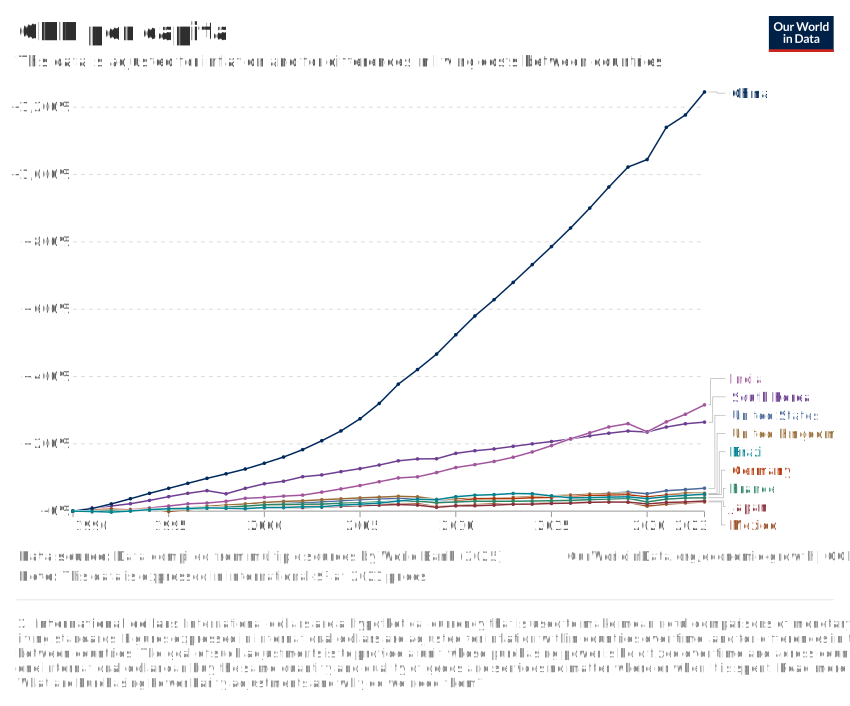
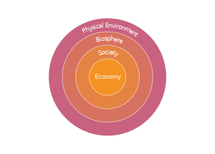
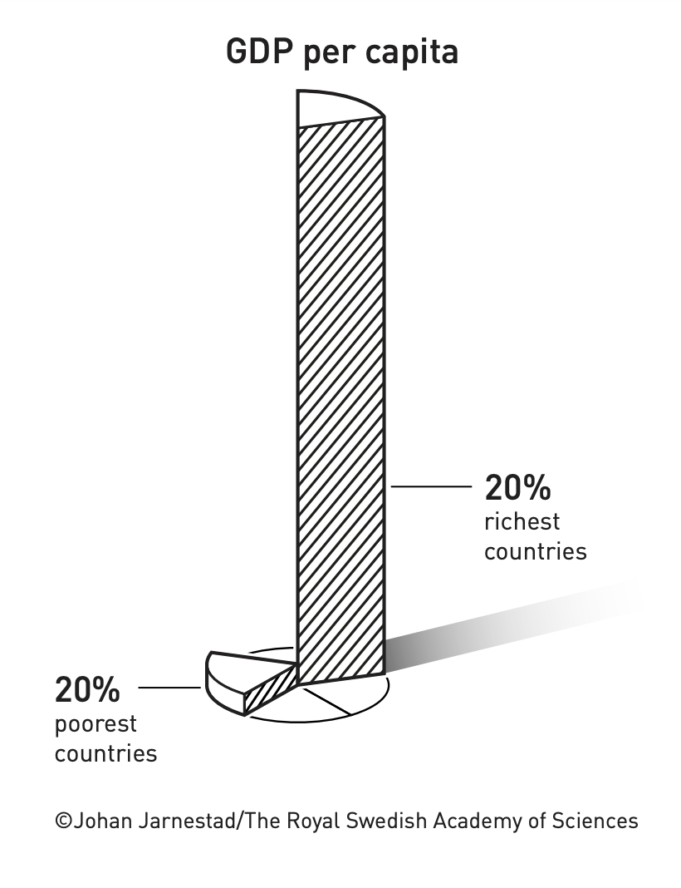
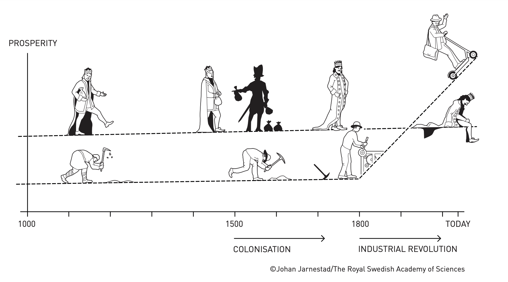
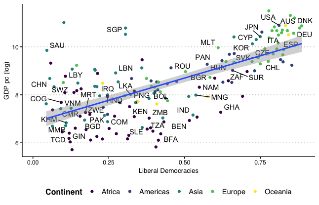
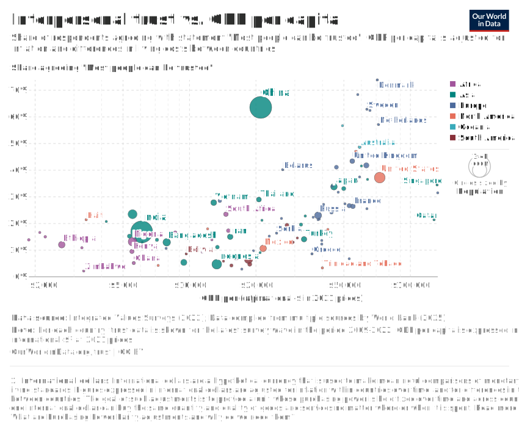
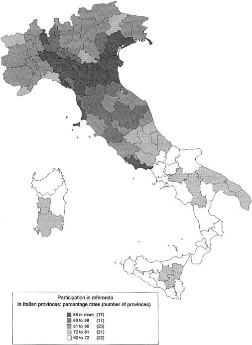

<style>

.center2 {
  margin: 0;
  position: absolute;
  top: 50%;
  left: 50%;
  -ms-transform: translate(-50%, -50%);
  transform: translate(-50%, -50%);
}

</style>

```{r setup, include = FALSE}
knitr::opts_chunk$set(echo = FALSE)
knitr::opts_chunk$set(out.width = "90%")
knitr::opts_chunk$set(fig.align="center")

options(htmltools.dir.version = FALSE)
library(knitr)
library(tidyverse)
library(xaringanExtra)
# set default options
opts_chunk$set(echo=FALSE,
               collapse = TRUE,
               fig.width = 7.252,
               fig.height = 4,
               dpi = 300)
# set engines
knitr::knit_engines$set("markdown")
xaringanExtra::use_tile_view()
xaringanExtra::use_panelset()
xaringanExtra::use_clipboard()
xaringanExtra::use_webcam()
xaringanExtra::use_broadcast()
xaringanExtra::use_share_again()
xaringanExtra::style_share_again(
  share_buttons = c("twitter", "linkedin", "pocket")
)
# uncomment the following lines if you want to use the NHS-R theme colours by default
# scale_fill_continuous <- partial(scale_fill_nhs, discrete = FALSE)
# scale_fill_discrete <- partial(scale_fill_nhs, discrete = TRUE)
# scale_colour_continuous <- partial(scale_colour_nhs, discrete = FALSE)
# scale_colour_discrete <- partial(scale_colour_nhs, discrete = TRUE)
```

.center2[
# Are we better off?
]

---

```{r, out.width="70%"}
knitr::include_graphics("imgs/Two-centuries-World-as-100-people.png")
```


---
## Countries Better-Off than GB in 1800

--

Koyama and Rubin, 2022

```{r}
knitr::include_graphics("imgs/fig_1_2_koyama_rubin.png")
```

---
## Countries Better-Off than US in 1900

--

Koyama and Rubin, 2022

```{r}

```


---
.center2[
# Why are we better off?
]

---
.center2[
# Unit 1: The Capitalist Revolution
]

---
## Unit 1: The Capitalist Revolution

--

- Economic inequality and divergence

--

- The technological revolution and growth

--

- The role of capitalism in economic growth

--

- Importance of the government in capitalist economies

--

> **The causes of the wealth and poverty of nations [were] the grand object of all enquiries in Political Economy** (Thomas Malthus to David Ricardo)

--

> **An Inquiry into the Nature and Causes of the Wealth of Nations** (Adam Smith)

---
.center2[
# Measuring income and living standards
]

---
## Measuring income and living standards

--

What is a good measure of our well-being?
--
 For practical reasons, economist use (mainly) two:
 
--

**Gross Domestic Product (GDP)**

A measure of the market value of the output of final goods and services in the economy in a given period. 
--
 Output of intermediate goods that are inputs to final production is excluded to prevent double counting.

--

.pull-left[
**GDP per capita**

The average income of people in a country.
]

--

.pull-right[
**Disposable Income**

$\textit{Total income} – taxes + \textit{government transfers}$
]

--

.center[
**GDP per capita** $\neq$ **Disposable Income**
]

--

Other measures of well-being?

--

- Human Development Index (Life expectancy, Education, Income)

--

- Subjective well-being (Life satisfaction, Happiness, Leisure)

--

- Nightlights 

---
## Comparing income at different times, and across different countries

--

- The starting point: **Nominal GDP**

$$\textit{Nominal GDP}_y = \sum_i p_{iy} q_{iy}$$

--

- Taking account of price changes over time: **Real GDP**

$$\textit{Real GDP}_{y,\bar{y}} = \sum_i p_{i\bar{y}} q_{iy}$$

--

- Taking account of price differences among countries: **International prices and purchasing power**

**Purchasing Power Parity (PPP) prices**. Achieve parity (equality) in the real purchasing power.

--


```{r out.width="60%"}

```


---

```{r out.width="80%"}
knitr::include_graphics("imgs/gdp-per-capita-worldbank.svg")
```

---
.center2[
# History's hockey stick: Growth in income
]

---
## Growth

--
Growth take-off occurred at different points in time for different countries:

--

- Britain was the first country to experience sustained economic growth. It began around 1650.

--

- In Japan, it occurred around 1870.

--

- The kink for China and India happened in the second half of the 20th century. 

--

In some economies, substantial improvements in people’s living standards did not occur until they gained independence from colonial rule or interference by European nations.

--

Hitorical data: The Maddison Project

---

```{r, out.width="80%"}

```

---

$$\textit{growth rate} = \frac{y_{i1} - y_{i0}}{ y_{i0}} = \frac{\textit{change in y}}{\textit{original level of y}}$$

```{r, out.width="70%"}

```

---
## GDP Levels ≠ GDP Growth

```{r, out.width="60%"}
knitr::include_graphics("imgs/gdp-per-capita-worldbank.svg")
```

.center[Levels]

---
## GDP Levels ≠ GDP Growth

```{r, out.width="60%"}

```

.center[Growth]

---
.center2[
# Income Inequality
]

---
## Inequalities

--

```{r, out.width="80%"}

knitr::include_graphics("imgs/figure-01-02-e.svg")

```

--

- Between countries

--

- Within countries


---

```{r}


```

---
## Inequality and Growth

--

Between-country inequalities:

--

- Countries that took off economically a century or more ago —UK, Japan, Italy— are now rich. 

--

- The countries that took off only recently, or not at all, are in the flatlands.

--

Within-country inequalities:

--

- Does growth lift all boats? 

--

- Inequality hinders economic development?


---

```{r}

knitr::include_graphics("imgs/global_inequality.gif")

```

---
.center2[
# The permanent technological revolution
]

---
## The Technological Revolution

--

**Technology**: The description of a process using a set of materials and other inputs, including the work of people and machines, to produce an output.

--

By reducing the amount of work-time it takes to produce the things we need, technological changes allowed significant increases in living standards.

--

```{r out.width="60%"}
knitr::include_graphics("https://media.giphy.com/media/HteV6g0QTNxp6/giphy.gif")
```

---
## The Industrial Revolution

--

Remarkable scientific and technological advances occurred more or less at the same time as the upward kink in the hockey stick in Britain in the middle of the 18th century. 

--

**Industrial Revolution**: a wave of technological advances starting in Britain in the 18th century, which transformed an agrarian and craft-based economy into a commercial and industrial economy.

--

```{r out.width = "55%"}

```

---


```{r out.width = "85%"}
knitr::include_graphics("imgs/mobile-phone-subscriptions-vs-gdp-per-capita.svg")
```

---
.center2[
# The economy and the environment
]

---
## Environmental consequences

Increased production and population growth affects the environment

--

- Global impacts – climate change
- Local impacts – pollution in cities, deforestation

--

```{r out.width = "80%"}

```
--

These effects are results of both the expansion of the economy (illustrated by the growth in total output)
--
 the way the economy is organized (what kinds of things are valued and conserved, for example).


---


```{r out.width = "80%"}

```

---

.center2[

<iframe width="840" height="472.5" src="https://www.youtube.com/embed/HwbhEL-6zCU?si=1FxeQHkufwRgOrsn" title="YouTube video player" frameborder="0" allow="accelerometer; autoplay; clipboard-write; encrypted-media; gyroscope; picture-in-picture; web-share" referrerpolicy="strict-origin-when-cross-origin" allowfullscreen></iframe>

.center[
[How human and ecosystem health are intertwined: Evidence from vulture population collapse in India (Frank and Sudarshan, 2023)](https://voxdev.org/topic/energy-environment/how-human-and-ecosystem-health-are-intertwined-evidence-vulture-population)
]


]

---
.center2[
# Capitalism defined: Private property, market, and firms
]

---
## Institutions

--

**Institutions:** the laws and informal rules that regulate social interactions among people and between people and the biosphere, sometimes also termed the rules of the game.

--

.pull-left[
```{r out.width="75%"}
knitr::include_graphics("https://media.giphy.com/media/xT5LMpwRdyRjlBlOko/giphy.gif")
```
]


--

.pull-right[
```{r out.width="100%"}
knitr::include_graphics("https://media.giphy.com/media/NWGbK3xCYgQVy/giphy.gif")
```

]


---
## Economic systems

**Economic system:** a way of organizing the economy that is distinctive in its basic institutions. 

--

.pull-left[

.center[
**Feudalism**
```{r out.width="50%"}
knitr::include_graphics("https://brewminate.com/wp-content/uploads/2020/08/080320-01-History-Feudalism-Medieval.jpg")
```

]

]

--

.pull-right[


.center[
**Central economic planning**
```{r out.width="50%"}
knitr::include_graphics("https://s3.amazonaws.com/s3.timetoast.com/public/uploads/photo/17837782/image/medium-6f28c696cf14eae4d6aa206cb6b938a8.jpg")
```
]

]

--

.pull-left[

.center[
**Slave economy**
```{r out.width="50%"}
knitr::include_graphics("https://api.time.com/wp-content/uploads/2021/09/Transatlantic-Slave-Trade-brooks.jpg?w=800&quality=85")
```
]

]

--

.pull-right[

.center[
**Capitalism**
```{r out.width="50%"}
knitr::include_graphics("https://thecitizenjack.files.wordpress.com/2014/08/enjoy-capitalism.png")
```
]

]

---
## Capitalism

--

**Capitalism**: An economic system in which the main form of economic organization is the **firm**,
--
 in which the private owners of **capital goods** hire **labour**
--
 to produce goods and services for sale on **markets** with the intent of making a profit. 
--

The main economic institutions in a capitalist economic system, then, are **private property**, **markets**, and **firms**.

--

```{r out.width="80%"}

```

---
## The Capitalist Revolution

--
Capitalism led to growth in living standards because of:

--

- **impact on technology**: firms competing in markets had strong incentives to adopt and develop new technologies

--

- **specialization**: the growth of firms and the expansion of markets linking the entire world allowed historically unprecedented specialization in tasks and production

--

Together with the technological revolution, this increased worker productivity.

--

```{r out.width="35%"}
knitr::include_graphics("https://s3.amazonaws.com/nfpf-videos/it-s-everybody-s-business-1954-image-normal.jpg?2017")
```


---
.center2[
# The gains from specialization
]

---
## The gains from specialization

--
Specialization increases productivity of labour because we become better at producing things when we each focus on a limited range of activities

--

- learning by doing
- taking advantage of natural differences in skill and talent
- economies of scale

--

People can only specialize if they have a way to acquire the other goods they need. In a capitalist society, this is done via markets.

--

  > *When the market is very small, no person can have any encouragement to dedicate himself entirely to one employment, for want of the power to exchange all that surplus part of the produce of his own labour, which is over and above his own consumption, for such parts of the produce of other men’s labour as he has occasion for.* (Adam Smith)


---
## Comparative advantage

--

|     | Production if 100% of time is spent on one good |
| --- | ----------------------------------------------- |
| Greta |	1,250 apples or 50 tonnes of wheat |
| Carlos | 1,000 apples or 20 tonnes of wheat |

--

- Greta has **absolute advantage** in production of both crops

--

- Greta has a **comparative advantage** in wheat

--

- Carlos has a **comparative advantage** in apples: he is least disadvantaged in production of apples.

--


```{r out.width="35%"}
knitr::include_graphics("https://media.giphy.com/media/WRQBXSCnEFJIuxktnw/giphy.gif")
```


---
## Comparative advantage

--

> **comparative advantage** the cost of producing an additional unit of one good relative to the cost of producing another good is lower than another person or country’s cost to produce the same two goods.

--

.pull-left[

.center[

$$CA_{apples} = \frac{Greta_{apples}}{Carlos_{apples}} = \frac{1250}{1000} = 1.25$$

]

]

.pull-right[

.center[

$$CA_{wheat} = \frac{Greta_{wheat}}{Carlos_{wheat}} = \frac{50}{20} = 2.5$$

]

]

--

.center[
**Who has the lowest *opportunity cost* in wheat?**
]

.pull-left[

.center[

$$OC^{Greta}_{apples/wheat} = \frac{Greta_{apples}}{Greta_{wheat}} = \frac{1250}{50} = 25$$

]

]

.pull-right[

.center[

$$OC^{Carlos}_{apples/wheat} = \frac{Carlos_{apples}}{Carlos_{wheat}} = \frac{1000}{20} = 50$$

]

]


--

All producers can benefit by specializing and trading goods, even when this means that one producer specializes in a good that another could produce at lower cost.

--

Markets contribute to increasing the productivity of labour by allowing people to specialize. 

---
.center2[
# Capitalism, causation and history's hockey stick
]

---
## Did capitalism *cause* the hockey-stick growth?

--

**Natural experiment**: 
--
 the division of Germany at the end of World War II into two separate economic systems, capitalist in the west and centrally planned in the east.  

--

```{r out.width="55%"}
knitr::include_graphics("imgs/figure-01-10.svg")
```

---
.center2[
# Why is there a persistent gap in GDP per capita or income between countries?
]

---

```{r out.width="70%"}
knitr::include_graphics("https://www.amse-aixmarseille.fr/sites/default/files/styles/slide_-_760/public/photos/slideshow/prix-nobel-2024.jpg?itok=PzqTFZLq")
```

---

```{r out.width="45%"}

```

---

```{r out.width="90%"}

```

---

```{r out.width="85%"}
knitr::include_graphics("https://eoimages.gsfc.nasa.gov/images/imagerecords/83000/83182/ISS038-E-038300_lrg.jpg")
```


---
.center2[
# Varieties of capitalism: Institutions, goverment, and the economy
]

---
## Divergence in growth

--

Not all capitalist economies are equally successful

--

- **economic conditions**: firms, private property, or markets may fail

--

- **political conditions**: capitalist institutions are regulated by the government

--

- the government also provides essential goods and services (infrastructure, education)

--

```{r out.width="50%"}

```


---
## Democracy and Economic Development? 

--

```{r gdp-inst, out.width="80%", echo=FALSE}

```

---

```{r , out.width="62.5%", echo=FALSE}
knitr::include_graphics("imgs/acemoglu2019-jpe.png")
```

.center[
[Democracy Does Cause Growth (Acemoglu, Naidu, Restrepo, and Robinson, 2019)](https://voxdev.org/topic/institutions-political-economy/democracy-and-economic-growth-new-evidence)
]

---
## Political systems

--

Capitalism coexists with many political systems. 

--

A **political system** determines how governments will be selected, and how those governments will make and implement decisions.

--

In most countries today, capitalism coexists with democracy

--
- individual rights of citizens (e.g. freedom of speech)
- fair elections 

--

But capitalism has coexisted with non-democratic systems, too. Even democracy is 'not enough': populism.

--

```{r out.width="75%"}
knitr::include_graphics("imgs/populism.png")
```

---
.center2[
# Is there a silver bullet?
]

---

.pull-left[
```{r out.width="80%"}
knitr::include_graphics("https://m.media-amazon.com/images/I/81wNl0CEpmL._AC_UF1000,1000_QL80_.jpg")
```
]

--

**These are causal questions**

.pull-right[

- Geography
- Institutions
- Culture
- Demography
- Colonization and exploitation

1. Why did Europe got rich first?
2. Why did Britain got rich first?
3. Why the patterns expanded to other places?

]

---
## Culture: Example

```{r out.width="60%"}

```

Nexus between trust and economic development.

.center[
[Does Culture Affect Economic Outcomes? (Guiso, Sapienza, and Zingales, 2006)](https://www.aeaweb.org/articles?id=10.1257/jep.20.2.23)
]

---
## Culture: Italy as a case study

```{r, out.width="35%"}

```

.center[
[The Role of Social Capital in Financial Development (Guiso, Sapienza, and Zingales, 2004)](https://www.aeaweb.org/articles?id=10.1257/0002828041464498)
]

---
## Colonization and Exploitation: Britain as a case study

.pull-left[
```{r}
knitr::include_graphics("https://cepr.org/sites/default/files/styles/flexible_wysiwyg/public/2023-02/voth11febfig1.png?itok=HYijHr4i")
```
]

.pull-right[
```{r out.width="120%"}
knitr::include_graphics("https://cepr.org/sites/default/files/styles/flexible_wysiwyg/public/2023-02/voth11febfig2.png?itok=-PFQelk6")
```
]

.center[
[Slavery and the British Industrial Revolution (Heblich, Redding, and Voth, 2023)](https://cepr.org/voxeu/columns/slavery-and-british-industrial-revolution)
]

---
.center2[
# Economics and the Economy
]

---
## Again: What is Economics?

--

- **How we come to acquire the things that make up our livelihood**: Things like food, clothing, shelter, or free time.

--

- **How we interact with each other**: Either as buyers and sellers, employees or employers, citizens and public officials, parents, children and other family members.

--

- **How we interact with our natural environment**: From breathing, to extracting raw materials from the earth.

--

- **How each of these changes over time.**

--

```{r out.width="60%"}
knitr::include_graphics("imgs/figure-01-12.svg")
```

---
.center2[
# Summary
]

---
## Summing up

--

1) Important trends in economic variables over time

--

- Income inequality across regions has increased a lot over time 

--

- “Hockey-stick” growth in GDP, and its negative consequences

--

- Technological progress helped bring about these trends

--

2) The adoption of capitalism was another key factor

--

- Capitalism = Private property + Markets + Firms

--

- Failure of these institutions can explain divergence in economic growth across countries

--

- Political systems and the role of government also determine the type of capitalist society

---
## Next class

- Using economic models to explain the trends in technological growth over time

- The role of firms in technological development

- **Malthusian economics**: studying the interaction between population, technology, and economic growth

