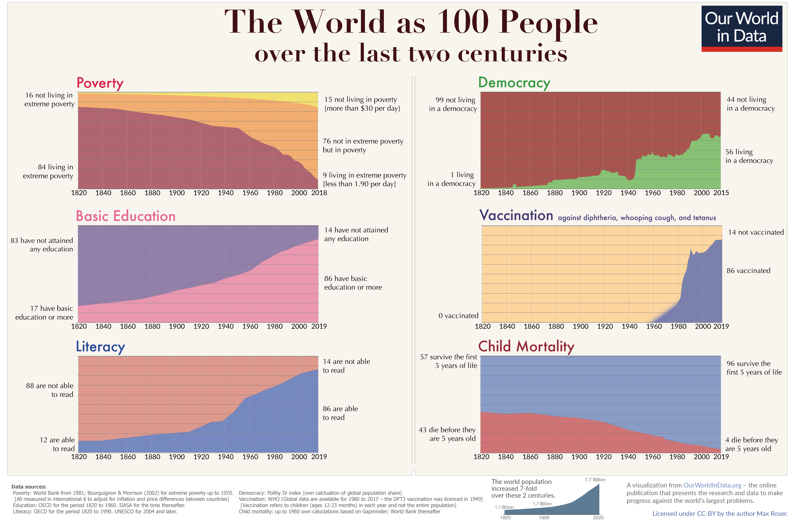
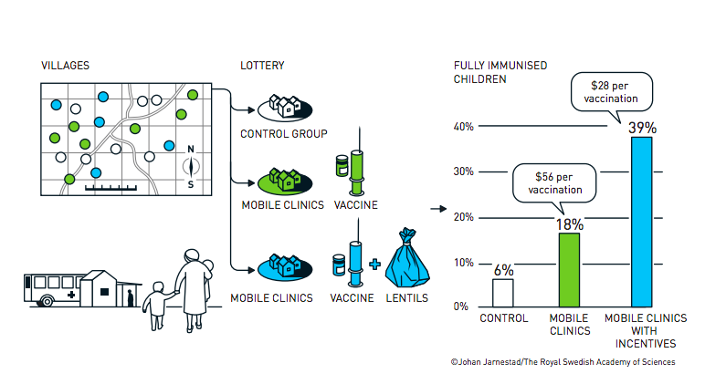
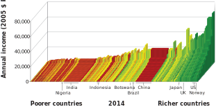

```{r meta, echo=FALSE}
library(metathis)
meta() %>%
  meta_general(
    description = "An Introduction to xaringan for Presentations: The Basics",
    generator = "xaringan and remark.js"
  ) %>% 
  meta_name("github-repo" = "spcanelon/xaringan-basics-and-beyond")
  # meta_social(
  #   title = "Sharing Your Work with xaringan &#8212; Day 1",
  #   url = "https://spcanelon.github.io/xaringan-basics-and-beyond/slides/day-01-basics.html#1",
  #   image = "https://raw.githubusercontent.com/spcanelon/xaringan-basics-and-beyond/main/slides/day-01-cover-image.png",
  #   image_alt = "Title slide for the day 1 slides of the Sharing Your Work with xaringan workshop series",
  #   og_type = "website",
  #   og_author = "Silvia Canelon",
  #   twitter_card_type = "summary_large_image",
  #   twitter_creator = "@spcanelon"
  # )
```

```{r setup, include = FALSE}
knitr::opts_chunk$set(echo = FALSE)
knitr::opts_chunk$set(out.width = "90%")
knitr::opts_chunk$set(fig.align="center")

options(htmltools.dir.version = FALSE)
library(knitr)
library(tidyverse)
library(xaringanExtra)
# set default options
opts_chunk$set(echo=FALSE,
               collapse = TRUE,
               fig.width = 7.252,
               fig.height = 4,
               dpi = 300)
# set engines
knitr::knit_engines$set("markdown")
xaringanExtra::use_tile_view()
xaringanExtra::use_panelset()
xaringanExtra::use_clipboard()
xaringanExtra::use_webcam()
xaringanExtra::use_broadcast()
xaringanExtra::use_share_again()
xaringanExtra::style_share_again(
  share_buttons = c("twitter", "linkedin", "pocket")
)
# uncomment the following lines if you want to use the NHS-R theme colours by default
# scale_fill_continuous <- partial(scale_fill_nhs, discrete = FALSE)
# scale_fill_discrete <- partial(scale_fill_nhs, discrete = TRUE)
# scale_colour_continuous <- partial(scale_colour_nhs, discrete = FALSE)
# scale_colour_discrete <- partial(scale_colour_nhs, discrete = TRUE)
```

---

# Welcome!

--

This time should work ... `r emo::ji("grinning face with sweat")`

--

  - Welcome to General Economy. CORE Econ: Macroeconomics.

--

  - Study concepts and models used in Macro.
  
--
  
  - Understand real-world problems in the short, medium, and long run.

--

  - Ideally: Open the newspaper and have a better understanding what is happening globally.

--

  - **Spoiler**: We will only have a better understanding. Unfortunately, we would not be able to fully know what happen, is happening, or will happen. But that's because there is uncertainty and we are humans `r emo::ji("smile")`

--

## What kind of world are we living in? 

---

```{r}

```

---

```{r, out.width="60%"}
knitr::include_graphics("imgs/economix.png")

```


---


# Economics: 
--
The dismal science

--

Misunderstandings and (really) bad communication:
--

> *"Neoclassical economics has become an unquestioned belief system and treats anybody who challenges the creed of self-righting markets and rational consumers as dangerous heretics"* 

--

> *"Complex mathematics is used to mystify economics, just as congregations in Luther’s time were deliberately left in the dark by services conducted in Latin."*
    
--

> **Responsible of 2008 Great Recession**.
    
--

```{r out.width="20%"}
knitr::include_graphics("https://media.giphy.com/media/l3q2K5jinAlChoCLS/giphy.gif")
```

---

# Defending the dismal science 

--
OK. Economist can be quite arrogant (sometimes we are nice).
--
 But...

--

.pull-left[

> *"The economy did not die, and a Great Depression was avoided, in no small part due to the advances of economics over many decades"* (Ricardo Reis)


> *"The London Tube map is not realistic and makes absurd assumptions. [...] is useful precisely because it abstracts from unnecessary details to show you the way. This is what economic models are for, they help us to find our way through complex data in a complex world."* (Oriana Bandiera et al)

]

--

.pull-right[

```{r out.width="100%", fig.align='center'}
knitr::include_graphics("imgs/tube-map.gif")
```

]

---

# Defending the dismal science 

--

> *"Economics' recent empirical bent makes it more difficult to idolize markets because it makes it more difficult to ignore inconvenient facts."* (Dani Rodrik, Suresh Naidu  and Gabriel Zucman)

--

.pull-left[
```{r out.width="100%", fig.align='center'}

```
]

--

.pull-right[
```{r out.width="100%", fig.align='center'}
knitr::include_graphics("imgs/nobel2021.png")
```
]

---

```{r, out.width="100%"}
knitr::include_graphics("imgs/meme1.jpeg")

```


---
# Economics

--

.pull-left[
```{r out.width="70%"}
knitr::include_graphics("imgs/coreecon.jpeg")
```
]

--
.pull-right[ 

The CORE team, The Economy, 2017. https://www.core-econ.org.

#### Economics:

> *The study of how people interact with each other and with their natural surroundings in producing their livelihoods, and how this changes over time*

#### Macroeconomics:

> *concerned with the aggregate sum of spending decisions of [...] groups, and the consequences of those decisions for economy—wide outcomes such as the rate of unemployment or inflation* 
(Carlin and Soskice)

]


---
# Course structure

--

.pull-left[
- The capitalist revolution
- Technology, population and growth
- Labour markets and unemployment
- Credit markets
- Economic accounting and fluctuations
- Fiscal Policy
- Monetary policy
- Long-run economic performance
]

--

.pull-right[
- Applications
  - Inequality
  - Culture and History
  - Environment
  - Innovation and Information
  - Politics
  - Global Financial Crisis
  - Nation and World Economy
]

--

.pull-left[
```{r syllabus-qr, out.width="50%"}


```
]

.pull-right[

Course website: https://github.com/woomora/CORE-econ-macro/tree/master

The schedule is tentative and subject to change. 
Please check the most recent version of the syllabus.

Each week there is at least one The Economy’s Unit you must read in advance to the class. 
Extra suggested readings and articles to complement the topic.
]

---
# Grading

--

**40% Exam **

--

**60% Policy and research project:**

--

In teams of 5-6, students will choose one of the six Capstone chapters of The Economy (chapters 17-22). The team has to do and deliver the following:

--

**- 20% Presentation**: In-depth reading of the chapter, summarize it and present it to the rest of the class.

--

**- 40% Policy brief**: Write a policy brief related to the chapter. 
--

- A motivation based on contemporary, relevant issues to solve locally, in another location,
or globally.
- A detailed and delimited policy question.
- A brief literature review on the topic.
- The use of data to describe the problem and context.
- A policy proposal to tackle the problem.
- A research question proposal to further study in more depth the topic (only the research question).

--

Teams will have to schedule a meeting in office hours to discuss their policy brief proposals with me.

---

--

.pull-left[

**Unit 21: Innovation, Information, and the Networked Economy**

- **Valentine Baudry**
- Clément 
- Alfred
- Mathilde
- Valentine

]

--

.pull-right[

**Unit 17: The Great Depression, Golden Age, and Global Financial Crisis**

- **Charlotte Touzeau**
- Robin
- Manon
- Baptiste

]


--

.pull-left[

**Unit 22: Economics, politics, and public policy**

- **Clara Lemercier**
- Clara Sefzig 
- Adèle Besnard
- Maria Fe Garcia
- Elise Thai

]

--

.pull-right[

**Unit 20: Economics of the environment**

- **Elvire Landais**
- Emily Zajac 
- Paula Myscza 
- Laetitia Leroy 
- Manon Le Teuff

]

--

.pull-left[

**Unit 18: The Nation and the World Economy**

- **Matis Bernadac**
- Thaïs Boutreau  
- Vipulan Puvaneswaran 
- Elisa Bornsheuer 
- Lucas Mesnard 
- Phanie Dimitriadis

]

--

.pull-right[

**Unit 19: Economic Inequality**

- **Lucie Acarq**
- Alice
- Kelly 
- Rosine
- Thaïs 

]

--


---
# Course Policies

--

- Be nice to each other `r emo::ji("smiling face with smiling eyes")`
--

- No harassment to any person or of any kind will be tolerated.
- Computers allowed. No cellphones.
- Attendance is not mandatory, but it may influence the professor’s benevolence `r emo::ji("winking face")`
- You have enough time for your assignments, so late assignments are penalized. One point
by each hour after deadline. 
- Academic integrity and honesty: cite other peoples’ ideas and work.

--

### Any questions?

---

.center[
# Unit 1: The Capitalist Revolution
]

--

- Economic inequality and divergence

--

- The technological revolution and growth

--

- The role of capitalism in economic growth

--

- Importance of the government in capitalist economies

--

> **The causes of the wealth and poverty of nations [were] the grand object of all enquiries in Political Economy** (Thomas Malthus to David Ricardo)

--

> **An Inquiry into the Nature and Causes of the Wealth of Nations** (Adam Smith)

---

```{r out.width="80%"}


```

---

# Countries Better-Off than GB in 1800

--

Koyama and Rubin, 2022

```{r}


```

---

# Countries Better-Off than US in 1900

--

Koyama and Rubin, 2022

```{r}

knitr::include_graphics("imgs/fig_1_1_koyama_rubin.png")

```

---
# Measuring income and living standards

--

What is a good measure of our well-being?
--
 For practical reasons, economist use (mainly) two:
 
--

**Gross Domestic Product (GDP)**

A measure of the market value of the output of final goods and services in the economy in a given period. 
--
 Output of intermediate goods that are inputs to final production is excluded to prevent double counting.

--

.pull-left[
**GDP per capita**

The average income of people in a country.
]

--

.pull-right[
**Disposable Income**

$\textit{Total income} – taxes + \textit{government transfers}$
]

--

.center[
**GDP per capita** $\neq$ **Disposable Income**
]

--

Other measures of well-being?

--

- Human Development Index (Life expectancy, Education, Income)

--

- Subjective well-being (Life satisfaction, Happiness, Leisure)

--

- Nightlights 

---
## Comparing income at different times, and across different countries

--

- The starting point: **Nominal GDP**

$$\textit{Nominal GDP}_y = \sum_i p_{iy} q_{iy}$$

--

- Taking account of price changes over time: **Real GDP**

$$\textit{Real GDP}_{y,\bar{y}} = \sum_i p_{i\bar{y}} q_{iy}$$

--

- Taking account of price differences among countries: **International prices and purchasing power**

**Purchasing Power Parity (PPP) prices**. Achieve parity (equality) in the real purchasing power.

--


```{r out.width="60%"}

knitr::include_graphics("imgs/big-mac-index.png")

```


---

```{r out.width="80%"}


```


---
# Growth

--
Growth take-off occurred at different points in time for different countries:

--

- Britain was the first country to experience sustained economic growth. It began around 1650.

--

- In Japan, it occurred around 1870.

--

- The kink for China and India happened in the second half of the 20th century. 

--

In some economies, substantial improvements in people’s living standards did not occur until they gained independence from colonial rule or interference by European nations.

--

Hitorical data: The Maddison Project

---

```{r, out.width="80%"}

knitr::include_graphics("imgs/gdp-per-capita-maddison-2020.svg")

```

---

$$ \textit{growth rate} = \frac{\textit{change in income}}{\textit{original level of income}} $$

```{r, out.width="70%"}

knitr::include_graphics("imgs/gdp-per-capita-maddison-2020-grate.svg")

```


---

# Inequalities

--

```{r, out.width="80%"}



```

--

- Between countries

--

- Within countries


---

```{r}

knitr::include_graphics("imgs/global_ineq_percentile_2019.png")

```

---
# Inequality and Growth

--

Between-country inequalities:

--

- Countries that took off economically a century or more ago —UK, Japan, Italy— are now rich. 

--

- The countries that took off only recently, or not at all, are in the flatlands.

--

Within-country inequalities:

--

- Does growth lift all boats? 

--

- Inequality hinders economic development?


---

```{r}


```

---

# The Technological Revolution

--

**Technology**: The description of a process using a set of materials and other inputs, including the work of people and machines, to produce an output.

--

By reducing the amount of work-time it takes to produce the things we need, technological changes allowed significant increases in living standards.

--

```{r out.width="60%"}
knitr::include_graphics("https://media.giphy.com/media/HteV6g0QTNxp6/giphy.gif")
```

---

# The Industrial Revolution

--

Remarkable scientific and technological advances occurred more or less at the same time as the upward kink in the hockey stick in Britain in the middle of the 18th century. 

--

**Industrial Revolution**: a wave of technological advances starting in Britain in the 18th century, which transformed an agrarian and craft-based economy into a commercial and industrial economy.

--

```{r out.width = "55%"}
knitr::include_graphics("imgs/figure-01-03.svg")
```

---


```{r out.width = "85%"}
knitr::include_graphics("imgs/mobile-phone-subscriptions-vs-gdp-per-capita.svg")
```

---
# Environmental consequences

--

Increased production and population growth affects the environment

--

- Global impacts – climate change
- Local impacts – pollution in cities, deforestation

--

```{r out.width = "80%"}
knitr::include_graphics("imgs/figure-01-06-b.svg")
```
--

These effects are results of both the expansion of the economy (illustrated by the growth in total output)
--
 the way the economy is organized (what kinds of things are valued and conserved, for example).


---


```{r out.width = "80%"}
knitr::include_graphics("imgs/figure-01-05.svg")
```

---
# Institutions

--

**Institutions:** the laws and informal rules that regulate social interactions among people and between people and the biosphere, sometimes also termed the rules of the game.

--

.pull-left[
```{r out.width="75%"}
knitr::include_graphics("https://media.giphy.com/media/xT5LMpwRdyRjlBlOko/giphy.gif")
```
]


--

.pull-right[
```{r out.width="100%"}
knitr::include_graphics("https://media.giphy.com/media/NWGbK3xCYgQVy/giphy.gif")
```

]


---
# Economic systems

**Economic system:** a way of organizing the economy that is distinctive in its basic institutions. 

--

.pull-left[

.center[
**Feudalism**
```{r out.width="50%"}
knitr::include_graphics("https://brewminate.com/wp-content/uploads/2020/08/080320-01-History-Feudalism-Medieval.jpg")
```

]

]

--

.pull-right[


.center[
**Central economic planning**
```{r out.width="50%"}
knitr::include_graphics("https://s3.amazonaws.com/s3.timetoast.com/public/uploads/photo/17837782/image/medium-6f28c696cf14eae4d6aa206cb6b938a8.jpg")
```
]

]

--

.pull-left[

.center[
**Slave economy**
```{r out.width="50%"}
knitr::include_graphics("https://api.time.com/wp-content/uploads/2021/09/Transatlantic-Slave-Trade-brooks.jpg?w=800&quality=85")
```
]

]

--

.pull-right[

.center[
**Capitalism**
```{r out.width="50%"}
knitr::include_graphics("https://thecitizenjack.files.wordpress.com/2014/08/enjoy-capitalism.png")
```
]

]

---
# Capitalism

--

**Capitalism**: An economic system in which the main form of economic organization is the **firm**,
--
 in which the private owners of **capital goods** hire **labour**
--
 to produce goods and services for sale on **markets** with the intent of making a profit. 
--

The main economic institutions in a capitalist economic system, then, are **private property**, **markets**, and **firms**.

--

```{r out.width="80%"}
knitr::include_graphics("imgs/figure-01-08.svg")
```

---
# The Capitalist Revolution

--
Capitalism led to growth in living standards because of:

--

- **impact on technology**: firms competing in markets had strong incentives to adopt and develop new technologies

--

- **specialization**: the growth of firms and the expansion of markets linking the entire world allowed historically unprecedented specialization in tasks and production

--

Together with the technological revolution, this increased worker productivity.

--

```{r out.width="35%"}
knitr::include_graphics("https://s3.amazonaws.com/nfpf-videos/it-s-everybody-s-business-1954-image-normal.jpg?2017")
```


---
# The gains from specialization

--
Specialization increases productivity of labour because we become better at producing things when we each focus on a limited range of activities

--

- learning by doing
- taking advantage of natural differences in skill and talent
- economies of scale

--

People can only specialize if they have a way to acquire the other goods they need. In a capitalist society, this is done via markets.

--

  > *When the market is very small, no person can have any encouragement to dedicate himself entirely to one employment, for want of the power to exchange all that surplus part of the produce of his own labour, which is over and above his own consumption, for such parts of the produce of other men’s labour as he has occasion for.* (Adam Smith)


---
# Comparative advantage

--

|     | Production if 100% of time is spent on one good |
| --- | ----------------------------------------------- |
| Greta |	1,250 apples or 50 tonnes of wheat |
| Carlos | 1,000 apples or 20 tonnes of wheat |

--

- Greta has **absolute advantage** in production of both crops

--

- Greta has a **comparative advantage** in wheat

--

- Carlos has a **comparative advantage** in apples: he is least disadvantaged in production of apples.

--


```{r out.width="35%"}
knitr::include_graphics("https://media.giphy.com/media/WRQBXSCnEFJIuxktnw/giphy.gif")
```


---
# Comparative advantage

--

> **comparative advantage** the cost of producing an additional unit of one good relative to the cost of producing another good is lower than another person or country’s cost to produce the same two goods.

--

.pull-left[

.center[

$CA_{apples} = \frac{Greta_{apples}}{Carlos_{apples}} = \frac{1250}{1000} = 1.25$

]

]

.pull-right[

.center[

$CA_{wheat} = \frac{Greta_{wheat}}{Carlos_{wheat}} = \frac{50}{20} = 2.5$

]

]

--

All producers can benefit by specializing and trading goods, even when this means that one producer specializes in a good that another could produce at lower cost.

--

Markets contribute to increasing the productivity of labour by allowing people to specialize. 

---
# Did capitalism *cause* the hockey-stick growth?

--

**Natural experiment**: 
--
 the division of Germany at the end of World War II into two separate economic systems, capitalist in the west and centrally planned in the east.  

--

```{r out.width="55%"}

```

---

```{r out.width="85%"}
knitr::include_graphics("https://eoimages.gsfc.nasa.gov/images/imagerecords/83000/83182/ISS038-E-038300_lrg.jpg")
```

---
# Divergence in growth

--

Not all capitalist economies are equally successful

--

- **economic conditions**: firms, private property, or markets may fail

--

- **political conditions**: capitalist institutions are regulated by the government

--

- the government also provides essential goods and services (infrastructure, education)

--

```{r out.width="50%"}
knitr::include_graphics("imgs/figure-01-11.svg")
```


---
# Political systems

--

Capitalism coexists with many political systems. 

--

A **political system** determines how governments will be selected, and how those governments will make and implement decisions.

--

In most countries today, capitalism coexists with democracy

--
- individual rights of citizens (e.g. freedom of speech)
- fair elections 

--

But capitalism has coexisted with non-democratic systems, too.

--

```{r out.width="75%"}
knitr::include_graphics("imgs/populism.png")
```


---
# Again: What is Economics?

--

- **How we come to acquire the things that make up our livelihood**: Things like food, clothing, shelter, or free time.

--

- **How we interact with each other**: Either as buyers and sellers, employees or employers, citizens and public officials, parents, children and other family members.

--

- **How we interact with our natural environment**: From breathing, to extracting raw materials from the earth.

--

- **How each of these changes over time.**

--

```{r out.width="60%"}
knitr::include_graphics("imgs/figure-01-12.svg")
```

---
# Summing up

--

1) Important trends in economic variables over time

--

- Income inequality across regions has increased a lot over time 

--

- “Hockey-stick” growth in GDP, and its negative consequences

--

- Technological progress helped bring about these trends

--

2) The adoption of capitalism was another key factor

--

- Capitalism = Private property + Markets + Firms

--

- Failure of these institutions can explain divergence in economic growth across countries

--

- Political systems and the role of government also determine the type of capitalist society

---
# Next class

--

- Using economic models to explain the trends in technological growth over time

--

-  The role of firms in technological development

--

- **Malthusian economics**: studying the interaction between population, technology, and economic growth


```{r, out.width="35%"}
knitr::include_graphics("https://media.giphy.com/media/hmxZRW8mhs4ak/giphy.gif")

```

