<style>

.center2 {
  margin: 0;
  position: absolute;
  top: 50%;
  left: 50%;
  -ms-transform: translate(-50%, -50%);
  transform: translate(-50%, -50%);
}

</style>

```{r meta, echo=FALSE}
library(metathis)
meta() %>%
  meta_general(
    description = "An Introduction to xaringan for Presentations: The Basics",
    generator = "xaringan and remark.js"
  ) %>% 
  meta_name("github-repo" = "spcanelon/xaringan-basics-and-beyond")
  # meta_social(
  #   title = "Sharing Your Work with xaringan &#8212; Day 1",
  #   url = "https://spcanelon.github.io/xaringan-basics-and-beyond/slides/day-01-basics.html#1",
  #   image = "https://raw.githubusercontent.com/spcanelon/xaringan-basics-and-beyond/main/slides/day-01-cover-image.png",
  #   image_alt = "Title slide for the day 1 slides of the Sharing Your Work with xaringan workshop series",
  #   og_type = "website",
  #   og_author = "Silvia Canelon",
  #   twitter_card_type = "summary_large_image",
  #   twitter_creator = "@spcanelon"
  # )
```

```{r setup, include = FALSE}
knitr::opts_chunk$set(echo = FALSE)
knitr::opts_chunk$set(out.width = "90%")
knitr::opts_chunk$set(fig.align="center")

options(htmltools.dir.version = FALSE)
library(knitr)
library(tidyverse)
library(xaringanExtra)
library(tweetrmd)
# set default options
opts_chunk$set(echo=FALSE,
               collapse = TRUE,
               fig.width = 7.252,
               fig.height = 4,
               dpi = 300)
# set engines
knitr::knit_engines$set("markdown")
xaringanExtra::use_tile_view()
xaringanExtra::use_panelset()
xaringanExtra::use_clipboard()
xaringanExtra::use_webcam()
xaringanExtra::use_broadcast()
xaringanExtra::use_share_again()
xaringanExtra::style_share_again(
  share_buttons = c("twitter", "linkedin", "pocket")
)
# uncomment the following lines if you want to use the NHS-R theme colours by default
# scale_fill_continuous <- partial(scale_fill_nhs, discrete = FALSE)
# scale_fill_discrete <- partial(scale_fill_nhs, discrete = TRUE)
# scale_colour_continuous <- partial(scale_colour_nhs, discrete = FALSE)
# scale_colour_discrete <- partial(scale_colour_nhs, discrete = TRUE)
```


.center2[
# Whether we like it (or account for it) or not, our actions have consequences
]

---

```{r, out.width="85%"}
knitr::include_graphics("https://imagenes.elpais.com/resizer/N9gEsWKIQU2BDaR_xotOn03NKzA=/1200x0/cloudfront-eu-central-1.images.arcpublishing.com/prisa/Y4GCIVHPZZDUBPQ72SZQXGYPJU.jpeg")
```

---

```{r, out.width="55%"}
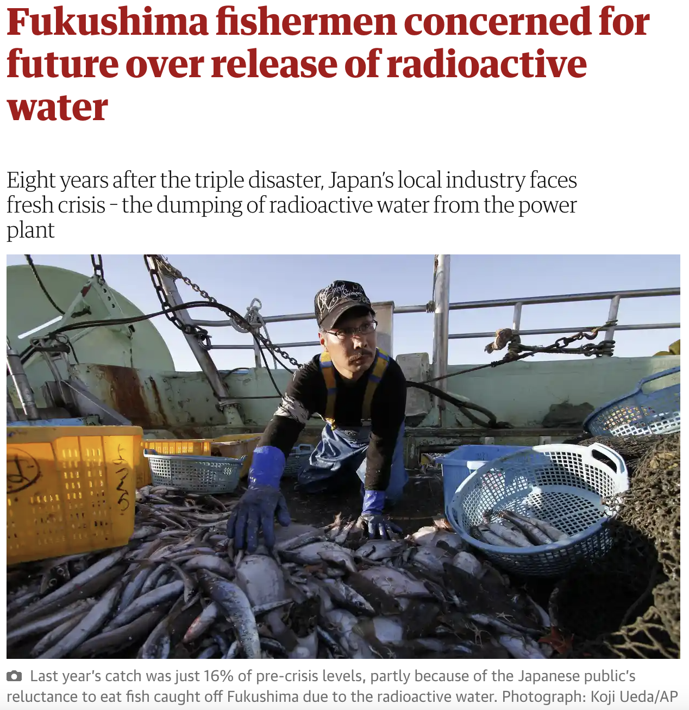
```

---

.center2[
<iframe src="https://player.vimeo.com/video/185057317?h=96e92c7b14" width="640" height="360" frameborder="0" allow="autoplay; fullscreen; picture-in-picture" allowfullscreen></iframe>
<p><a href="https://vimeo.com/185057317">&uml;Gente de Mar y Viento&uml; (2016)</a> from <a href="https://vimeo.com/ambulantemasalla">Ambulante M&aacute;s All&aacute;</a> on <a href="https://vimeo.com">Vimeo</a>.</p>
]

---

```{r, out.width="90%"}
knitr::include_graphics("https://i.kinja-img.com/gawker-media/image/upload/c_fit,f_auto,g_center,pg_1,q_60,w_1600/10577227897831b497970b239eb24d2c.jpg")
```

.center[
[Reparations for Haiti](https://www.lemonde.fr/blog/piketty/2020/06/16/affronter-le-racisme-reparer-lhistoire/)
]

---

.center[
## The context for this Unit
]

Looked at behaviour of buyers and sellers under different market conditions, and conditions under which the competitive equilibrium is Pareto efficient.

```{r, out.width="50%"}
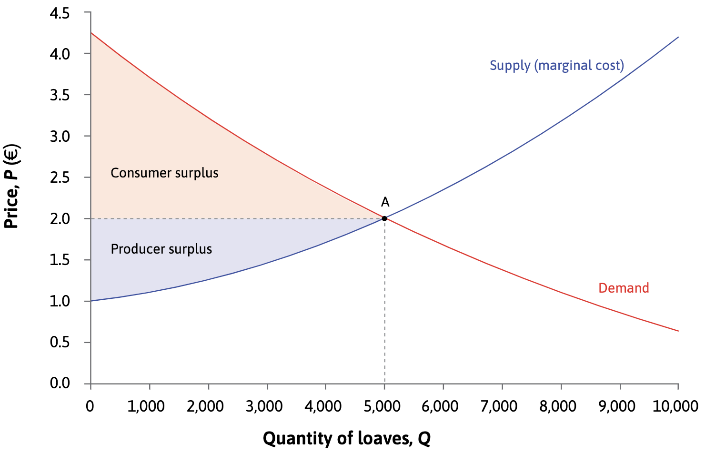
```

In reality, markets may allocate resources in a Pareto-inefficient way (market failure).
- What are the sources of these inefficiencies?
- How can governments solve the problem?

---

.center[
## Why do markets fail?
]

Conditions for markets to work well:

--

- **Private property** - the rights to the thing bought/sold 
- **Institutions** e.g. government - enforce property rights
- **Social norms** – respecting property rights
- Ability to write complete and enforceable contracts that can be evaluated in a court of law 

--

.center[
Markets fail when property rights are missing, incomplete, or are difficult to enforce with a contract.
]

--

.center[
## This Unit
]

--

1. Causes of market failure: External effects, asymmetric information, incomplete contracts

--

2. Possible solutions: Private bargaining, government policies

--

3. The limits of markets: should all goods be allocated via markets?

---

.center2[
# Externalities
]

---

.center[
# Externalities: key concepts
]

**External effect (externality)** = an effect of an economic decision that is not specified as a benefit or liability in the contract.

--

```{r, out.width="60%"}
knitr::include_graphics("https://images.radio-canada.ca/q_auto,w_960/v1/ici-info/16x9/pollution-plastique-oiseau-dechets.jpg")
```

---

.center[
# Externalities: key concepts
]

**External effect (externality)** = an effect of an economic decision that is not specified as a benefit or liability in the contract.

```{r, out.width="60%"}
knitr::include_graphics("https://images.ctfassets.net/y5z23yb0t4f0/1vvBN5lM1cyq429LRfu7PL/747f05bb157e6222edbbb094109431e7/GettyImages-8359262462.jpg")
```

---

.center[
# Externalities: key concepts
]

**External effect (externality)** = an effect of an economic decision that is not specified as a benefit or liability in the contract.

```{r, out.width="60%"}
knitr::include_graphics("https://upload.wikimedia.org/wikipedia/commons/thumb/a/a6/Bike_Panning._%288663144133%29.jpg/1920px-Bike_Panning._%288663144133%29.jpg")
```


---

.center[
# Externalities: key concepts
]

**External effect (externality)** = an effect of an economic decision that is not specified as a benefit or liability in the contract.

```{r, out.width="60%"}
knitr::include_graphics("https://www.vie-publique.fr/sites/default/files/styles/large_full/public/en_bref/image_principale/coronavirus_programme_vaccination_392019081_Drupal.jpg?itok=QeKtyoQo")
```

---

.center[
# Externalities: key concepts
]

- **Marginal private cost (MPC)** = marginal cost to decision-maker

- **Marginal external cost (MEC)** = costs imposed by decision-maker on society (fishermen)

- **Marginal social cost (MSC)** = MPC + MEC (full cost to society)

---

Pesticide in bananas' production:

```{r, out.width="80%"}
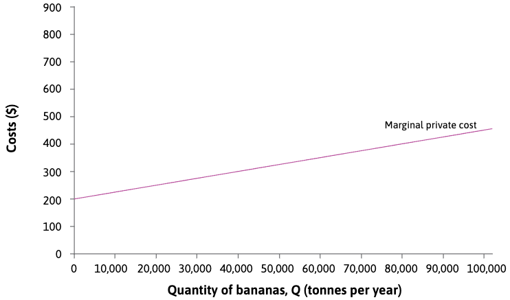
```

The purple line is the marginal cost for the growers: the **marginal private cost (MPC)** of banana production. It slopes upward because the cost of producing an additional tonne increases as the land is more intensively used, requiring more Weevokil.

---

Pesticide in bananas' production:

```{r, out.width="80%"}
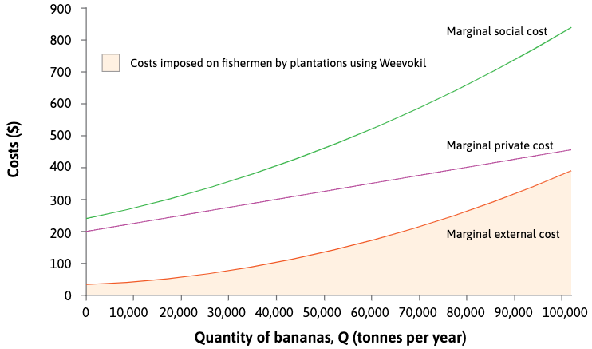
```

The orange line shows the marginal cost imposed by the banana growers on fishermen—the **marginal external cost (MEC)**. This is the cost of the reduction in quantity and quality of fish caused by each additional tonne of bananas.

---

Pesticide in bananas' production:

```{r, out.width="80%"}
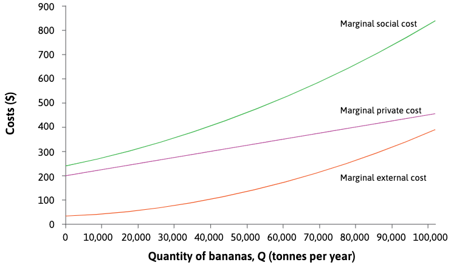
```

**MPC + MEC = MSC**

The green line in the diagram is the **marginal social cost (MSC)**. 


---

Pesticide in bananas' production:

```{r, out.width="80%"}
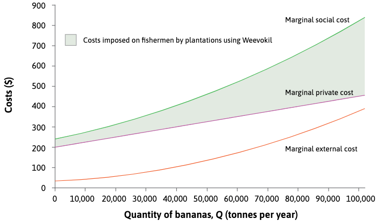
```

Total external cost: the sum of the differences between the marginal social cost and the marginal private cost at each level of production.

---

```{r, out.width="80%"}
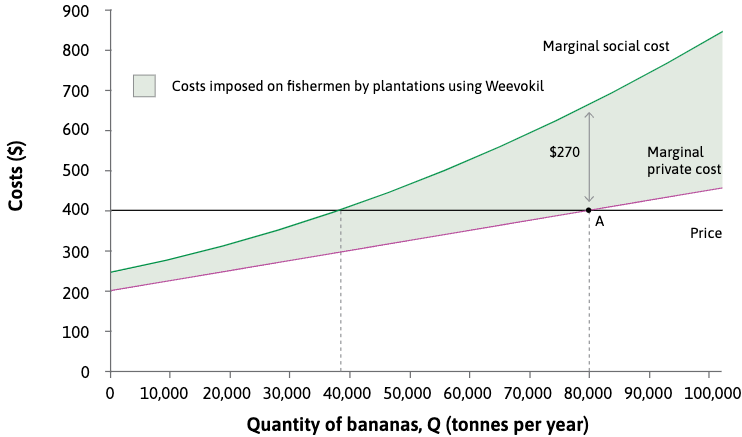
```

If banana plantation owners want to maximize profits:
--
 $MC = P$

Then 80,000 tonnes maximizes profits for banana producers, **but this does not include the cost imposed on the fishing industry**

---

```{r, out.width="80%"}

```

.center[
## Not a Pareto-efficient outcome
]

---

.center[
### Not a Pareto-efficient outcome
]

What would happen if the plantations were to produce less?


```{r, out.width="60%"}

```

The plantations would lose hardly anything. Their revenues would fall by 400, but their costs would fall by almost exactly this amount because, when producing 80,000 tonnes, the marginal private cost is equal to the price (400).


---

.center[
### Not a Pareto-efficient outcome
]

What would happen if the plantations were to produce less?


```{r, out.width="60%"}

```

So if the fishermen paid the plantation owners any amount between just greater than zero and just less than $270, both groups would be better off with 79,999 tonnes of bananas.

---

.center2[
# Solutions
]

---

.center[
## Solution #1: *Coasean* Bargaining
]

```{r, out.width="35%"}
knitr::include_graphics("https://i.imgflip.com/54hjww.jpg")
```

---

.center[
## Solution #1: *Coasean* Bargaining
]


.pull-left[
```{r, out.width="75%"}
knitr::include_graphics("https://i.imgflip.com/54hjww.jpg")
```
]


- Legally assign property rights to the externality (e.g. the right to pollute, the right to clean air)

--

- **In abscence of transaction costs**, Private bargaining between parties involved will result in a Pareto-efficient allocation regardless of which party has the property rights.

--

- In some situations, may be more effective than government intervention because private parties have more of the necessary information.

  
---

.center[
## Solution #1: *Coasean* Bargaining
]

Initially pesticide is not illegal:
--
 the allocation of property rights is such that the plantations have the right to use it, and choose to produce 80,000 tonnes of bananas

---

.center[
## Solution #1: *Coasean* Bargaining
]

Initially pesticide is not illegal:

```{r, out.width="60%"}

```

The situation before bargaining is represented by point A, and the Pareto-efficient quantity of bananas is 38,000 tonnes. 

---

.center[
## Solution #1: *Coasean* Bargaining
]

Initially pesticide is not illegal:

```{r, out.width="60%"}
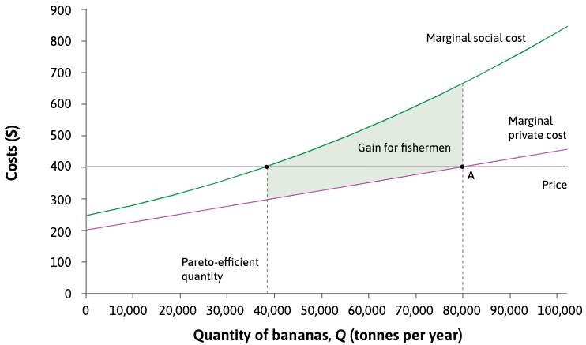
```

The total shaded area shows the gain for fishermen if output is reduced from 80,000 to 38,000 (that is, the reduction in the fishermen’s costs or **reservation option**).

---

.center[
## Solution #1: *Coasean* Bargaining
]

Pesticide is not illegal:

```{r, out.width="60%"}
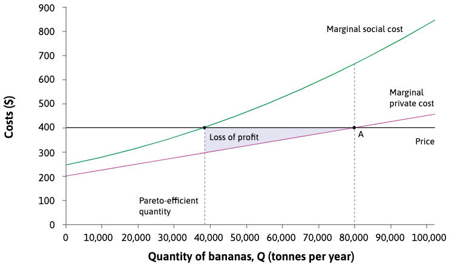
```

Reducing output from 80,000 to 38,000 tonnes reduces the profits of plantations. The lost profit is known as **minimum acceptable offer** equal to the loss of producer surplus, shown by the blue area.


---

.center[
## Solution #1: *Coasean* Bargaining
]

Pesticide is not illegal:

```{r, out.width="60%"}
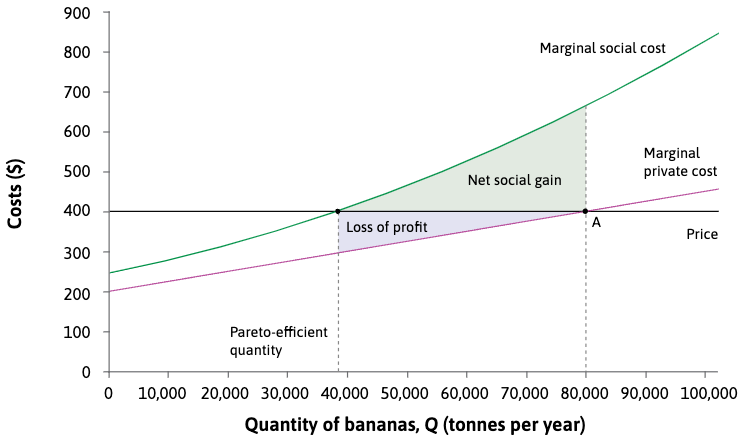
```

The net social gain is the gain for the fishermen minus the loss for the plantations, shown by the remaining green area.

---

.center[
## Solution #1: *Coasean* Bargaining
]

Pesticide is not illegal:

```{r, out.width="60%"}

```

The fishermen would be willing to pay the banana growers to reduce output to 38,000 tonnes if they had the funds to do so.


---

.center[
## Solution #1: *Coasean* Bargaining
]

Pesticide is not illegal:

```{r, out.width="60%"}

```

How much? Any range from **minimum acceptable offer** to **fallback (reservation) option**.

As in the cases of bargaining the compensation they agree on, between these maximum and minimum levels, will be determined by the bargaining power of the two groups.

---

.center[
## Solution #1: *Coasean* Bargaining
]

An alternative legal framework: fishermen have the right to clean water.

```{r, out.width="60%"}

```

In principle, bargaining process would result in a Pareto-efficient allocation independently of whether the initial rights were granted to the plantations (right to pollute) or to the fishermen (right to unpolluted water)

---

.center[
## Solution #1: *Coasean* Bargaining
]

.center[
### Actual compensation depends on relative bargaining power
]

--

Practical limits of bargaining:

- **Limited funds** – fisherman may not have enough money to pay plantations the compensation required.

--

- **Impediments to collective action** – finding a representative and agreeing on how to split the gains within each party

--

- **Missing information** – calculating the exact costs imposed on each fisherman and each plantation’s contribution to pollution.

--

- **Enforcement** – it may be difficult for a court to determine whether plantations have complied or not.

---

.center[
## Solution #2: Government policies
]

```{r, out.width="50%"}
knitr::include_graphics("https://pbs.twimg.com/media/FXRgnimX0AIDFvP.jpg")
```

---

.center[
### Solution #2: Government policies
### Regulation of production
]

Cap at socially optimal amount

```{r, out.width="40%"}
knitr::include_graphics("https://i.imgflip.com/42k41q.png?a465216")
```

May be difficult to determine and enforce the right quota for each polluter


---

.center[
### Solution #2: Government policies
### Pigouvian tax/subsidy
]

Tax/subsidy on firms generating negative/positive external effects, in order to correct an inefficient market outcome.

Note that the government is who recieves the payment.

```{r, out.width="40%"}
knitr::include_graphics("https://i.imgflip.com/4yo1ob.png")
```

---

.center[
### Solution #2: Government policies
### Pigouvian tax/subsidy
]

At the Pareto-efficient quantity, 38,000 tonnes, the MPC is 295. The MSC is 400. So the marginal external cost is MSC – MPC = 105.

```{r, out.width="60%"}
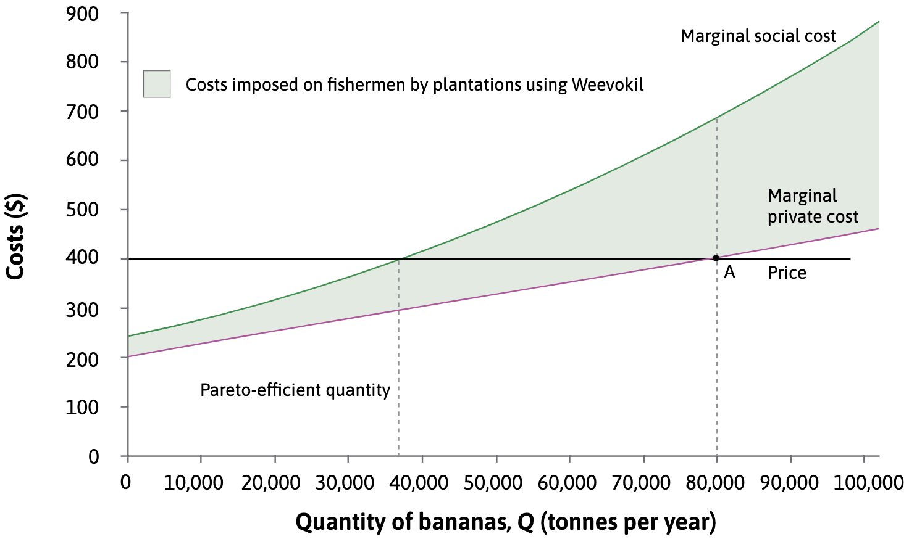
```

---

.center[
### Solution #2: Government policies
### Pigouvian tax/subsidy
]

If the government puts a tax (= MSC-MPC) on each tonne of bananas produced equal to 105, the marginal external cost, then the after-tax price received by plantations will be 295.

```{r, out.width="60%"}
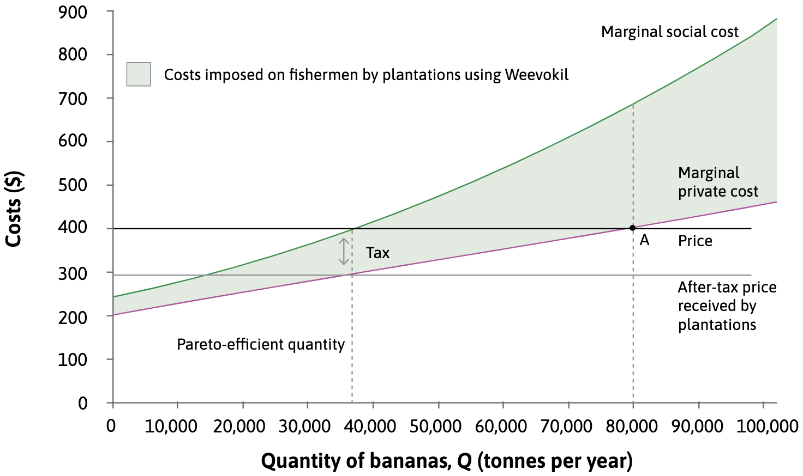
```

---

.center[
### Solution #2: Government policies
### Pigouvian tax/subsidy
]

To maximize profit, the plantations will choose their output so that the MPC is equal to the after-tax price. They will choose point $P_1$ and produce 38,000 tonnes.


```{r, out.width="60%"}
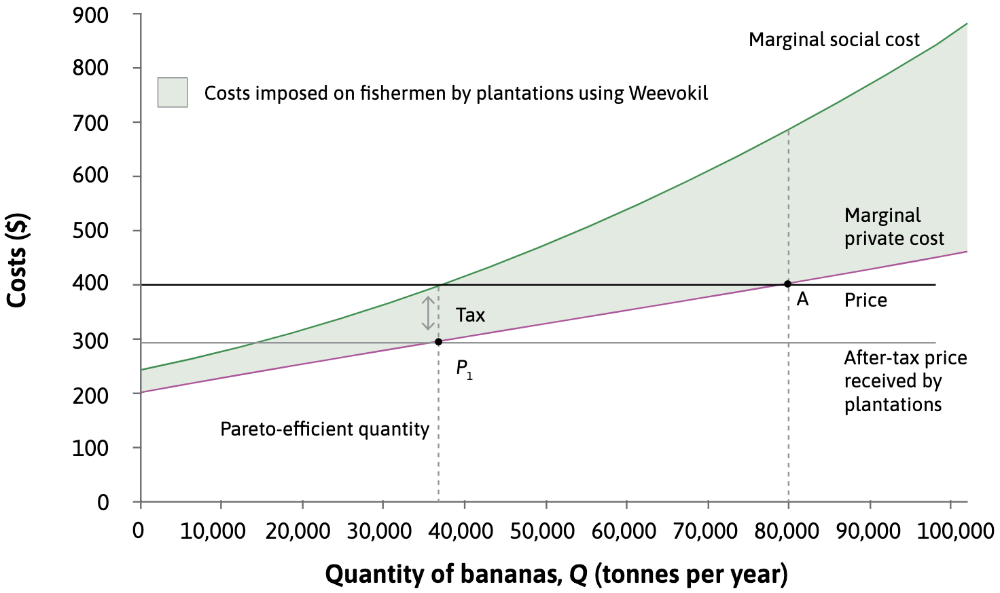
```


---

.center[
### Solution #2: Government policies
### Compensation
]

Enforcing compensation for affected parties. The compensation required for each tonne of bananas will be equal to the difference between the MSC and the MPC:

```{r, out.width="50%"}
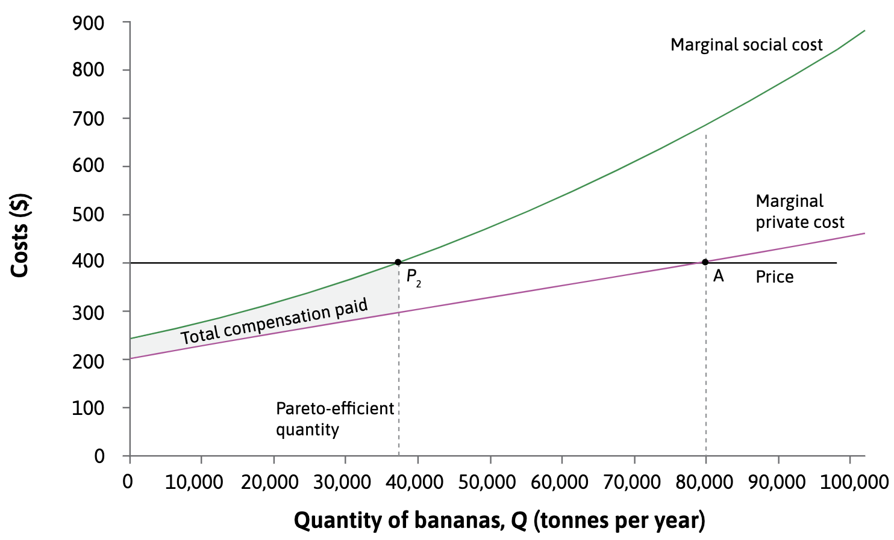
```

Similar to the effect of the tax, but the fishermen do better because they receive payment.

---

.center[
## Solution #2: Government policies
]

Practical limits of goverment policies:

- **Missing information** – government may not know the exact compensation needed to correct the problem.

--

- **Measurement** – Marginal social costs are difficult to measure.

--

- **Lobbying** - The government may favour the more powerful group, in which case it could impose a Pareto-efficient outcome that is unfair.

---
.center[
## Why do externalities occur?
]

--

External costs cause market failure due to **incomplete contracts**.

--

- Incomplete contracts do not specify, in an enforceable way, every aspect of the exchange that affects the interests of all affected parties (Units 6 & 9).

--

- Contracts that include external costs/benefits are not enforceable because the relevant information is not **verifiable** or **asymmetric** (not known by decision-maker).

--

- Therefore, in reality it is impossible to use contracts or property rights so that all social costs/benefits are included in the decision-making process.

```{r, out.width="30%"}
knitr::include_graphics("https://media.giphy.com/media/l0G18S6f5RfkI8JNK/giphy.gif")
```


---

.center2[
# Market failure: Other types
]

---

.center[
## 1) Public goods
]

--

.center[
**Public good** = **Non-rival**; may or may **not** be **excludable**
]

--

.pull-left[
**Non-rival**: use by one person does not reduce its availability to others
]

.pull-right[
**Non-excludable**: impossible to exclude anyone from having access
]

--


```{r, out.width="45%"}
knitr::include_graphics("https://media.giphy.com/media/ToMjGpRhf96j23aTc5i/giphy.gif")
```

---

.center[
## 1) Public goods
]

.center[
**Public good** = **Non-rival**; may or may **not** be **excludable**
]

.pull-left[
**Non-rival**: use by one person does not reduce its availability to others
]

.pull-right[
**Non-excludable**: impossible to exclude anyone from having access
]


|   |  Rival | Non-rival |
| --- | --- | --- |
| **Excludable** | Private goods | Public goods that are artificially scarce |
| **Non-excludable** | Common-pool resources | Non-excludable public goods and bads |

---

.center[
## 1) Public goods
]

.center[
**Public good** = **Non-rival**; may or may **not** be **excludable**
]

.pull-left[
**Non-rival**: use by one person does not reduce its availability to others
]

.pull-right[
**Non-excludable**: impossible to exclude anyone from having access
]


|   |  Rival | Non-rival |
| --- | --- | --- |
| **Excludable** | Private goods | Public goods that are artificially scarce |
|  | *food, clothes, houses* | *uncongested tollroads, knowledge subject to intellectual property rights* |
| **Non-excludable** | Common-pool resources | Non-excludable public goods and bads |
|  | *fish stocks in a lake, common grazing land* | *public broadcasts, rules of arithmetic or calculus, national defence, noise and air pollution* |


---

.center[
## 1) Public goods
]


.center[
Markets typically allocate private goods.

But for the other 3 types, markets are not possible or likely to fail.
]

--

- Non-rival goods have a marginal cost of zero, so it is not possible to set price = MC unless provision is subsidised.

--

- It is impossible to set a price for non-excludable goods because the provider cannot exclude those who haven’t paid.


--

.pull-left[

> If one farmer invests in a community irrigation project, other farmers receive external benefits, but it is difficult to make them pay for the benefits or write contracts that guarantee a Pareto-efficient irrigation level 

]

.pull-right[
```{r, out.width="50%"}
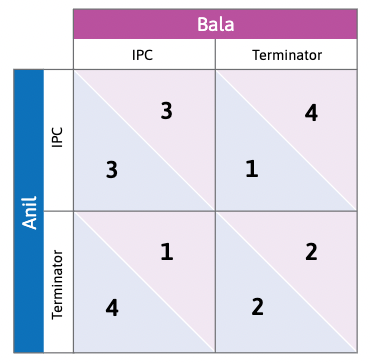
```
]

---

.center[
## 2) Asymmetric information
]

--

When information is **asymmetric**, one party knows something relevant to the transaction but the other party does not. 

--

.center[
Two forms of asymmetric information:
]

.pull-left[
1. **Hidden action** – leads to a **moral hazard** problem 

*Example* – Involuntary unemployment because employers cannot observe employees’ exact work effort (Unit 6).
]

.pull-right[
2. **Hidden attributes** – leads to an **adverse selection** problem

*Example* – Buyers of second-hand cars do not know all the attributes of the car e.g. quality, but the sellers do.
]

```{r, out.width="20%"}
knitr::include_graphics("https://assets.pourleco.com/s3fs/public/styles/square_w800/public/2019-10/20081211-George%20Akerlof-500.jpg?itok=afyI74Nj")
```

---

.center[
## 2) Asymmetric information
]

When information is **asymmetric**, one party knows something relevant to the transaction but the other party does not. 

.center[
Two forms of asymmetric information:
]

.pull-left[
1. **Hidden action** – leads to a **moral hazard** problem 

*Example* – Involuntary unemployment because employers cannot observe employees’ exact work effort (Unit 6).
]

.pull-right[
2. **Hidden attributes** – leads to an **adverse selection** problem

*Example* – Buyers of second-hand cars do not know all the attributes of the car e.g. quality, but the sellers do.
]

```{r, out.width="35%"}
knitr::include_graphics("https://www.economist.com/img/b/1424/801/90/sites/default/files/images/print-edition/20190928_FND002_0.jpg")
```

---

.center[
## 2) Asymmetric information

### Example #1: Health insurance
]

.pull-left[

Insurance companies cannot observe the health of the people buying insurance.

Purchasers know their health status. The less healthy are more likely to buy.

- To be profitable, the company must charge prices high enough and only the less healthy people are willing to buy.

- This adverse selection means that most people buying insurance already know they have a health problem.

- There is a missing market: many (healthier) people who would like to buy insurance will remain uninsured. 

]

.pull-right[
```{r, out.width="90%"}
knitr::include_graphics("https://today.uconn.edu/wp-content/uploads/2017/04/shutterstock_373492012-health-insurance-e1491415000969.jpg")
```
]

---

.center[
## 2) Asymmetric information

### Example #2: Car insurance
]

.pull-left[
```{r, out.width="90%"}
knitr::include_graphics("https://www.expatica.com/app/uploads/sites/5/2020/01/car-insurance-france.jpg")
```
]

.pull-right[

Any form of insurance also has a hidden action problem – the buyer may take more risks now that he/she is insured. 

Example – purchasing full coverage against damage may make someone more careless in driving.

- Insurance companies can put some limits in a contract, but cannot enforce other types of behaviour e.g. driving speed. 

- This moral hazard problem is another principal-agent problem, and we can also think of it in terms of external effects (being careful gives external benefits to the company)

]

---

.center[
## 2) Asymmetric information

### Example #3: The banking system
]

.pull-left[

Borrowing and lending is another principal-agent problem in which the borrower’s decisions have external effects on the lender.

- Poor borrowers are often credit-constrained or credit-excluded, which is a form of credit market failure (Unit 10).


Another form of credit market failure is the banks themselves:

- If they take risks and go bankrupt, other banks (whom they have
borrowed from) will bear some of the costs.

- Governments will also bail out banks that are ‘too big to fail’, which incentivizes risk-taking behaviour.

]

.pull-right[
```{r, out.width="90%"}
knitr::include_graphics("https://img.20mn.fr/GVh7hMX9QsuUquyDxqSjBw/768x492_enseigne-lehman-brothers-encheres-chez-christie-2010")
```
]

---

.center[
## 3) Price > MC
]

Firms may set price above marginal cost because of:

- Limited competition e.g. selling differentiated product 
- Decreasing long-run average costs due to economies of scale e.g. natural monopoly
- Deadweight loss can be eliminated via price discrimination (allocation ‘unfair’ because firms capture entire surplus) or competition policy.

.center[
Market failure because allocation is not Pareto efficient
]

```{r, out.width="45%"}
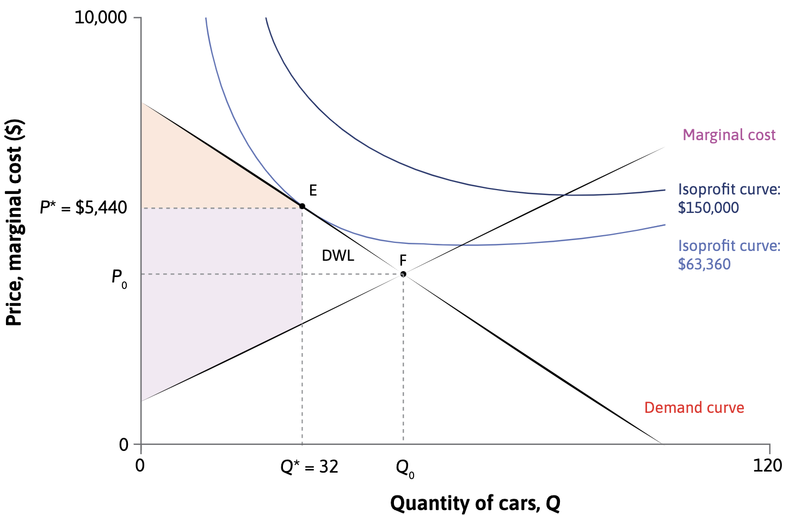
```

---

.center[
## 3) Price > MC
]

Firms may set price above marginal cost because of:

- Limited competition e.g. selling differentiated product 
- Decreasing long-run average costs due to economies of scale e.g. natural monopoly
- Deadweight loss can be eliminated via price discrimination (allocation ‘unfair’ because firms capture entire surplus) or competition policy.

.center[
Market failure because allocation is not Pareto efficient
]

```{r, out.width="45%"}
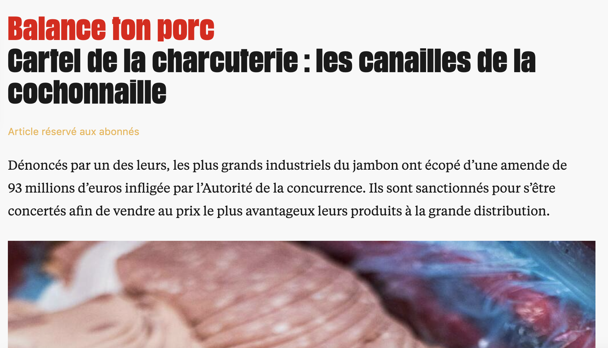
```

---

.center2[
# Limits to markets
]

---

.center[
# Should markets allocate everything?
]

.center2[
<iframe width="560" height="315"  src="https://www.youtube.com/embed/3nsoN-LS8RQ" frameborder="0" allow="accelerometer; autoplay; encrypted-media; gyroscope; picture-in-picture" allowfullscreen></iframe>
]

---

.center[
# Should markets allocate everything?
]

Most likely not:

- **Repugnant markets**: creating a market for certain goods/services would violate ethical/social norms e.g. slavery

- Other institutions may be more effective e.g. governments, families

- Market mechanisms may **crowd out norms of social preferences** 

- **Merit goods**: goods that should be available to everyone, independently of their ability to pay e.g. education

---

.center[
# Summary
]

--

1) Sources of market failure
  - External costs or benefits
  - Asymmetric information (hidden action/hidden attributes)
  - Limited competition (P > MC)

--

2) Possible solutions – regulation, taxation, compensation

--

3) Markets for other types of goods

  - Public goods and public ‘bads’
  - Limits to markets – not every good should have a market
  
  
---

.center[
# EconFrame
]

```{r, out.width="60%"}
knitr::include_graphics("imgs/econframe.jpeg")
```

🖼️ Submit a photo capturing an economics concept explained in class

🏆 You could win up to £100 in Amazon vouchers!

https://twitter.com/coreeconteam/status/1618534497364086791?s=20&t=eUq2H0WK8OXnNa4H00h8KA
