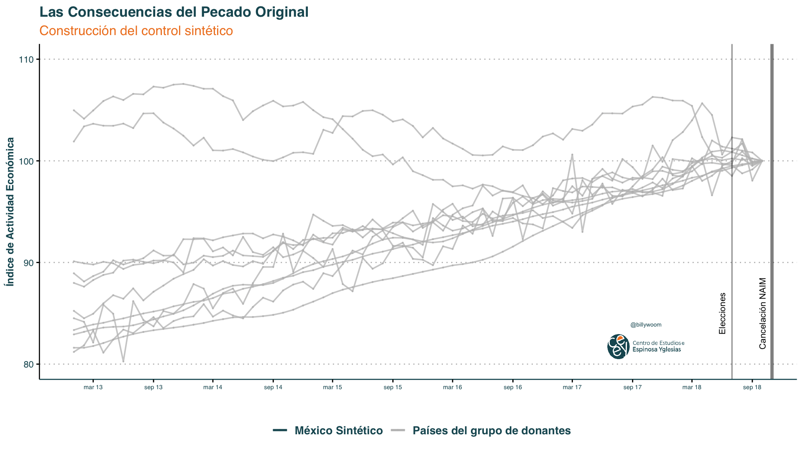

<style>

.center2 {
  margin: 0;
  position: absolute;
  top: 50%;
  left: 50%;
  -ms-transform: translate(-50%, -50%);
  transform: translate(-50%, -50%);
}

</style>

```{r setup, include = FALSE}
knitr::opts_chunk$set(echo = FALSE)
knitr::opts_chunk$set(out.width = "90%")
knitr::opts_chunk$set(fig.align="center")
options(htmltools.dir.version = FALSE)


options(htmltools.dir.version = FALSE)
library(knitr)
library(tidyverse)
library(xaringanExtra)
# set default options
opts_chunk$set(echo=FALSE,
               collapse = TRUE,
               fig.width = 7.252,
               fig.height = 4,
               dpi = 300)
# set engines
knitr::knit_engines$set("markdown")
xaringanExtra::use_tile_view()
xaringanExtra::use_panelset()
xaringanExtra::use_clipboard()
xaringanExtra::use_webcam()
xaringanExtra::use_broadcast()
xaringanExtra::use_share_again()
xaringanExtra::style_share_again(
  share_buttons = c("twitter", "linkedin", "pocket")
)
# uncomment the following lines if you want to use the NHS-R theme colours by default
# scale_fill_continuous <- partial(scale_fill_nhs, discrete = FALSE)
# scale_fill_discrete <- partial(scale_fill_nhs, discrete = TRUE)
# scale_colour_continuous <- partial(scale_colour_nhs, discrete = FALSE)
# scale_colour_discrete <- partial(scale_colour_nhs, discrete = TRUE)
```


```{r out.width="80%"}
knitr::include_graphics("https://pbs.twimg.com/media/EaP79PwWoAIykCb.jpg")
```

---

```{r out.width="90%"}
knitr::include_graphics("imgs/covid1.png")
```

---

```{r out.width="90%"}
knitr::include_graphics("imgs/covid2.png")
```

---

```{r out.width="90%"}
knitr::include_graphics("imgs/covid3.png")
```

---

.center[
Unemployment is related to higher stress
]

```{r out.width="85%"}

```

Changes in unemployment and wellbeing during the financial crisis: Evidence from the US states (2007–2010)

---
.center2[
# Growth and fluctuations
]

---
## Economic growth is not a smooth process

```{r out.width="70%"}
knitr::include_graphics("imgs/uk-real-gdp-per-capita-in-2011-us-dollars.svg")
```

---
## Economic growth is not a smooth process

```{r out.width="70%"}
knitr::include_graphics("imgs/uk-log-of-real-gdp-per-capita-in-2011-us.svg")
```

---
.pull-left[
## The business cycle
]

.pull-right[
```{r out.width="100%"}
knitr::include_graphics("imgs/f13-3-a.png")
```
]

---
.pull-left[
## The business cycle

- **Business cycle**: Alternating periods of positive and negative growth rates.


]

.pull-right[
```{r out.width="100%"}
knitr::include_graphics("imgs/f13-3-b.png")
```
]

---
.pull-left[
## The business cycle

- **Business cycle**: Alternating periods of positive and negative growth rates.

- **Recession**: period when output is declining or below its potential level


]

.pull-right[
```{r out.width="100%"}
knitr::include_graphics("imgs/f13-3-c.png")
```
]

---
.pull-left[
## The business cycle

- **Business cycle**: Alternating periods of positive and negative growth rates.

- **Recession**: period when output is declining or below its potential level

- The business cycle affects labour market outcomes.


]

.pull-right[
```{r out.width="100%"}
knitr::include_graphics("imgs/f13-3-d.png")
```
]

---
.pull-left[
## The business cycle

- **Business cycle**: Alternating periods of positive and negative growth rates.

- **Recession**: period when output is declining or below its potential level

- The business cycle affects labour market outcomes

  - Changes in the rate of GDP growth are negatively correlated with the unemployment rate.
  
  - Output falls $\rightarrow$ Unemployment rises
 $\rightarrow$ Well-being falls
]

.pull-right[
```{r out.width="100%"}
knitr::include_graphics("imgs/f13-3-d.png")
```
]

---
.center2[
# Output growth and changes in unemployment
]

---
.left-column[
## Okun's Law

$$\Delta u_t = \alpha + \beta \textit{GDP Growth}_t$$ 

A strong and stable empirical relationship in most economies since the Second World War

]

.right-column[

```{r out.width="80%"}
knitr::include_graphics("imgs/f13-5.png")
```
]


---
## Okun's Law

.pull-left[

**Choose the correct answer(s)**

a) The unemployment rate remains stable when there is zero real GDP growth.

b) Okun’s coefficient for the US is **1.0827**.

c) Policymakers can be sure that a **1% increase in real GDP** next year will definitely lead to a **fall in the unemployment rate of 0.37 percentage points**.

d) A **2.8% drop in real GDP in 2009** predicts a rise **2.11 percentage points** in the unemployment rate.

]

.pull-right[

$$\Delta u_t = \alpha + \beta \textit{GDP Growth}_t$$ 

```{r out.width="110%"}

```
]

---
## Okun's Law

.pull-left[

**Choose the correct answer(s)**

❌ a) The unemployment rate remains stable when there is zero real GDP growth.

❌ b) Okun’s coefficient for the US is **1.0827**.

❌ c) Policymakers can be sure that a **1% increase in real GDP** next year will definitely lead to a **fall in the unemployment rate of 0.37 percentage points**.

<span style="color: #008ac4;">
✅ **d) A 2.8% drop in real GDP in 2009 predicts a rise 2.11 percentage points in the unemployment rate.**
</span>

]

.pull-right[

$$\Delta u_t = \alpha + \beta \textit{GDP Growth}_t$$ 

```{r out.width="110%"}

```
]

---
.center2[
# Measuring the aggregate economy 
]


---
## Measuring the aggregate economy 

Economists use what are called aggregate statistics to describe the economy as a whole (known as the aggregate economy, meaning simply the sum of its parts brought together)

--

**National accounts**:  system used to measure overall output and expenditure in a country.

--

.left-column[

Three equivalent ways to measure GDP:

1. Total spending on domestic products

2. Total domestic production (measured as value added)

3. Total domestic income

]

.right-column[
```{r out.width="70%"}
knitr::include_graphics("imgs/f13-6.png")
```
]

---
## Measuring the aggregate economy 

### Example: GDP in a 3-industry economy

.pull-left[
Industries involved:

1.	Raw cotton → sells cotton for $50

2.	Cloth → buys cotton, sells cloth for $80

3.	Shirt → buys cloth, sells shirt for $100

]

--

.pull-right[

- **GDP via final expenditure:**
 - = $100 (value of shirts sold to consumers)

- **GDP via value added:**
  - Cotton: $50
	-	Cloth: $80 − $50 = $30
	-	Shirt: $100 − $80 = $20
  - **Total: $100**
  
- **GDP via income:**
  - = Wages + Profits across all industries
  - = Total value added = $100
  
]

---
## Exports, imports, and government

- How do we account for international transactions?
 e.g. foreign production is domestic consumption (imports); or domestic production is foreign consumption (exports)
 
--

  - We include exports and exclude imports, so that GDP includes value added, income from, or consumption of, domestic production.
  
--

- How do we incorporate government?

--

  - Treat it as another producer – public services are “bought” via taxes
  
--
  
  - Assume that cost of production captures the value added


---
.center2[
# Measuring the aggregate economy: The components of GDP
]

---
## Components of GDP

$$GDP = Y$$

---
## Components of GDP

$$GDP = Y = C + I + G + X – M$$
--

- **Consumption (C)**: Expenditure on consumer goods and services (durable, non-durable, intangible)

--

- **Investment (I)**: Expenditure on newly produced capital goods (incl. equipment, buildings, and inventories = unsold output) 

--

- **Government spending (G)**: Government expenditure on goods and services (excluding transfers to avoid double-counting)

--

- **Net exports (trade balance)** = **Exports (X)** minus **imports (M)**

--

| | US | Eurozone | China |
|-------------------------|
| Consumption (C)	| 68.4%	| 55.9%	| 37.3% |
| Government spending (G)	| 15.1%	| 21.1%	| 14.1% |
| Investment (I)	| 19.1%	| 19.5%	| 47.3% |
| Change in inventories	 | 0.4%	 | 0.0%	 | 2.0% |
| Exports (X)	| 13.6%	| 43.9%	| 26.2% |
| Imports (M)	| 16.6%	| 40.5%	| 23.8% |


---
## Components of GDP

$$GDP = Y = C + I + G + X – M$$

- **Consumption (C)**: Expenditure on consumer goods and services (durable, non-durable, intangible)

- **Investment (I)**: Expenditure on newly produced capital goods (incl. equipment, buildings, and inventories = unsold output) 

- **Government spending (G)**: Government expenditure on goods and services (excluding transfers to avoid double-counting)

- **Net exports (trade balance)** = **Exports (X)** minus **imports (M)**


$$ \Delta GDP \% = \Delta Y \% = \Delta C \% \cdot \frac{C}{Y} + \Delta I \% \cdot \frac{I}{Y}  + \Delta G \% \cdot \frac{G}{Y}  + \Delta NE \% \cdot \frac{NE}{Y} $$

| 	| GDP	| Consumption	| Investment |	Government spending	| Net exports |
|-----------|
| 2009	| −2.8	| −1.06	| −3.52	| 0.64	| 1.14 |


---
.center2[
# Economic fluctuations and consumption
]

---
.center[
## Economic fluctuations: UK
]

```{r out.width="75%"}
knitr::include_graphics("imgs/f13-9a-a.png")
```


Economies fluctuate between good and bad times. 

---
.center[
## Economic fluctuations: UK
]

```{r out.width="75%"}
knitr::include_graphics("imgs/f13-9a-b.png")
```

Economies fluctuate between good and bad times. 

---
.center[
## Economic fluctuations: UK
]

```{r out.width="75%"}
knitr::include_graphics("imgs/f13-9a-c.png")
```

Economies fluctuate between good and bad times. 

---
.center[
## Economic fluctuations: UK
]

```{r out.width="75%"}
knitr::include_graphics("imgs/f13-9a-d.png")
```

Economies fluctuate between good and bad times. 

---
.center[
## Economic fluctuations: UK
]

```{r out.width="75%"}
knitr::include_graphics("imgs/f13-9a-e.png")
```

Economies fluctuate between good and bad times. 

---
.center[
## Economic fluctuations: India
]

```{r out.width="75%"}
knitr::include_graphics("imgs/f13-9b.png")
```

Economies fluctuate between good and bad times. 

---

**Shock**: an unexpected event which causes GDP to fluctuate.

--

Two kinds of shocks:
--
 **Household shocks**

--
 and **Economy-wide shocks**.

--
 How to deal with them?

--

.pull-left[

**Household shocks**

1) **Self-insurance** – saving and borrowing. Other households are not involved. 

2) **Co-insurance** – support from social network or government.

This reflects that households prefer to **smooth their consumption**, and that they are (to a degree) **altruistic**.

]

--

.pull-right[

**Economy-wide shocks**

Co-insurance is less effective if the bad shock hits everyone at the same time.

But co-insurance is even more necessary.

In farming economies of the past that were based in volatile climates, people practised co-insurance based on **trust, reciprocity, and altruism**.


]

--

.pull-left[

Formal mechanisms
```{r out.width="80%"}
knitr::include_graphics("https://www.portdebouc.fr/media/images/page/images/principale/85/1000-1000/logo-cpam.jpg?version=1559138298")
```
]

--

.pull-right[

Informal mechanisms

```{r out.width="50%"}
knitr::include_graphics("https://miro.medium.com/max/1280/1*GLCCcriKywWHkfmEW3WIsA.jpeg")
```
]

---
.center2[
# Why is consumption smooth?
]

---
## Why is consumption smooth?

```{r out.width="75%"}
knitr::include_graphics("imgs/f13-9a-e.png")
```

---
.center2[
# Detour to Micro
]

---
.center[
## Consumption over time
]

Trade-off between consuming goods now and later: **opportunity cost** of having more goods now is having fewer goods later.

--

Borrowing and lending allow us to rearrange our capacity to buy goods and services across time.

--

**Repayment**: principal + interest.

--

**Interest rate (r)**: The price of bringing some buying power forward in time. $r = \frac{repaument}{principal} - 1$ 

--

**(1+r)**: Tradeoff between current and future consumption (MRT)

--

.center[
Example: Julia, principal = 91 and repayment = 100
]


.pull-left[

$$repayment = 91 + 91\cdot r = 91 \cdot (1 + r) \approx 100$$
]

.pull-right[

$$r = \frac{100}{91} - 1  \approx 1.10 - 1 = .10 = 10\%$$
]

---
### Borrowing

```{r out.width="60%"}

```

Julia does not have money now, but knows that in the next period (later) she will have $100 from her paycheck or harvest.

---
### Borrowing

```{r out.width="60%"}

```

Julia could borrow 91 now and promise to pay the lender the 100 that she will have later. The interest rate would be 10%.

---
### Borrowing

```{r out.width="60%"}

```

Julia could borrow 91 now and promise to pay the lender the 100 that she will have later. The interest rate would be 10%.

---
### Borrowing

```{r out.width="60%"}

```

At the same interest rate (10%), she could also borrow 70 to spend now, and repay 77 at the end of the year. In that case she would have 23 to spend next year.

---
### Borrowing

```{r out.width="60%"}

```

She could also borrow 30 to spend now, and repay 33 at the end of the year. In that case she would have 67 to spend next year.

---
### Borrowing

```{r out.width="60%"}
knitr::include_graphics("imgs/f10-2-e.png")
```

The boundary of Julia’s feasible set is her feasible frontier, shown for the interest rate of 10%.

---
### Borrowing

```{r out.width="60%"}

```

Juila can borrow now and choose any combination on her feasible frontier.

---
### Borrowing

```{r out.width="60%"}

```

If, instead of 10%, the interest rate is 78%, Julia can only borrow a maximum of $56 now.

---
### Borrowing

```{r out.width="60%"}

```

The feasible set with the interest rate of 78% is the dark shaded area, while the feasible set with an interest rate of 10% is the dark shaded area plus the light shaded area.


---
### Preferences for consumption

How much consumption we bring forward depends on how impatient we are.
--

How much consumption an individual will bring forward depends on:  

- **consumption smoothing**: changing consumption across time (consuming a lot in one period and little in the other).
- **impatience**
  - **Myopia (short-sightedness)**: People experience the present satisfaction more strongly than the same satisfaction later
  - **Prudence**: People know that they may not be around in the future, and so they want to consume now
  
--

**Diminishing marginal returns to consumption**  the value to the individual of an additional unit of consumption in a given period declines the more that is consumed.

---
### Consumption smoothing

```{r out.width="55%"}

```

The dashed line shows the combinations of consumption now and consumption later from which Julia can choose.

---
### Consumption smoothing

```{r out.width="55%"}
knitr::include_graphics("imgs/f10-3-b.png")
```

Julia’s IC is bowed toward the origin as a consequence of diminishing marginal returns to consumption in each period: the more goods she has in the present, the less she values an additional one now relative to more in the future. 

---
### Consumption smoothing

```{r out.width="55%"}

```

The MRS at C is high (the slope of her indifference curve is steep): Julia has little consumption now and a lot later, so diminishing marginal returns mean that she would like to move some consumption to the present.

---
### Consumption smoothing

```{r out.width="55%"}

```

The MRS at E is low: She has a lot of consumption now and less later, so diminishing marginal returns mean that she would like to move some consumption to the future.

---
### Consumption smoothing

```{r out.width="55%"}

```

MRS is falling as we move along the indifference curve from C to E: the slope is steeper at C than at E.

---
### Consumption smoothing

```{r out.width="55%"}

```

Julia will choose point F. It is on the highest attainable indifference curve. She prefers to smooth consumption between now and later.

---
### Consumption smoothing: Optimal decision-making

**Discount rate** $(\rho)$: a measure of a person's impatience.

--
  - Consumption smoothing
  - Pure impatience 
  
--

Individual borrows at the point where discount rate = interest rate

--

$$ \textit{slope of the indifference curve (MRS)} = \textit{slope of the feasible frontier (MRT)}$$

--

.pull-left[
$$MRS = 1 + \rho$$
]

.pull-right[
$$MRT = 1 + r$$
]

--

$$ MRS = MRT \iff 1 + \rho = 1 + r \iff \rho = r $$

---
### Consumption smoothing: Optimal decision-making

```{r out.width="52.25%"}

```

Julia wishes to get to the highest indifference curve but is limited by her feasible frontier.

---
### Consumption smoothing: Optimal decision-making

```{r out.width="52.25%"}

```

When the interest rate is 10%, the highest attainable indifference curve will be the one that is tangent to the feasible frontier.

---
### Consumption smoothing: Optimal decision-making


```{r out.width="52.25%"}

```

Point E: MRS = MRT.

---
### Consumption smoothing: Optimal decision-making

```{r out.width="52.25%"}

```

At point F, her discount rate, $\rho$, exceeds $r$, the interest rate, so she would like to bring consumption forward in time. 

---
### Consumption smoothing: Optimal decision-making

```{r out.width="52.25%"}

```

If the interest rate at which she can borrow increases, the feasible set gets smaller.

---
### Consumption smoothing: Optimal decision-making

```{r out.width="52.25%"}

```

The best Julia can do now is to borrow less (35 instead of 58), as shown by point G.

---
.center2[
# Back to Macro
]

---
## Why is consumption smooth? 

```{r out.width="75%"}
knitr::include_graphics("imgs/f13-9a-e.png")
```

---
## Smoothing Consumption

```{r out.width="70%"}
knitr::include_graphics("imgs/f13-10-a.png")
```

The blue line shows the path of income over time: it starts low, rises when the individual is promoted and falls at retirement.

---
## Smoothing Consumption

```{r out.width="70%"}
knitr::include_graphics("imgs/f13-10-b.png")
```

This is the red line. It is smooth (flat) from the point at which the individual first gets a job.

---
## Smoothing Consumption


```{r out.width="65%"}
knitr::include_graphics("imgs/f13-10-c.png")
```

At this time income is low. The individual saves and repays the debt when older and earning more, and finally runs down savings after retirement, when income falls again.

---
## Smoothing Consumption


```{r out.width="65%"}
knitr::include_graphics("imgs/f13-10-c.png")
```

**Consumption smoothing is a basic source of stabilisation in an economy.** They think about what might happen to their income in the future, and they save and borrow to smooth the bumps in income. This is self-insurance.

---
.center[
## Limitations to smoothing: credit constraints
]

.left-column[

**Credit constraints** – limits on amount borrowed/ability to borrow.

The blue lines on the figure show that the path of income over time is the same in both households.
]

--

.right-column[
```{r out.width="70%"}
knitr::include_graphics("imgs/f13-11-a.png")
```
]

---
## Limitations to smoothing: credit constraints

.left-column[

**Credit constraints** – limits on amount borrowed/ability to borrow.

In a consumption-smoothing household, consumption changes immediately once the household receives the news.

]


.right-column[
```{r out.width="70%"}
knitr::include_graphics("imgs/f13-11-b.png")
```
]

---
## Limitations to smoothing: credit constraints

.left-column[

**Credit constraints** – limits on amount borrowed/ability to borrow.

A credit-constrained household that cannot borrow has to wait until the income arrives before adjusting its standard of living.

]


.right-column[
```{r out.width="70%"}
knitr::include_graphics("imgs/f13-11-c.png")
```
]

---
## Limitations to smoothing: credit constraints

.left-column[

**Credit constraints** – limits on amount borrowed/ability to borrow.

A credit-constrained household that cannot borrow has to wait until the income arrives before adjusting its standard of living.


The households unable to adjust to a temporary income shock have lower welfare.

]


.right-column[
```{r out.width="70%"}
knitr::include_graphics("imgs/f13-11-c.png")
```
]


---
## Limitations to smoothing: credit constraints


```{r out.width="45%"}
knitr::include_graphics("imgs/f13-12-a.png")
```

Consider a household that receives the same income, y, this period and next period, indicated by the endowment point A.

---
## Limitations to smoothing: credit constraints


```{r out.width="45%"}
knitr::include_graphics("imgs/f13-12-b.png")
```

The interest rate is r so if the household can borrow and save, then it can choose any point on the budget constraint, which has the slope −(1 + r).

---
## Limitations to smoothing: credit constraints

```{r out.width="45%"}
knitr::include_graphics("imgs/f13-12-c.png")
```

If the household prefers to consume the same amount each period, shown by the point A where the indifference curve is tangent to the budget constraint.

---
## Limitations to smoothing: credit constraints


```{r out.width="45%"}
knitr::include_graphics("imgs/f13-12-d.png")
```

There is an unexpected negative temporary shock in income, which lowers this year’s income to y′, leaving expected income next year unaffected at y.

---
## Limitations to smoothing: credit constraints

```{r out.width="45%"}
knitr::include_graphics("imgs/f13-12-e.png")
```

If it can borrow and save, then its budget constraint has a slope of −(1 + r) and passes through point A′.

---
## Limitations to smoothing: credit constraints


```{r out.width="45%"}
knitr::include_graphics("imgs/f13-12-f.png")
```

Optimal consumption at A″: the household prefers to smooth consumption, consuming c′ in both periods. The household borrows c′ − y′ now and repays (1 + r)(c′ − y′) next period following the shock.

---
## Limitations to smoothing: credit constraints

.left-column[

**Weakness of will** – inability to commit to beneficial future plans.


The blue lines in the figure show that income follows the same path in both sets of households.


]

--

.right-column[
```{r out.width="70%"}
knitr::include_graphics("imgs/f13-13-a.png")
```
]

---
## Limitations to smoothing: weakness of will


.left-column[

**Weakness of will** – inability to commit to beneficial future plans.


When a consumption-smoothing household receives news of the imminent fall in income, it immediately starts saving to supplement consumption when income falls.

]

.right-column[
```{r out.width="70%"}
knitr::include_graphics("imgs/f13-13-b.png")
```
]

---
## Limitations to smoothing: weakness of will

.left-column[

**Weakness of will** – inability to commit to beneficial future plans.


The weak-willed household does not react to the news, and keeps consumption high until income falls.

]

.right-column[
```{r out.width="70%"}
knitr::include_graphics("imgs/f13-13-c.png")
```
]

---
## Limitations to smoothing: weakness of will

.left-column[

**Weakness of will** – inability to commit to beneficial future plans.


The weak-willed household does not react to the news, and keeps consumption high until income falls.

A household is able to smooth consumption but doesn’t, and may regret it later.

]

.right-column[
```{r out.width="70%"}
knitr::include_graphics("imgs/f13-13-c.png")
```
]


---
.center2[
# Economic fluctuations and investment
]

---

.center[
## Investment
]

Firms don’t have preferences for smoothing like households.
--
 They adjust investment plans to both temporary and permanent shocks, to maximise their profits.  

--

**Capacity utilisation**: A measure of the extent to which a firm, industry, or entire economy is producing as much as the stock of its capital goods and current knowledge would allow.

--

.pull-left[
```{r out.width="65%"}
knitr::include_graphics("imgs/f13-15.png")
```
]

.pull-right[
```{r out.width="65%"}
knitr::include_graphics("imgs/f13-16.png")
```
]

--

Investment decisions depend on firms’ expectations about future demand.

---
.center[
## Investment: A coordination game
]


```{r out.width="50%"}
knitr::include_graphics("imgs/f13-17.png")
```

---
.center[
## Investment: A coordination game
]

```{r out.width="70%"}
knitr::include_graphics("imgs/f13-18.png")
```

--

**Business confidence** coordinates firms to invest at the same time. 

---

```{r out.width="55%"}
knitr::include_graphics("imgs/f13-19-a.png")
```

---

```{r out.width="50%"}
knitr::include_graphics("imgs/f13-19-b.png")
```

---

.center[
## Investment and the aggregate economy
]

- The benefits of coordinating investment makes cycles self-reinforcing.

--

- Firms respond positively to the growth of demand in the economy. **This is why investment is more volatile than GDP.**

--

  - Government spending is less volatile than investment (does not depend on business confidence)
  
  - Exports depend on demand from other countries, so will fluctuate according to the business cycles of major export markets.  


---
.center2[
# Inflation
]

---
.center[
## Inflation
]

**Inflation**: an increase in the general price level in the economy, usually measured over a year.

--

```{r out.width="65%"}
knitr::include_graphics("imgs/uk-inflation-rate-19892019.svg")
```


---

Inflation tends to be lower during recessions.


```{r out.width="75%"}
knitr::include_graphics("imgs/uk-gdp-growth-19572016.svg")
```

---

Inflation tends to be lower during high unemployment.

```{r out.width="75%"}
knitr::include_graphics("imgs/uk-unemployment-rate-19712017.svg")
```

---

.center[
## Measuring inflation
]

--

.pull-left[

**Consumer Price Index (CPI)**

Measures the general level of prices that consumers have to pay for goods and services, including consumption taxes

- Based on a representative bundle of consumer goods – “cost of living”
- Common measure of inflation = change in CPI 

]

.pull-left[

**GDP deflator**

A measure of the level of prices for domestically produced output (ratio of nominal to real GDP) 

- Tracks prices of components of GDP (C, I, G, NX)
- Allows GDP to be compared across countries and over time

]

--

```{r out.width = "35%"}
knitr::include_graphics("https://media.giphy.com/media/xT5LMW0JYGEd9EIQF2/giphy.gif")
```

---
.center[
## Trends in inflation
]

```{r out.width="70%"}
knitr::include_graphics("imgs/inflation-levels-and-volatility-in-high--and-low-income-economies-1960-2017.svg")
```

---
.center[
## Summary
]

--

1) Economic growth is not a smooth process – the economy goes through a business cycle

--

  - Households try to smooth their consumption over the business cycle (problem: credit constraints)
  - Investment is more volatile than GDP; the outcome of a self-reinforcing coordination game
  -  Inflation moves with the business cycle
  
--

2) System of national accounts to measure the economy

  - GDP = C + I + G + X – M
  - Measuring GDP as income, spending, production

---
.center2[
# Example. Aggregate economy and shocks

## Populist policies in Mexico
]

---

.center2[
<iframe width="840" height="472.5" src="https://www.youtube.com/embed/ogLbkDAevxs" title="YouTube video player" frameborder="0" allow="accelerometer; autoplay; clipboard-write; encrypted-media; gyroscope; picture-in-picture; web-share" allowfullscreen></iframe>
]

---
## Mexico's New International Airport (NAIM)

```{r out.width = "75%"}
knitr::include_graphics("https://www.proceso.com.mx/u/fotografias/m/2021/4/30/f800x450-134426_185872_5050.jpg")
```

---
## Mexico's New International Airport (NAIM)

```{r out.width = "65%"}
knitr::include_graphics("https://cloudfront-us-east-1.images.arcpublishing.com/infobae/RRRFDF25TBAKRDKUPSCJ5A53YA.jpg")
```

---
## Populism

```{r out.width = "60%"}

```

*A ‘thin-centered’ ideology that views society as fundamentally divided into two homogeneous, opposing groups: ‘the people’ against ‘the elite’* (Mudde 2004, 2007; Mudde and Rovira Kaltwasser 2017)

---
## Populists

```{r out.width = "60%"}

```

.center[
AMLO (Mexican president between 2018-2024)
]

---
## Populist policies 

```{r out.width = "70%"}

```

.center[
*acclaim for referendums occupies a central place in the rhetoric of contemporary populisms* (Rosanvallon 2021)

Populist policies prioritize politics over sound policy —or *“politics without policy”* (Schmidt 2006)
]

---
## Economic activity 

```{r out.width = "80%"}

```

Does the populist policy have economic consequences without dismantling institutional constraints?

---
## Causality: Create a Mexico without NAIM Cancellation

```{r out.width = "80%"}

```

Synthetic Control: Choose countries that predict Mexico's economic activity before the policy

---
## Causality: Create a Mexico without NAIM Cancellation

```{r out.width = "80%"}

```


Synthetic Control: Weight those countries to match Mexico's economic activity before the policy 

---
## Real vs. Synthetic Mexico

```{r out.width = "70%"}

```

Within a year of the NAIM cancellation, Mexico’s GDP declined by 3.3% to 4.5%

---
## Real vs. Synthetic Mexico: Gap

```{r out.width = "70%"}

```

Within a year of the NAIM cancellation, Mexico’s GDP declined by 3.3% to 4.5%

---
## Why? Populist policies create uncertainty

```{r out.width = "60%"}

```

Such policies create economic uncertainty: creates ambiguity about future economic policies.

---
## Why? Populist policies create uncertainty

```{r out.width = "65%"}

```

Such policies create economic uncertainty: creates ambiguity about future economic policies.

---
## Why? Populist policies create uncertainty

```{r out.width = "65%"}

```

Such policies create economic uncertainty: creates ambiguity about future economic policies.

---
## GDP components

Which components are more responsive to shocks?

--

```{r out.width="45%"}
knitr::include_graphics("imgs/f13-15.png")
```

---
## GDP components

Which components are more responsive to shocks?

```{r out.width = "65%"}

```

.center[
**Investment**
]

---
## GDP components

Which components are more responsive to shocks? Zero effects on consumption, government spending, exports and imports.

```{r out.width = "60%"}

```

.center[
**Consumption**
]

---
## Distributional effects?

```{r out.width = "80%"}
knitr::include_graphics("imgs/POS/billionaires.gif")
```

---
## Sounds familiar?

.pull-left[
```{r out.width = "90%"}
knitr::include_graphics("https://pbs.twimg.com/media/GnneyYsWkAAg43r?format=jpg&name=medium")
```
]

.pull-right[
```{r out.width = "100%"}
knitr::include_graphics("https://pbs.twimg.com/media/GoLsoxCWIAAba9c?format=jpg&name=large")
```
]
