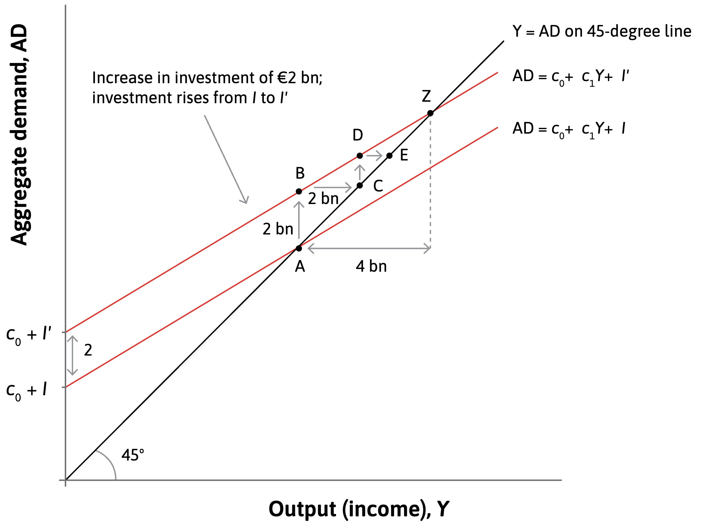
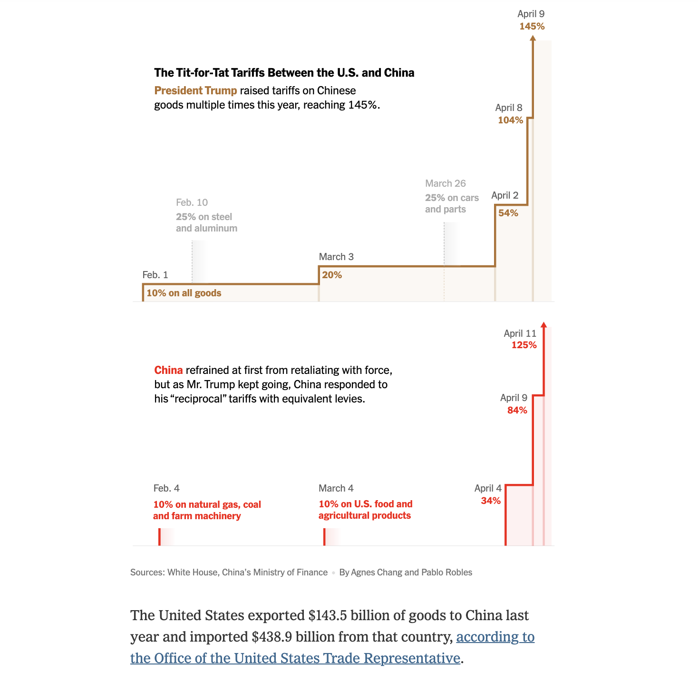

<style>

.center2 {
  margin: 0;
  position: absolute;
  top: 50%;
  left: 50%;
  -ms-transform: translate(-50%, -50%);
  transform: translate(-50%, -50%);
}

</style>

```{r setup, include = FALSE}
knitr::opts_chunk$set(echo = FALSE)
knitr::opts_chunk$set(out.width = "90%")
knitr::opts_chunk$set(fig.align="center")
options(htmltools.dir.version = FALSE)


options(htmltools.dir.version = FALSE)
library(knitr)
library(tidyverse)
library(xaringanExtra)
# set default options
opts_chunk$set(echo=FALSE,
               collapse = TRUE,
               fig.width = 7.252,
               fig.height = 4,
               dpi = 300)
# set engines
knitr::knit_engines$set("markdown")
xaringanExtra::use_tile_view()
xaringanExtra::use_panelset()
xaringanExtra::use_clipboard()
xaringanExtra::use_webcam()
xaringanExtra::use_broadcast()
xaringanExtra::use_share_again()
xaringanExtra::style_share_again(
  share_buttons = c("twitter", "linkedin", "pocket")
)
# uncomment the following lines if you want to use the NHS-R theme colours by default
# scale_fill_continuous <- partial(scale_fill_nhs, discrete = FALSE)
# scale_fill_discrete <- partial(scale_fill_nhs, discrete = TRUE)
# scale_colour_continuous <- partial(scale_colour_nhs, discrete = FALSE)
# scale_colour_discrete <- partial(scale_colour_nhs, discrete = TRUE)
```

.center2[
# Introduction
]

---

```{r out.width="32.5%"}
knitr::include_graphics("https://s1.odilejacob.fr/couvertures/9782738108098.jpg")
```

> Pourquoi la politique de stabilisation est-elle une source d’instabilité économique ?

---

<iframe src="https://ourworldindata.org/grapher/gdp-per-capita-worldbank?tab=line&time=2000..latest&country=USA~DEU~GBR~FRA~JPN~CHN~IND~MEX~BRA" loading="lazy" style="width: 100%; height: 600px; border: 0px none;" allow="web-share; clipboard-write"></iframe>

---

<iframe src="https://ourworldindata.org/grapher/annual-gdp-growth?tab=chart&country=USA~GBR~JPN~DEU~CHN~IND~FRA~MEX~BRA" loading="lazy" style="width: 100%; height: 600px; border: 0px none;" allow="web-share; clipboard-write"></iframe>

---

<iframe src="https://ourworldindata.org/grapher/government-spending-vs-gdp-per-capita?tab=chart" loading="lazy" style="width: 100%; height: 600px; border: 0px none;" allow="web-share; clipboard-write"></iframe>

---
```{r out.width="80%"}
knitr::include_graphics("imgs/fluctuations-in-output-and-the-size-of-government-in-the-us.svg")
```

---
## This Unit

Aggregate demand (GDP) can fluctuate due to consumption and investment decisions.

--

Sometimes the aggregate decisions of households and firms can destabilize the economy.

--

- How can the government stabilize the economy?

--

- Why might government policies be ineffective? 

--

- How can we model the link between output and unemployment?

--

Use a model of aggregate demand to explain how government spending can stabilize the economy

---
.center2[
# The transmission of shocks: The multiplier process
]

---
## The Multiplier model

Simple model that excludes the government and foreign trade.
--
 Then we only have
--
 consumption 
--
 and investment.

--

$$C = c_0 + c_1 Y$$

--

.pull-left[

- $c_0 \rightarrow$ **autonomous consumption**: how much people will spend, independent of their income.

- $c_1 \rightarrow$ **marginal propensity to consume (MPC)**: the effect of one additional unit of income on consumption.

- $0 > c_1 > 1$: only part of an increase in income is consumed; the rest is saved.

]

--

.pull-right[
```{r out.width="120%"}
knitr::include_graphics("imgs/f14-2-a.png")
```

]


---
## The Multiplier model

Simple model that excludes the government and foreign trade. Then we only have consumption and investment.


$$C = c_0 + c_1 Y$$


.pull-left[

- $c_0 \rightarrow$ **autonomous consumption**: how much people will spend, independent of their income.

- $c_1 \rightarrow$ **marginal propensity to consume (MPC)**: the effect of one additional unit of income on consumption.

- $0 > c_1 > 1$: only part of an increase in income is consumed; the rest is saved.

]


.pull-right[
```{r out.width="120%"}
knitr::include_graphics("imgs/f14-2-b.png")
```

]


---
## The Multiplier model

Simple model that excludes the government and foreign trade. Then we only have consumption and investment.


$$C = c_0 + c_1 Y$$


.pull-left[

- $c_0 \rightarrow$ **autonomous consumption**: how much people will spend, independent of their income.

- $c_1 \rightarrow$ **marginal propensity to consume (MPC)**: the effect of one additional unit of income on consumption.

- $0 > c_1 > 1$: only part of an increase in income is consumed; the rest is saved.

]


.pull-right[
```{r out.width="120%"}
knitr::include_graphics("imgs/f14-2-c.png")
```
]

---
## Consumption function

```{r out.width="80%"}
knitr::include_graphics("imgs/f14-2-c.png")
```

---
## Consumption function

Marginal propensity to consume varies across people:

--

- poor households with credit constraints react a lot to variation in current income, so their MPC is large

--

- for wealthy households, current income matters little for current consumption, so their MPC is small

--

Expectations about future income are reflected in autonomous consumption.


```{r out.width="60%"}
knitr::include_graphics("imgs/f14-3.png")
```

---
## Goods market equilibrium: The multiplier diagram

$$output= \textit{aggregate demand for goods produced in the home economy}$$
$$Y = AD$$

--

```{r out.width="55%"}
knitr::include_graphics("imgs/f14-4-a.png")
```

**Goods market equilibrium**: the economy will continue producing at that output level unless something changes spending behaviour.

---
## Goods market equilibrium: The multiplier diagram

$$Y = AD$$

```{r out.width="60%"}
knitr::include_graphics("imgs/f14-4-b.png")
```

The 45-degree line from the origin of the diagram shows all the combinations in which output is equal to aggregate demand, meaning the economy is in goods market equilibrium.

---
## Goods market equilibrium: The multiplier diagram

$$Y = AD = c_0 + c_1 Y$$
```{r out.width="60%"}
knitr::include_graphics("imgs/f14-4-c.png")
```

The first component of aggregate demand is consumption, which is represented by the consumption line.

---
## Goods market equilibrium: The multiplier diagram

$$Y = AD = c_0 + c_1 Y + I$$

```{r out.width="60%"}
knitr::include_graphics("imgs/f14-4-d.png")
```

Adding investment to the consumption line simply leads to a parallel upward shift of the aggregate demand line.

---
### The multiplier process

Changes in output can be greater than the initial change in aggregate demand. 

--

This is because of the circular flow of expenditure, income, and output.

--

$$Y = AD = C + I = c_0 + c_1 Y + I$$

--

$$\Rightarrow Y - c_1 Y = c_0 + I \iff Y \cdot (1 - c_1) = c_0 + I$$
$$\iff Y  = \frac{1}{(1 - c_1)} \cdot (c_0 + I)$$
--

The multiplier represents the relative magnitude of this change.

--

- multiplier = 1: the increase in GDP = the initial increase in spending

--

- multiplier > (<) 1: the total increase in GDP > (<) the initial increase in spending

--

**Decrease on investment**
--
 $\rightarrow$ lower spending
--
 $\rightarrow$ lower production and lower incomes
--
 $\rightarrow$
firms will fire workers
--
 $\rightarrow$ further decline in spending

---
### The multiplier process

```{r out.width="70%"}
knitr::include_graphics("imgs/f14-5-a.png")
```

The economy starts at point A, in goods market equilibrium.

---
### The multiplier process

```{r out.width="70%"}
knitr::include_graphics("imgs/f14-5-b.png")
```

The fall in investment cuts aggregate demand by EUR 1.5 billion, and the economy moves vertically downward from point A to point B.

---
### The multiplier process

```{r out.width="70%"}
knitr::include_graphics("imgs/f14-5-c.png")
```

With demand lower, firms cut back production and reduce employment. With output and employment lower, incomes fall by €1.5 billion. This is the move from B to C.

---
### The multiplier process

```{r out.width="70%"}
knitr::include_graphics("imgs/f14-5-d.png")
```

When household incomes fall, consumption drops—often due to credit constraints. Initially, aggregate consumption falls by 0.6 times the income loss (from point C to point D).

---
### The multiplier process

```{r out.width="70%"}
knitr::include_graphics("imgs/f14-5-e.png")
```

Firms respond by cutting production, output falls, and the economy moves from point D to point E.

---
### The multiplier process

```{r out.width="70%"}
knitr::include_graphics("imgs/f14-5-f.png")
```

The process will go on until the economy reaches point Z.

---
### The multiplier process

```{r out.width="70%"}
knitr::include_graphics("imgs/f14-5-g.png")
```

This goes through point Z and shows the new goods market equilibrium of the economy following the investment shock.

---
### The multiplier process

```{r out.width="70%"}
knitr::include_graphics("imgs/f14-5-h.png")
```

The total fall in output exceeds the initial size of the decline in investment; output has fallen by €3.75 billion.

---
### The multiplier process

```{r out.width="70%"}
knitr::include_graphics("imgs/f14-5-i.png")
```

The total change in output is 2.5 times larger than the initial change in investment.


---
### The multiplier process: Quizz

.pull-left[
The following diagram depicts the change in the aggregate goods market equilibrium when there is a EUR 2 billion increase in investment.

The economy’s marginal propensity to consume is 0.5. Based on this information, which of the following statements is correct?

a) The new goods market equilibrium after the investment increase is E.

b) Aggregate demand increases by a total of €2 billion × 0.5 = €1 billion due to the increase in investment.

c) The multiplier is 2.

d) The distance between C and D is three-quarters the distance between A and B (€1.5 billion).

]

.pull-right[
```{r out.width="110%"}

```
]

---
### The multiplier process: Quizz

❌ a) The new goods market equilibrium after the investment increase is E. 

 - The equilibrium is where the aggregate consumption line intersects with the 45-degree line. Therefore the new equilibrium is Z.

❌ a) Aggregate demand increases by a total of €2 billion × 0.5 = €1 billion due to the increase in investment.

 - The diagram shows that the increase in investment results in a €4 billion increase in aggregate demand.

<span style="color: #008ac4;">
✅ **c) The multiplier is 2. **
</span>

<span style="color: #008ac4;">
**The multiplier is equal to 1/(1 − 0.5) = 2.**
</span>


❌ a) The distance between C and D is three-quarters the distance between A and B (€1.5 billion).

 - The distance between A and B is the initial increase in investment of €2 billion. At C, the output Y has increased by €2 billion compared with B, which results in an increase in the aggregate demand of ΔY (change in Y) × MPC, that is, €2 billion × 0.5 = €1 billion.

---
.center2[
# Household target wealth, collateral, and consumption spending
]

---

Credit constraints and consumption smoothing is reflected in the **slope of the AD curve** and the **size of the multiplier**.
--
 But consumption and saving behaviour can also shift the aggregate demand curve.

--

$$Y = AD = c_0 + c_1 Y + I$$ 

--

.left-column[
**Fall in house prices**

$\rightarrow$ bad news for a household with a mortgage

$\rightarrow$ they may choose to save more (precautionary saving)

$\rightarrow$ their autonomous consumption would fall

**Aggregate demand in the Great Depression**
]

--

.right-column[

```{r out.width="75%"}
knitr::include_graphics("imgs/f14-6-a.png")
```

Point A shows the initial situation of the economy.
]

---

Credit constraints and consumption smoothing is reflected in the **slope of the AD curve** and the **size of the multiplier**.
But consumption and saving behaviour can also shift the aggregate demand curve.

$$Y = AD = c_0 + c_1 Y + I$$ 

.left-column[
**Fall in house prices**

$\rightarrow$ bad news for a household with a mortgage

$\rightarrow$ they may choose to save more (precautionary saving)

$\rightarrow$ their autonomous consumption would fall

**Aggregate demand in the Great Depression**
]


.right-column[

```{r out.width="75%"}
knitr::include_graphics("imgs/f14-6-b.png")
```

This shifts the aggregate demand curve from the pre-crisis to the crisis level.

]

---

Credit constraints and consumption smoothing is reflected in the **slope of the AD curve** and the **size of the multiplier**.
But consumption and saving behaviour can also shift the aggregate demand curve.

$$Y = AD = c_0 + c_1 Y + I$$  

.left-column[
**Fall in house prices**

$\rightarrow$ bad news for a household with a mortgage

$\rightarrow$ they may choose to save more (precautionary saving)

$\rightarrow$ their autonomous consumption would fall

**Aggregate demand in the Great Depression**

]


.right-column[

```{r out.width="75%"}
knitr::include_graphics("imgs/f14-6-c.png")
```

The economy would normally be at point B.

]

---

Credit constraints and consumption smoothing is reflected in the **slope of the AD curve** and the **size of the multiplier**.
But consumption and saving behaviour can also shift the aggregate demand curve.

$$Y = AD = c_0 + c_1 Y + I$$ 

.left-column[
**Fall in house prices**

$\rightarrow$ bad news for a household with a mortgage

$\rightarrow$ they may choose to save more (precautionary saving)

$\rightarrow$ their autonomous consumption would fall

**Aggregate demand in the Great Depression**
]


.right-column[

```{r out.width="75%"}
knitr::include_graphics("imgs/f14-6-d.png")
```

However, output fell by much more than can be explained by the multiplier process alone, which is shown by the move from B to C.

]

---
## Composition of Household Wealth

--

```{r out.width="55%"}
knitr::include_graphics("imgs/f14-7-a.png")
```

Expected future earnings from employment

---
## Composition of Household Wealth

```{r out.width="55%"}
knitr::include_graphics("imgs/f14-7-b.png")
```

Financial wealth

---
## Composition of Household Wealth

```{r out.width="55%"}
knitr::include_graphics("imgs/f14-7-c.png")
```

The household’s ownership stake in the house

---
## Composition of Household Wealth

```{r out.width="55%"}
knitr::include_graphics("imgs/f14-7-d.png")
```

The household’s total broad wealth: This is the sum of the green, blue, and orange rectangles.

---
## Composition of Household Wealth

```{r out.width="55%"}
knitr::include_graphics("imgs/f14-7-e.png")
```

Households also hold debt

---
## Composition of Household Wealth

```{r out.width="55%"}
knitr::include_graphics("imgs/f14-7-f.png")
```

**Household’s net worth** (material wealth): total assets (excluding expected future earnings), which is the value of the house plus financial wealth, and then subtracting the debt it owes.

---
## Composition of Household Wealth

```{r out.width="55%"}
knitr::include_graphics("imgs/f14-7-g.png")
```

**Value of the house**: Household’s equity⁠ in the house, plus what it owes to the bank (the mortgage).

---
## Composition of Household Wealth

```{r out.width="60%"}
knitr::include_graphics("imgs/f14-7-h.png")
```

**Target wealth**: the level of wealth that a household aims to hold, based on its economic goals (or preferences) and expectations.

---

**Precautionary saving**: An increase in saving to restore wealth to its target level. 

--

```{r out.width="50%"}
knitr::include_graphics("imgs/f14-8-a.png")
```

---

**Precautionary saving**: An increase in saving to restore wealth to its target level. 

```{r out.width="50%"}
knitr::include_graphics("imgs/f14-8-b.png")
```

---

**Precautionary saving**: An increase in saving to restore wealth to its target level. 

```{r out.width="50%"}
knitr::include_graphics("imgs/f14-8-c.png")
```

- A fall in expected earnings will lead to cut in consumption (precautionary savings) to restore target wealth.

- Changes in house prices affect consumption through 1) changes in household wealth (home equity), and 2) changes in credit constraints -lower house value makes it more difficult to borrow (greater credit constraint)-.

---

.center2[
# Investment spending
]

---
.center[
## Investment
]


Volatility of investment vs the smoothness of consumption spending.
--
 How do firms make investment decisions? What to do with accumulated profits?
 
--

- *Dividends*: Allocate the funds to managerial or employee salaries, or to dividends for owners.
- *Saving*: Buy an interest-bearing financial asset such as a bond, or retire (pay off) existing debt.
- *Investment abroad*: Build new productive capacity in another country.
- **Investment at home**: Build new capacity in the home country.

--

.pull-left[

- Owner’s discount rate: 
$$\rho$$

- Interest rate on assets: 
$$r$$

- Net profit rate on investment:
$$\Pi$$

]

--

.pull-right[

- Consume the extra income (dividends) if 

$$\rho > r ≥ \Pi$$

- Save the extra income/repay debts if

$$r > \rho ≥ \Pi$$

- Invest (at home or abroad) if Π > ρ ≥ r 

$$\Pi > \rho ≥ r$$

]

--

**A lower interest rate makes investment more likely.**

---

```{r out.width="52%"}
knitr::include_graphics("imgs/f14-9-a.png")
```

Firm A has three investment projects of different scale and rate of profit. They are shown in decreasing order of the expected rate of profit.

---

```{r out.width="52%"}
knitr::include_graphics("imgs/f14-9-b.png")
```

Firm B also has three different investment projects.

---

```{r out.width="52%"}
knitr::include_graphics("imgs/f14-9-c.png")
```

If the interest rate remains at 5%, Firm A goes ahead with project 1 and Firm B does not invest at all. But if the interest rate was 2%, A would undertake projects 1 and 2 and B would undertake all three of its projects.

---

```{r out.width="52%"}
knitr::include_graphics("imgs/f14-9-d.png")
```

The lower panel aggregates the potential investments of the two firms, arranged by the expected profit rate as before.

---

```{r out.width="52%"}
knitr::include_graphics("imgs/f14-9-e.png")
```

Investment in the economy increases after a fall in the interest rate. Five projects go ahead, instead of just one.

---

Higher expected rate of profit $E(\Pi)$ increases investment, holding $r$ constant.

```{r out.width="80%"}
knitr::include_graphics("imgs/f14-10a-a.png")
```

With the interest rate equal to 5%, only one project will go ahead.

---

Higher expected rate of profit $E(\Pi)$ increases investment, holding $r$ constant.

```{r out.width="80%"}
knitr::include_graphics("imgs/f14-10a-b.png")
```

Improvement in business environment (such as fall in the risk of expropriation by the government) also increases investment.

---

Higher expected rate of profit $E(\Pi)$ increases investment, holding $r$ constant.

```{r out.width="80%"}
knitr::include_graphics("imgs/f14-10a-b.png")
```

For the same interest rate, investment rises: two more projects go ahead.

---

Higher forecast demand raises the desired size of each project, so investment rises.

```{r out.width="80%"}
knitr::include_graphics("imgs/f14-10b-a.png")
```

With the interest rate equal to 2%, and the initial desired capacity, investment is shown by the darker coloured blocks.

---

Higher forecast demand raises the desired size of each project, so investment rises.

```{r out.width="80%"}
knitr::include_graphics("imgs/f14-10b-b.png")
```

Pressure on existing capacity from higher forecast demand raises the desired size of each project, so investment rises to include the lighter coloured blocks.

---
## Aggregate investment function

```{r out.width="55%"}
knitr::include_graphics("imgs/f14-10c-a.png")
```

In an economy with many thousands of firms, all their potential investment projects are represented by a downward-sloping aggregate investment function.

---
## Aggregate investment function

```{r out.width="55%"}
knitr::include_graphics("imgs/f14-10c-b.png")
```

In response to a fall in the interest rate, investment increases from C to E.

---
## Aggregate investment function

```{r out.width="55%"}
knitr::include_graphics("imgs/f14-10c-c.png")
```

How investment spending in the economy as a whole depends on other variables (interest rate and profit expectations). 

Investment is not very sensitive to interest rate. Instead, the shift factors are much more important.


---
## Aggregate investment function: Quizz

.pull-left[
a) Ceteris paribus, an increase in the interest rate would lead to a fall in investment due to an inward shift of the investment line.

b) A rise in corporate tax would shift the investment line outwards.

c) A forecast of a permanent demand increase shifts the investment line outwards.

d) A steeper line indicates the higher sensitivity of the level of aggregate investment to changes in interest rate.
]

.pull-right[
```{r out.width="100%"}
knitr::include_graphics("imgs/f14-10c-c.png")
```
]

---
## Aggregate investment function: Quizz

❌ a) Ceteris paribus, an increase in the interest rate would lead to a fall in investment due to an inward shift of the investment line.

 - The investment line represents the relationship between investment and interest rate, ceteris paribus. Therefore the fall in investment would be shown by a movement up the original line (from E to C for example), not a shift of the line.

❌ b) A rise in corporate tax would shift the investment line outwards.

 - A rise in corporate tax would decrease the expected profit rate, shifting the investment line inwards. This results in a fall in investment.

<span style="color: #008ac4;">
✅ **c) A forecast of a permanent demand increase shifts the investment line outwards.**
</span>

<span style="color: #008ac4;">
Higher demand makes it profitable to invest in larger projects, increasing investment at a given interest rate.
</span>

❌ b) A steeper line indicates the higher sensitivity of the level of aggregate investment to changes in interest rate.
 
 - A steeper line means smaller changes in investment when the interest rate moves, that is, lower sensitivity of investment to the interest rate.

---

.center2[
# The multiplier model: Including the government and net exports
]

---
## Adding government and net exports to aggregate demand

$$AD = C + I + G + X - M$$
 
--

.pull-left[

Government enters AD via

- Government spending: exogenous $\rightarrow$ shifts AD curve upwards

$$G$$

- Consumption **C**: household’s MPC is out of disposable income (1-t)Y

$$C= c_0 + c_1(1-t)Y$$

- Investment: depends on the interest rate and after-tax rate of profit


$$I= I(r)$$

]

--

.pull-right[

- Exports: exogenous

$$X$$

- Imports: depends on domestic income.

$$M = mY$$

Marginal propensity to import = The fraction of each additional unit of income that is spent on imports

]

--

$$AD = Y = c_0 + c_1(1 - t) Y + I(r) + G + X - mY$$

---
## The (complete) multiplier model

$$AD = Y = c_0 + c_1(1 - t) Y + I(r) + G + X - mY$$

--

Saving, taxation and imports are referred to as leakages from the circular flow of income.
--
 They reduce the size of the multiplier.
 
--

- some household income goes directly to the government as taxes
- some income is used to buy goods abroad

--

$$Y = 
\underbrace{
\frac{1}{1 - c_1 (1 - t) + m}
}_{\text{multiplier}} 
\times 
\underbrace{
(c_0 + I(r) + G + X)
}_{\text{demand that doesn't depend on income}}$$

--

Smaller multiplier = flatter AD curve. 

$$\underbrace{ \frac{1}{1 - c_1 (1 - t) + m}}_{\text{multiplier with imports and goverment}}  < \underbrace{\frac{1}{1 - c_1}}_{\text{multiplier}}$$


---
.center2[
# Fiscal policy: How governments can dampen and amplify fluctuations
]

---
## Stabilising the economy

There are three main ways that government spending and taxation can dampen fluctuations in the economy:

--

- The size of government: government spending on consumption and investment is usually stable.
  - Higher tax rate lowers the multiplier
- Automatic stabilization mechanisms: Unemployment insurance helps households smooth consumption
  - Failure of private market because of correlated risk, hidden actions, hidden attributes
- **Fiscal policy**

--

.pull-left[

**The paradox of thrift**: the aggregate attempt to increase savings leads to a fall in aggregate income.

- A family worried about their falling wealth cuts spending and saves more

- But in the economy as a whole, spending and earning go together

**Fallacy of composition:** what is true for one part of the economy (a single household) is not true of the whole economy.


]


.pull-right[

```{r out.width="60%"}
knitr::include_graphics("imgs/14-john-maynard-keynes.jpeg")
```

]

---
## Fiscal stimulus

Temporary increase in government spending or a temporary cut in taxation

--

```{r out.width="62.5%"}
knitr::include_graphics("imgs/f14-11a-a.png")
```

The economy starts at point A, in goods market equilibrium, at which aggregate demand is equal to output.

---
## Fiscal stimulus

Temporary increase in government spending or a temporary cut in taxation

```{r out.width="62.5%"}
knitr::include_graphics("imgs/f14-11a-b.png")
```

The economy moves into recession. This occurs after a fall in consumer confidence, reducing $c_0$. The aggregate demand line shifts downward and the economy moves from point A to point B.

---
## Fiscal stimulus

Temporary increase in government spending or a temporary cut in taxation

```{r out.width="62.5%"}
knitr::include_graphics("imgs/f14-11a-c.png")
```

The government then increases spending, from G to G′, in order to counteract the decline in aggregate demand. AD shifts back up and the economy moves to point C.

---
## Fiscal stimulus

Temporary increase in government spending or a temporary cut in taxation

```{r out.width="62.5%"}
knitr::include_graphics("imgs/f14-11a-c.png")
```

The rise in G operates via the multiplier, so the increase in Y will typically be greater than the increase in G.

---
## Fiscal stimulus

```{r out.width="80%"}
knitr::include_graphics("https://i.imgflip.com/1cizio.jpg")
```

---
## Financing fiscal stimulus

```{r out.width="80%"}
knitr::include_graphics("https://media.giphy.com/media/26ybwpPwBQ7tblT8c/giphy.gif")
```


- In a recession, budget deficit is part of its stabilizing role.

- When government chooses to reduce its deficit, this may amplify fluctuations in the economy.

---
## Austerity policy

Government tries to improve its budgetary position in a recession by cutting its spending.

--

```{r out.width="62.5%"}
knitr::include_graphics("imgs/f14-11b-a.png")
```

The economy starts at point A in goods market equilibrium, at which aggregate demand is equal to output.

---
## Austerity policy

Government tries to improve its budgetary position in a recession by cutting its spending.

```{r out.width="62.5%"}
knitr::include_graphics("imgs/f14-11b-b.png")
```

The economy moves into recession. This occurs after a fall in consumer confidence, reducing $c_0$. The aggregate demand line shifts downward and the economy moves from point A to point B.

---
## Austerity policy

Government tries to improve its budgetary position in a recession by cutting its spending.

```{r out.width="62.5%"}
knitr::include_graphics("imgs/f14-11b-c.png")
```

Suppose that the government then reduces spending from G to G′, in a bid to offset the deterioration of its budget balance. The recession then feeds back to raise government transfers and reduce tax revenue.

---
## Austerity policy

Government tries to improve its budgetary position in a recession by cutting its spending.

```{r out.width="62.5%"}
knitr::include_graphics("imgs/f14-11b-c.png")
```

Austerity policy can reinforce a recession by further reducing aggregate demand.

---

```{r out.width="75%"}
knitr::include_graphics("imgs/f14-12.png")
```

---

.center[
## How responsive is the economy to government spending?
]

- In reality, the multiplier also depends on:

  -  rate of capacity utilisation (the phase of the business cycle):  with fully employed resources, an increase in government spending would **crowd out** private spending

  - expectations of the private sector: the multiplier could be negative if rising fiscal deficit erodes consumer confidence

--


.pull-left[

- After the 2008 Financial crisis, a heated political debate

  - Robert Barro: $\leq 0.8$
  - President Obama’s Council of Economic Advisors: $\approx 1.6$
  - Alan Auerbach and Yuriy Gorodnichenko: **depends**
      - recessions: $\in (1.5, 2)$
      - expansions: $\approx 0.5$

]

.pull-right[
```{r out.width="100%"}
knitr::include_graphics("imgs/14_auerbach_gorodnichenko.png")
```
]

---
.center2[
# The government’s finances
]

---
## The government’s finances

.pull-left[
**Revenue**

- income taxes
- spending taxes (VAT, sales tax)
- wealth taxes (inheritance taxes)

]


.pull-left[
**Expenditure**

- health
- education
- defence
- public investment (roads or schools)

]

--

**Government primary deficit**

$$ \textit{primary budget deficit} = G − T$$

$$\textit{Budget balance} = T - G $$

--

| | Budget | | 
|----|
| in balance: $G = T$ | deficit: $G > T$ | surplus: $G < T$ |

--

- procyclical

- the government must borrow to cover the gap between spending and revenue, by **issuing bonds**


---
## Government debt

- **Government debt**: sum of all the bonds sold over time to finance budget deficit – matured bonds (repaid debt).

--

- **Sovereign debt crisis**: a situation in which government bonds come to be considered risky (default risk).

--

.pull-left[

- A large stock of debt relative to GDP can be a problem because the government has to pay interest on its debt.

- There is no point at which the government has to pay off all its stock of debt—it can roll it over instead by issuing new bonds.

- Indebtedness can fall
  - if the primary budget balance is positive
  - if GDP is growing faster than government debt
  - if inflation is high (real value of debt falls)

]

.pull-right[

```{r out.width="100%"}
knitr::include_graphics("imgs/uk-government-debt-as-a-percentage-of-gdp-17272016.svg")
```

]

---
.center2[
# Fiscal policy and the rest of the world
]

---
## Foreign markets and aggregate demand

```{r, out.width="55%"}

```

---
## Foreign markets and aggregate demand

```{r, out.width="55%"}

```

---
## Foreign markets and aggregate demand

- Fluctuations in the growth rate of important markets abroad influence the domestic economy via demand for exports.

- Demand for imports dampens domestic fluctuations (marginal propoensity to import).

- Foreign trade limits the use of fiscal stimulus if the marginal propensity to import is large.

---
## Foreign markets and aggregate demand: France and Germany

A striking example comes from France in the 1980s. 

At the start of the 1980s, the French economy remained weak following the oil shocks of the 1970s, which disrupted the world economy. 

In 1981, François Mitterrand won the presidential election. 

His appointed prime minister, Pierre Mauroy, implemented a program to stimulate aggregate demand through increased government spending and tax cuts (in the multiplier model, this is a rise in G and a fall in t, the tax rate).

---
## Foreign markets and aggregate demand: France and Germany

```{r out.width="75%"}
knitr::include_graphics("imgs/f14-16.png")
```

The figure presents the outcomes for three years. In the first year, there was no stimulus, in the second, there was a fiscal stimulus in France, and the third year was the year following the stimulus.

---
## Foreign markets and aggregate demand: France and Germany

```{r out.width="75%"}
knitr::include_graphics("imgs/f14-16.png")
```

France’s budget balance turned negative after 1980, with a deficit exceeding 3% of GDP by 1983, while Germany maintained a balanced budget.

---
## Foreign markets and aggregate demand: France and Germany

```{r out.width="75%"}
knitr::include_graphics("imgs/f14-16.png")
```

France’s expansionary fiscal policy in 1982 led to a brief increase in growth, but most of the demand boosted imports, benefiting countries like Germany and Japan instead.

---
## Foreign markets and aggregate demand: France and Germany

```{r out.width="75%"}
knitr::include_graphics("imgs/f14-16.png")
```

The French stimulus failed to significantly improve domestic output or employment and caused pressure on the French franc, requiring three devaluations by 1983.

---
## Foreign markets and aggregate demand: France and Germany

```{r out.width="75%"}
knitr::include_graphics("imgs/f14-16.png")
```

The policy highlighted the low effectiveness of unilateral fiscal stimulus in an open economy, where much of the stimulus leaked abroad.

---
## Foreign markets and aggregate demand: France and Germany

```{r out.width="75%"}
knitr::include_graphics("imgs/f14-16.png")
```

Coordinated fiscal expansion across major European economies might have yielded better results, illustrating the importance of accounting for international economic interdependence.

---

.center2[
# Aggregate Demand and unemployment
]

---
## Aggregate Demand and unemployment

.pull-left[

**Supply-side** = labour market model

Medium-run model: wages and prices can change, but capital stock, technology and institutions are fixed

]


.pull-right[

**Demand-side** = multiplier model

Short-run model: all variables fixed

]

.center[
**Production function connects employment (N) and output (Y)**
]

--

.pull-left[

```{r out.width="100%"}
knitr::include_graphics("imgs/f14-18-a.png")
```

]


.pull-right[

```{r out.width="100%"}
knitr::include_graphics("imgs/f14-18-b.png")
```

]

---

```{r out.width="50%"}
knitr::include_graphics("imgs/f14-19-a.png")
```

---

```{r out.width="50%"}
knitr::include_graphics("imgs/f14-19-b.png")
```

---

```{r out.width="50%"}
knitr::include_graphics("imgs/f14-19-c.png")
```

---
.center[
## Fiscal policy and Covid-19
]


```{r out.width="75%"}
knitr::include_graphics("imgs/covid-19 stimulus.png")
```

.center[
[Real Time Inequality](https://realtimeinequality.org/?id=income&incomeend=03012022&incomefreq=monthly&incomegroups=Top%2010%25&incomegroups=Middle%2040%25&incomegroups=Bottom%2050%25&incomegroups=Total&incomestart=01012019&incometype=factor_income&incomeunit=Adults&incomey=growth)
]

---
.center2[
# Summary
]

---
.center[
## Summary
]

- The aggregate demand function and its components: $AD = C + I + G + NX$

- Shocks to aggregate demand are amplified by the multiplier

- Government can stabilise economic fluctuations
  - Automatic stabilisers
  - Fiscal stimulus – offset decline in aggregate demand from the private sector
  - Austerity policies amplify the negative demand shock

- Fiscal stimulus in a recession must be reversed in a boom to prevent government debt from escalating (sovereign debt crisis)


