<style>

.center2 {
  margin: 0;
  position: absolute;
  top: 50%;
  left: 50%;
  -ms-transform: translate(-50%, -50%);
  transform: translate(-50%, -50%);
}

</style>

```{r setup, include = FALSE}
knitr::opts_chunk$set(echo = FALSE)
knitr::opts_chunk$set(out.width = "90%")
knitr::opts_chunk$set(fig.align="center")

options(htmltools.dir.version = FALSE)
library(knitr)
library(tidyverse)
library(xaringanExtra)
# set default options
opts_chunk$set(echo=FALSE,
               collapse = TRUE,
               fig.width = 7.252,
               fig.height = 4,
               dpi = 300)
# set engines
knitr::knit_engines$set("markdown")
xaringanExtra::use_tile_view()
xaringanExtra::use_panelset()
xaringanExtra::use_clipboard()
xaringanExtra::use_webcam()
xaringanExtra::use_broadcast()
xaringanExtra::use_share_again()
xaringanExtra::style_share_again(
  share_buttons = c("twitter", "linkedin", "pocket")
)
# uncomment the following lines if you want to use the NHS-R theme colours by default
# scale_fill_continuous <- partial(scale_fill_nhs, discrete = FALSE)
# scale_fill_discrete <- partial(scale_fill_nhs, discrete = TRUE)
# scale_colour_continuous <- partial(scale_colour_nhs, discrete = FALSE)
# scale_colour_discrete <- partial(scale_colour_nhs, discrete = TRUE)
```

--

'Potato blight' - Great Famine (Ireland, 1845 - 1852) 
 
--

```{r out.width= "27.5%"}
knitr::include_graphics("https://upload.wikimedia.org/wikipedia/commons/9/97/Skibbereen_by_James_Mahony%2C_1847.JPG")
```

By the time the Irish famine ended, about a million people out of an initial total of 8.5 million had died.

---
'Potato blight' - Great Famine (Ireland, 1845 - 1852) 
 
```{r out.width= "27.5%"}
knitr::include_graphics("https://upload.wikimedia.org/wikipedia/commons/9/97/Skibbereen_by_James_Mahony%2C_1847.JPG")
```

Nassau Senior consistently opposed British government famine relief

> feared the famine of 1848 in Ireland would not kill more than a million people, and that would scarcely be enough to do much good.

--

A result of **Malthusianism**, a key early 19th-century economic theory by Thomas Malthus in *An Essay on the Principle of Population*.

---

**Malthusianism**, a key early 19th-century economic theory by Thomas Malthus in *An Essay on the Principle of Population*.

--

Malthus held that a sustained increase in income per capita would be impossible.

--

1. **Malthusian Poverty Trap:**  
   $$
   \uparrow \textit{Technology} \Rightarrow \; \uparrow \textit{Productivity} \Rightarrow  \; \uparrow \textit{Income} \Rightarrow  \;  \uparrow \textit{Birth Rate} \Rightarrow  \; \uparrow \textit{Population Growth}
   $$
 $$
   \Rightarrow  \; \downarrow \textit{Living Standards} \Rightarrow  \;  \textit{Subsistence Level} \Rightarrow  \;  \textit{No Further Growth}
   $$
--

But in Malthus’ lifetime something big was happening all around him...

---

```{r}
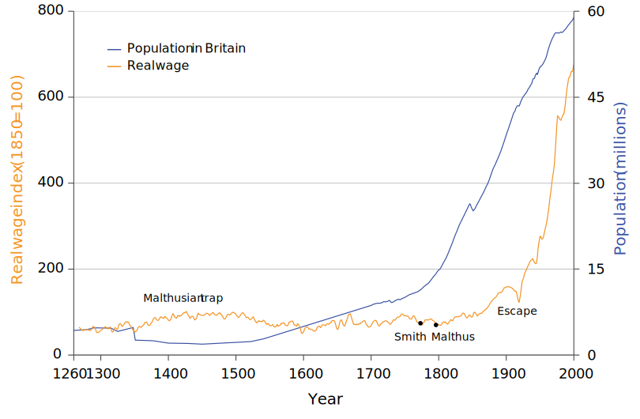
```

---

.center2[
# What caused the break from the Malthusian trap?
]


---

.center2[
# Techological change, Population, and Growth
]

---
## **Introduction: Technological Change, Population, and Growth**  

--

#### **1) The Capitalist and Industrial Revolutions**  
- Why did the **Industrial Revolution** occur in Britain?  
- How did **economic models** help explain this transformation?  
- The role of **wages, machinery costs, and relative prices** in driving economic decisions.  

--

#### **2) The Role of Economic Models**  
- Models help us understand **why and when technological revolutions happen**.  
- They allow us to explore both **economic growth** and **stagnation** over time.  
- Key question: **What conditions enabled sustained economic progress?**  

--

#### **3) Understanding Technological Progress**  
- **How did the technological revolution start?**  
- **Why did it not start earlier?**  
- **Why did it start in England?**  

---
.center2[
# Economists, historians, and the Industrial Revolution
]

---

```{r, out.width="80%"}

```


---
## Economists, historians, and the Industrial Revolution


Why did the Industrial Revolution happen first in the 18th Century, on an island off the coast of Europe?

--

Many alternative explanations
--
 provided by historians, economic historians, and economists
--

- **Robert Allen**: relatively high cost of labour & cheap local sources of energy

--

- **Joel Mokyr**: Europe’s scientific revolution and Enlightenment

--

- **David Landes**: political and cultural characteristics of nations as a whole

--

- **Gregory Clark**: cultural attributes such as hard work and savings

--

- **Kenneth Pomeranz**: abundance of coal and access to colonies

--

Economists can learn from historians, but historical arguments are often too imprecise for economic models. Conversely, historians may find economic models too simplistic. 

--

(If you're interested in **drama, academic gossip, or debates** between historians and economists, I highly recommend this [post](https://www.noahpinion.blog/p/on-the-wisdom-of-the-historians).)

---
.center2[
# Economic models: How to see more by looking at less
]

---
## Economic models: See more by looking at less

We need to be able to stand back and look at the big picture. 

--

They often use mathematical equations and graphs as well as words and pictures. 

--

A good model:

--

- **Is clear**: it helps us better understand something important

--

- **Predicts accurately**: its predictions are consistent with evidence 

--

- **Improves communication**: it helps us to understand what we agree (and disagree) about 

--

- **It is useful**: We can use it to find ways to improve how the economy works

---
## Economic models: See more by looking at less

We need to be able to stand back and look at the big picture. 

They often use mathematical equations and graphs as well as words and pictures. 

.pull-left[
A good model:

- **Is clear**: it helps us better understand something important

- **Predicts accurately**: its predictions are consistent with evidence 

- **Improves communication**: it helps us to understand what we agree (and disagree) about 

- **It is useful**: We can use it to find ways to improve how the economy works
]

.pull-right[
```{r out.width="90%"}
knitr::include_graphics("imgs/tube-map.gif")
```
]

--

Bad models can result in disastrous policies. To have confidence in a model, we need to see whether it is consistent with evidence.

---
.center2[
# Basic concepts: Prices, costs, and innovation rents
]

---
## Key concepts in economic models

--

**Ceteris paribus** = simplification that involves "holding other things (in/outside the model) constant”. 

--

**Incentives** = economic rewards or punishments, which influence the benefits and costs of alternative courses of action.

--

**Relative prices** help us compare alternatives.

--

**Economic rent** = the benefit received from a choice, taking into account the next best alternative (reservation option)

$$ \textit{economic rent} = \textit{benefit from option taken}  -  \textit{benefit from next best option} $$ 


--
**Reservation option**: A person’s next best alternative among all options in a particular transaction.

--

**Equilibrium of a model**: situation that is self-perpetuating. Something of interest does not change unless an external force is introduced that alters the model's description of the situation.

---
.center2[
# Modelling a dynamic economy: Technology and costs
]


---

## Technology 

--

**Technology**: A process that uses inputs to produce an output.

--

.left-column[

Produce 100 metres of cloth, using as inputs labour (number of workers) and energy (tonnes of coal).

| Tech.| Workers | Coal |
| --- | --- | --- |
| A |	1 | 6 |
| B | 4 | 2 |
| C |	3 | 7 |
| D | 5 | 5 |
| E | 10 | 1 |

]

--

.right-column[

```{r}
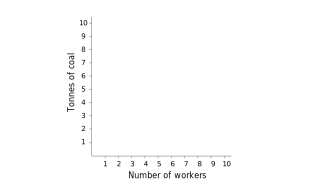
```

]

---

## Technology 


**Technology**: A process that uses inputs to produce an output.


.left-column[

Produce 100 metres of cloth, using as inputs labour (number of workers) and energy (tonnes of coal).

| Tech.| Workers | Coal |
| --- | --- | --- |
| A |	1 | 6 |
| B | 4 | 2 |
| C |	3 | 7 |
| D | 5 | 5 |
| E | 10 | 1 |

]


.right-column[

```{r}
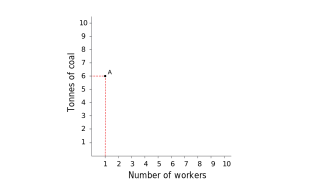
```

]

---

## Technology 


**Technology**: A process that uses inputs to produce an output.


.left-column[

Produce 100 metres of cloth, using as inputs labour (number of workers) and energy (tonnes of coal).

| Tech.| Workers | Coal |
| --- | --- | --- |
| A |	1 | 6 |
| B | 4 | 2 |
| C |	3 | 7 |
| D | 5 | 5 |
| E | 10 | 1 |

]


.right-column[

```{r}
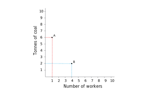
```

]

---

## Technology 


**Technology**: A process that uses inputs to produce an output.


.left-column[

Produce 100 metres of cloth, using as inputs labour (number of workers) and energy (tonnes of coal).

| Tech.| Workers | Coal |
| --- | --- | --- |
| A |	1 | 6 |
| B | 4 | 2 |
| C |	3 | 7 |
| D | 5 | 5 |
| E | 10 | 1 |

]

.right-column[

```{r}
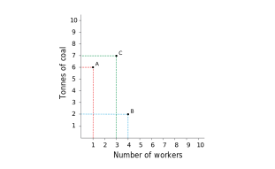
```

]

---
## Technology 

**Technology**: A process that uses inputs to produce an output.


.left-column[

Produce 100 metres of cloth, using as inputs labour (number of workers) and energy (tonnes of coal).

| Tech.| Workers | Coal |
| --- | --- | --- |
| A |	1 | 6 |
| B | 4 | 2 |
| C |	3 | 7 |
| D | 5 | 5 |
| E | 10 | 1 |

]


.right-column[

```{r}
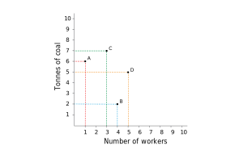
```

]

---
## Technology 

**Technology**: A process that uses inputs to produce an output.


.left-column[

Produce 100 metres of cloth, using as inputs labour (number of workers) and energy (tonnes of coal).

| Tech.| Workers | Coal |
| --- | --- | --- |
| A |	1 | 6 |
| B | 4 | 2 |
| C |	3 | 7 |
| D | 5 | 5 |
| E | 10 | 1 |

]


.right-column[

```{r}
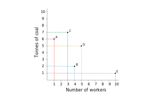
```

]

---

Firms choose between technologies (specific combinations of inputs) to produce outputs.

--

```{r out.width="70%"}

```


---

Firms choose between technologies (specific combinations of inputs) to produce outputs.


```{r out.width="70%"}
knitr::include_graphics("imgs/figure-02-04-b.svg")
```

Technology A dominates the C-technology: the same amount of cloth can be produced using A with fewer inputs of labour and energy. This means that, whenever A is available, you would never use C.

---

Firms choose between technologies (specific combinations of inputs) to produce outputs.


```{r out.width="70%"}
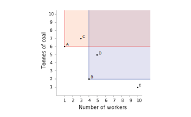
```

Technology B dominates the D-technology: the same amount of cloth can be produced using B with fewer inputs of labour and energy. Note that B would dominate any other technology that is in the shaded area above and to the right of point B.

---

Firms choose between technologies (specific combinations of inputs) to produce outputs.


```{r out.width="70%"}
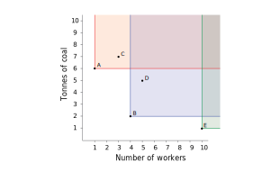
```

Technology A dominates C; technology B dominates D. The E-technology does not dominate any of the other available technologies. We know this because none of the other four technologies are in the area above and to the right of E.

---

## Firm’s choice: minimising cost 

--

Firms aim to maximise their profit,
--
 which means producing cloth at the least possible cost.
 
--

This is why the firms’ choice of technology depends on economic information about relative prices of inputs.

--

$$ cost = (wage \times workers ) + (\textit{price of a tonne of coal} \times \textit{number of tonnes of coal}) $$

--

$$ c = (w \times L ) + (p \times R) $$

--

$$ c = w L + p R $$

--
Then

--

$$ p R = c - w L $$

--

$$ R = \frac{c}{p} - \frac{w}{p} L $$
--

** $R$ =  Isocost lines**: combinations of inputs that give the same cost (slope = relative price of inputs)

--

** $- \frac{w}{p}$ **: slope $\rightarrow$ **relative price of labour**

---

**Suppose that the wage is £10 and the price of coal is £20 per tonne**
--
 $\rightarrow \textit{Relative price}:  \frac{w}{p} = \frac{10}{20} = .5$ 

--

```{r out.width="70%"}
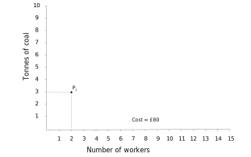
```

--

The total cost of employing 2 workers with 3 tonnes of coal is (2 × 10) + (3 × 20) = £80.

---

**Suppose that the wage is £10 and the price of coal is £20 per tonne** $\rightarrow \textit{Relative price}:  \frac{w}{p} = \frac{10}{20} = .5$ 

```{r out.width="70%"}
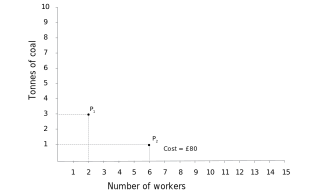
```


If the number of workers is increased to 6, costing £60, and the input of coal is reduced to 1 tonne, the total cost will still be £80.

---

**Suppose that the wage is £10 and the price of coal is £20 per tonne** $\rightarrow \textit{Relative price}:  \frac{w}{p} = \frac{10}{20} = .5$


```{r out.width="70%"}
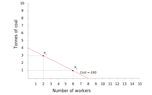
```


The straight line through P1 and P2 joins together all the points where the total cost is £80.

---

**Suppose that the wage is £10 and the price of coal is £20 per tonne** $\rightarrow \textit{Relative price}:  \frac{w}{p} = \frac{10}{20} = .5$


```{r out.width="70%"}
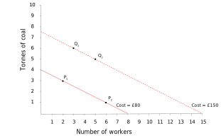
```


At point Q1 (3 workers, 6 tonnes of coal) the total cost is £150. 
In point Q2, if 2 more workers are employed, the input of coal should be reduced by 1 tonne to keep the cost at £150. This is the £150 isocost line.

---

**Suppose that the wage is £10 and the price of coal is £20 per tonne** $\rightarrow \textit{Relative price}:  \frac{w}{p} = \frac{10}{20} = .5$


```{r out.width="70%"}
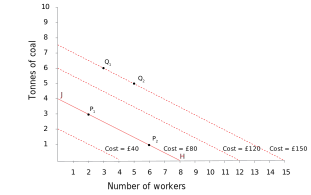
```


If prices of inputs are fixed, the isocost lines are parallel. A simple way to draw any line is to find the end points: for example, the £80 line joins the points J (4 tonnes of coal and no workers) and H (8 workers, no coal).

---

**Suppose that the wage is £10 and the price of coal is £20 per tonne** $\rightarrow \textit{Relative price}:  \frac{w}{p} = \frac{10}{20} = .5$


```{r out.width="70%"}

```


The slope of the isocost lines is negative. In this case the slope is −0.5, because at each point, if you hired one more worker, costing £10, and reduced the amount of coal by 0.5 tonnes, saving £10.

---

**Suppose that the wage is £10 and the price of coal is £20 per tonne** $\rightarrow \textit{Relative price}:  \frac{w}{p} = \frac{10}{20} = .5$


```{r out.width="70%"}
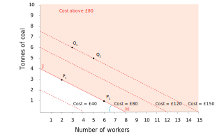
```


Points above an isocost line cost more.

---

**Suppose that the wage is £10 and the price of coal is £20 per tonne** $\rightarrow \textit{Relative price}:  \frac{w}{p} = \frac{10}{20} = .5$


```{r out.width="100%"}
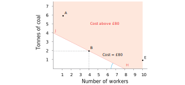
```


Which is the least-cost technology?
--
 **B**

---

**Suppose that the wage is £10 and the price of coal is £20 per tonne** $\rightarrow \textit{Relative price}:  \frac{w}{p} = \frac{10}{20} = .5$


| Technology | Number of workers | Coal required (tonnes) | Total cost (£) |
|------------|------------------|------------------------|---------------|
| B          | 4                | 2                      | 80            |
| A          | 1                | 6                      | 130           |
| E          | 10               | 1                      | 120           |

*Wage £10, cost of coal £20 per tonne*

Which is the least-cost technology? **B**

---
.center2[
# Modelling a dynamic economy: Innovation and profit
]

---
## How does a cost-reducing innovation raise the profits of the firm?

**Suppose that the price of coal falls to £5 while the wage remains at £10**
--
 $\rightarrow \textit{Relative price}:  \frac{w}{p} = \frac{10}{5} = 2$
 
---
**Suppose that the price of coal falls to £5 while the wage remains at £10**
 $\rightarrow \textit{Relative price}:  \frac{w}{p} = \frac{10}{5} = 2$

```{r out.width="70%"}
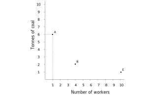
```

--

A-technology, which is more energy-intensive than the others, can produce 100 metres of cloth at a lower cost than B or E.

---

**Suppose that the price of coal falls to £5 while the wage remains at £10** $\rightarrow \textit{Relative price}:  \frac{w}{p} = \frac{10}{5} = 2$
 

```{r out.width="70%"}
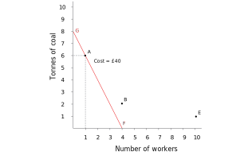
```


The A-technology is on the isocost line FG. At any point on this line, the total cost of inputs is £40. Technologies B and E are above this line, with higher costs.


---

**Suppose that the price of coal falls to £5 while the wage remains at £10** $\rightarrow \textit{Relative price}:  \frac{w}{p} = \frac{10}{5} = 2$
 

```{r out.width="70%"}
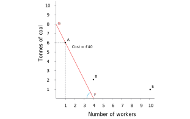
```


The slope of the isocost line is equal to −(10/5) = −2. If you spent £10 on labour by hiring an extra worker, you could reduce coal by 2 tonnes and keep the total cost at £40.

---
## How does a cost-reducing innovation raise the profits of the firm?

At the original relative price, B is the lower cost technology


```{r out.width="60%"}
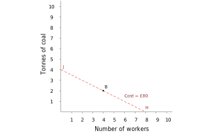
```

When the wage is £10 and the price of coal is relatively high at £20, the cost of producing 100 metres of cloth using technology B is £80: choosing the B-technology puts the firm on the HJ isocost curve.

---
## How does a cost-reducing innovation raise the profits of the firm?

The price of coal falls to £5

```{r out.width="60%"}
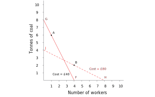
```

If the price of coal falls relative to the wage as shown by the isocost curve FG, then using the A-technology, which is more energy-intensive than B, costs £40. 


---

## How does a cost-reducing innovation raise the profits of the firm?

The price of coal falls to £5

| Technology | Number of workers | Coal required (tonnes) | Total cost (£) |
|------------|------------------|------------------------|---------------|
| B          | 4                | 2                      | 50            |
| A          | 1                | 6                      | 40            |
| E          | 10               | 1                      | 105           |

*Wage £10, cost of coal £5 per tonne*

If the price of coal falls relative to the wage as shown by the isocost curve FG, then using the A-technology, which is more energy-intensive than B, costs £40. 

---

## How does a cost-reducing innovation raise the profits of the firm?

B now costs more than A

```{r out.width="60%"}
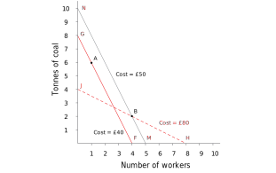
```

At the new relative prices, the B-technology is on the isocost line MN, where the cost is £50. Switching to technology A will be cheaper.

---


$$ profits = revenue - costs $$
--

Switching from A to B:

$$ \Delta profits =  \Delta revenue -  \Delta costs =  0 -  (40 - 50) = 10 $$

--

The economic rent for a firm switching from B to A is £10 per 100 metres of cloth, which is the cost reduction made possible by the new technology 

**Schumpeterian (innovation) rents**

--

.pull-left[

Joseph Schumpeter: the adoption of technological improvements by **entrepreneurs** --first adopters-- a key part of his explanation for the dynamism of capitalism. 

**Creative Destruction**: the process by which old technologies and the firms that do not adapt are swept away by the new, because they cannot compete in the market.
]

--

.pull-right[
```{r out.width="80%"}
knitr::include_graphics("https://media.giphy.com/media/xT0xeJpnrWC4XWblEk/giphy-downsized-large.gif")
```
]

---
.center2[
# The British Industrial Revolution and incentives for new technologies
]

---
## Technological change in Industrial Revolution

--

One of the first sectors to undergo technological change was textiles

--

- Before the Industrial Revolution, making clothes for the household were time-consuming tasks

--

- By the late 19th century, a single spinning mule operated by a very small number of people could replace more than 1,000 spinsters

--

- These machines were powered by water wheels and later coal-powered steam engines instead of using human labour

--


```{r out.width="37%"}
knitr::include_graphics("https://upload.wikimedia.org/wikipedia/commons/0/04/Zeichnung_Spinning_jenny.jpg")
```


---

## Why Britian?

--

**Hypothesis**:
--
 When the cost of labour increased relative to the cost of energy, there were innovation rents to be earned from a switch to the energy-intensive technology.

--

.pull-left[
```{r}
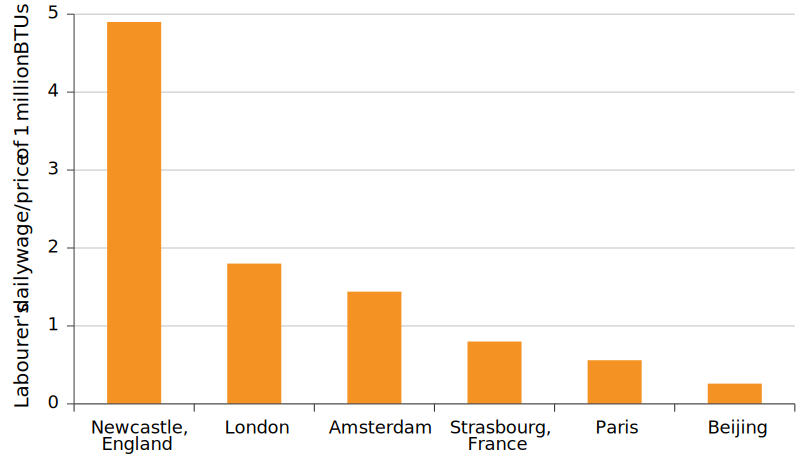
```
]

.pull-right[
```{r}
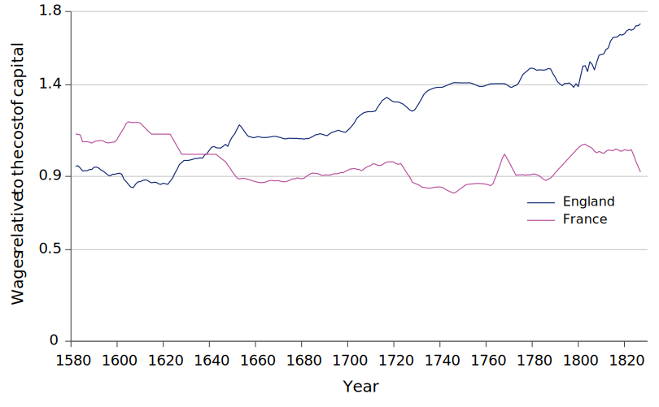
```
]

--

The incentive to replace workers with machines was increasing in England during this time, but this was not true in France.

---
## Shift to a lower-cost technology

--

The combination of capacity to innovate and changing relative prices of inputs led to a switch to energy-intensive technology.

--

```{r out.width="60%"}
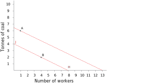
```

--

In the 1600s, the relative prices are shown by isocost line HJ. The B-technology was used. At those relative prices, there was no incentive to develop a technology like A, which is outside the isocost line HJ.

---
## Shift to a lower-cost technology


The combination of capacity to innovate and changing relative prices of inputs led to a switch to energy-intensive technology.


```{r out.width="60%"}
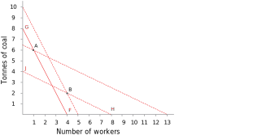
```

In the 1700s, the isocost lines such as FG were much steeper, because the relative price of labour to coal was higher. The relative cost was sufficiently high to make the A-technology lower cost than the B-technology.

---
## Shift to a lower-cost technology


The combination of capacity to innovate and changing relative prices of inputs led to a switch to energy-intensive technology.


```{r out.width="60%"}
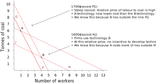
```

We know that when the relative price of labour is high, technology A is lower cost because the B-technology lies outside the isocost line FG.

---

```{r, out.width="80%"}

```

The historical evidence supports our model that uses relative prices and innovation rents to provide a simple account of the timing and the geographical spread of the permanent technological revolution.

---

```{r, out.width="80%"}

```

This is part of the explanation of the upward kink in the hockey stick. Explaining the long flat part of the stick is another story, requiring a different model.

---
.center2[
# Malthusian economics: Diminishing average product of labour
]

---
## Diminishing average product of labour

--

Agricultural economy

--

**Factors of production**: labour and land

--

- production: one good, grain.
- only farm labour, working on the land.

--

**Ceteris paribus** assumption: that the amount of land is fixed and all of the same quality.

--

**Average productivity**

$$ \textit{average productivity of labour} = \frac{\textit{total output}}{\textit{total number of farmers}}  $$

--

**Production function**: relationship between the amount of output produced and the amounts of inputs used to produce it.

$$ Y = f(X) $$

Production function gives maximum output for a given set of inputs.

---
## Diminishing average product of labour

--

If we hold one input (land) fixed, and expand the other input (labour), the average output per worker is going to fall. 

--

```{r out.width="65%"}
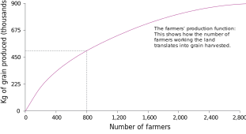
```

The production function shows how the number of farmers working the land translates into grain produced at the end of the growing season.

---
## Diminishing average product of labour

If we hold one input (land) fixed, and expand the other input (labour), the average output per worker is going to fall. 

```{r out.width="65%"}
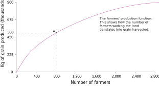
```

Point A on the production function shows the output of grain produced by 800 farmers.

---
## Diminishing average product of labour

If we hold one input (land) fixed, and expand the other input (labour), the average output per worker is going to fall. 

```{r out.width="65%"}
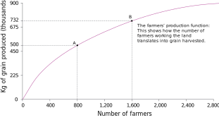
```

Point B on the production function shows the amount of grain produced by 1,600 farmers.

---
## Diminishing average product of labour

If we hold one input (land) fixed, and expand the other input (labour), the average output per worker is going to fall. 

```{r out.width="65%"}
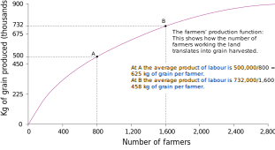
```

At A, the average product of labour is 500,00/800 = 625 kg of grain per farmer. At B, the average product of labour is 732,000/1,600 = 458 kg of grain per farmer.

---
## Diminishing average product of labour

If we hold one input (land) fixed, and expand the other input (labour), the average output per worker is going to fall. 

```{r out.width="65%"}
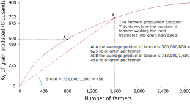
```

The slope of the ray from the origin to point B on the production function shows the average product of labour at point B. The slope is 458, meaning an average product of 458 kg per farmer when 1,600 farmers work the land.

---
## Diminishing average product of labour

If we hold one input (land) fixed, and expand the other input (labour), the average output per worker is going to fall. 

```{r out.width="65%"}
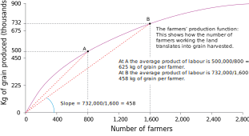
```

The slope of the ray to point A is steeper than to point B. When only 800 farmers work the land there is a higher average product of labour. The slope is 625, the average product of 625 kg per farmer that we calculated previously.

---
.center2[
# Malthusian economics: Population grows when living standards rise
]

---
## Malthus argument

--

1. Population expands if living standards increase

2. Law of diminishing average product of labour implies that as more people work on the land, their income will inevitably fall

--

.pull-left[

In equilibrium, living standards will be forced down to subsistence level. 

Population and income will stay constant. 

Self-correcting response to new technology. In the long run, an increase in productivity will result in increased population but not increased wages. 


]

.pull-right[

```{r out.width="100%"}
knitr::include_graphics("imgs/figure-02-15.svg")
```
]


---
## Modelling Malthus

--

```{r out.width="75%"}
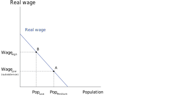
```

At a medium population level, the wage of people who work the land is at subsistence level (point A). The wage is higher at point B, where the population is smaller, because the average product of labour is higher.

---
## Modelling Malthus

```{r out.width="75%"}
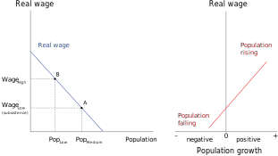
```

When wages (on the vertical axis) are high, population growth (on the horizontal axis) is positive (so the population will rise). When wages are low, population growth is negative (population falls).

---
## Modelling Malthus

```{r out.width="75%"}
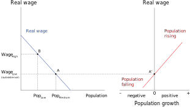
```

At point A, on the left, population is medium-sized and the wage is at subsistence level. So if the economy is at point A, it is in equilibrium: population stays constant and wages remain at subsistence level.


---
## Modelling Malthus

```{r out.width="75%"}
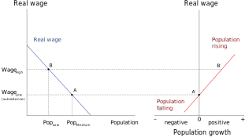
```

Suppose the economy is at B, with a higher wage and lower population. Point B′, on the right, shows that the population will be rising.

---
## Modelling Malthus

```{r out.width="75%"}
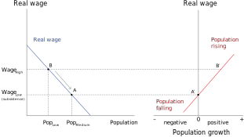
```

As the population rises, the economy moves down the line in the left diagram: wages fall until they reach equilibrium at A.

---
## Modelling Malthus

```{r out.width="75%"}

```

Malthusian population trap: Population will be constant when the wage is at subsistence level, it will rise when the wage is above subsistence level, and it will fall when the wage is below subsistence level.

---
## Modelling Malthus: productivity increases

```{r out.width="75%"}
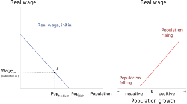
```

The economy starts at point A, with a medium-sized population and wage at subsistence level.

---
## Modelling Malthus: productivity increases

```{r out.width="75%"}
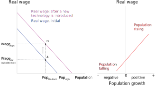
```

Technological improvement (better seeds) raises the average product of labour, and the wage is higher for any level of population. The real wage line shifts upward. At the initial population level, the wage increases and the economy moves to point D.

---
## Modelling Malthus: productivity increases

```{r out.width="75%"}
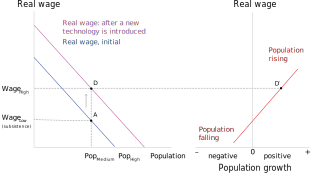
```

At point D, the wage has risen above subsistence level and therefore the population starts to grow (point D′).

---
## Modelling Malthus: productivity increases

```{r out.width="75%"}

```

As population rises, the wage falls, due to the diminishing average product of labour. The economy moves down the real-wage curve from D.

---
## Modelling Malthus: productivity increases

```{r out.width="75%"}
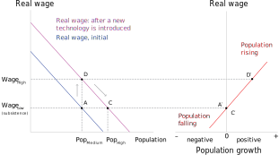
```

At C, the wage has reached subsistence level again. The population remains constant (point C′). The population is higher at equilibrium C than it was at equilibrium A.

---
## Modelling Malthus: productivity increases

```{r out.width="75%"}

```

Malthusian model predicts that even if productivity increases, living standards in the long run do not.

---
.center2[
# The Malthusian trap and long-term economic stagnation
]

---
## Testing Malthus

--

1) Diminishing average product of labour 

--

2) Rising population in response to increases in wages

--

3) **An absence of improvements in technology to offset the diminishing average product of labour**

--

```{r out.width="70%"}
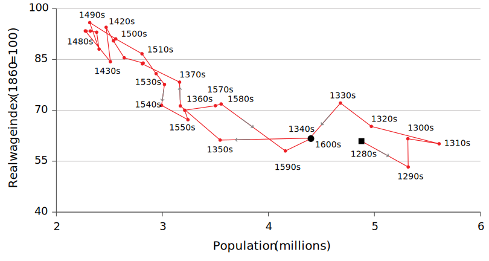
```

---
```{r out.width="50%"}
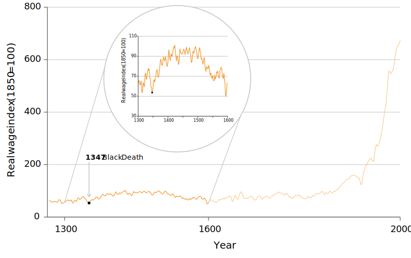
```

```{r out.width="35%"}
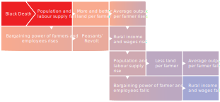
```

The bubonic plague of 1348–50 was known as the Black Death. It killed 1.5 million people out of an estimated English population of 4 million, leading to a dramatic fall in labour supply.

---
```{r out.width="50%"}
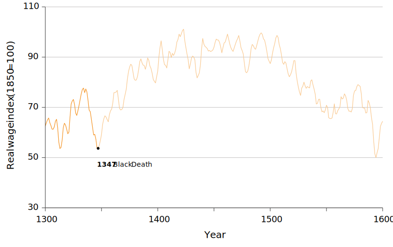
```

```{r out.width="35%"}
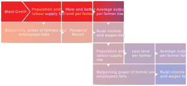
```

This decline in the population had an economic benefit for the farmers and workers who survived: it meant that farmers had more and better land, and workers could demand higher wages. Incomes rose as the plague abated.


---
```{r out.width="50%"}
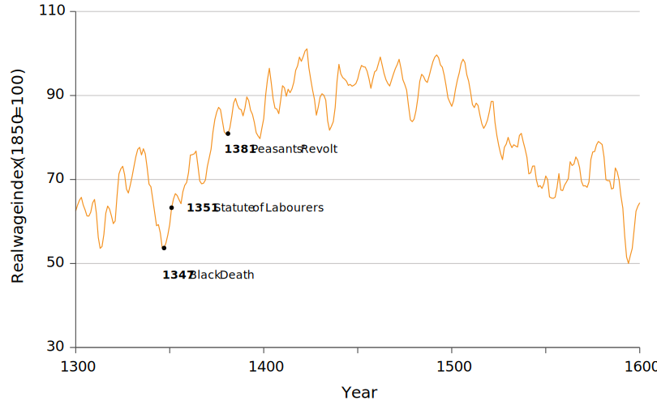
```

```{r out.width="35%"}
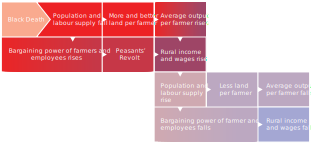
```

In 1351, King Edward III of England tried to limit wage rises by law, helping to cause a period of rebellions against authority, notably the Peasants’ Revolt of 1381. Despite the King’s actions, incomes continued to increase.

---
```{r out.width="50%"}
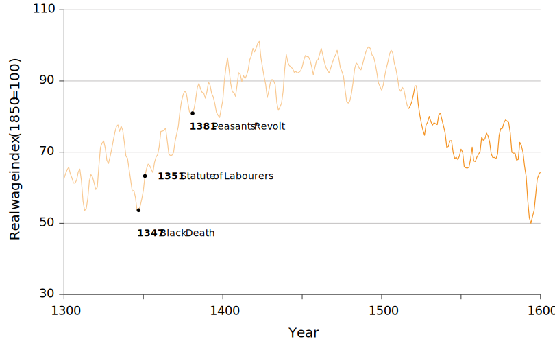
```

```{r out.width="35%"}

```

By the middle of the fifteenth century, the real wages of English building workers had doubled. Increased wages helped the population to recover in the sixteenth century, but Malthus’ law asserted itself: as the population increased, incomes fell.

---
```{r out.width="50%"}

```

```{r out.width="35%"}

```

By 1600, real wages had fallen to the level they were 300 years previously.

---
```{r out.width="50%"}

```

```{r out.width="35%"}

```

Our model of Malthusian economics helps to explain the rise and fall of incomes between 1300 and 1600 in England.

---
.center2[
# Escaping from Malthusian stagnation
]

---
## Escaping from Malthusian stagnation

Improvements in technology could happen at a faster rate than population growth, offsetting the diminishing average product of labour.

```{r out.width="70%"}

```

[Our World in Data animation](https://ourworldindata.org/grapher/englands-economy-over-the-long-run-gdp-vs-population?time=1270..1292&country=~GBR
)

---

```{r out.width="50%"}

```

```{r out.width="35%"}

```

The story begins with technological improvements, such as the spinning jenny and the steam engine, that increased output per worker. Innovation continued as the technological revolution became permanent, displacing thousands of spinsters, weavers and farmers.

---

```{r out.width="50%"}

```

```{r out.width="35%"}

```

The loss of employment reduced workers’ bargaining power, keeping wages low, seen in the flat line between 1750 and 1830. The size of the pie was increasing, but the workers’ slice was not.

---

```{r out.width="50%"}

```

```{r out.width="35%"}

```

In the 1830s, higher productivity and low wages led to a surge in profits. Profits, competition, and technology drove businesses to expand. The demand for labour went up. People left farming for jobs in the new factories.

---
```{r out.width="50%"}

```

```{r out.width="35%"}

```

The supply of labour fell when business owners were stopped from employing children. The combination of higher labour demand and lower supply enhanced workers’ bargaining power.

---
```{r out.width="50%"}

```

```{r out.width="35%"}

```

The power of working people increased as they gained the right to vote and formed trade unions. These workers were able to claim a constant or rising share of the increases in productivity generated by the permanent technological revolution.

---
.center2[
# Conclusion and summary
]

---
## Conclusion & Key Takeaways

--

#### **1) The Role of Economic Models**  
- Models simplify reality to highlight key mechanisms (e.g., *ceteris paribus* assumptions).  
- Using models helps explain historical economic transformations, such as the Industrial Revolution.  

--

#### **2) Insights on the Technological Revolution**  
- **Firm Behavior:** High wages relative to capital (including energy) created incentives for technological innovation.  
- **Malthusian Model:** Before the Industrial Revolution, population growth offset income gains, leading to stagnation.  
- **Breaking the Cycle:** Permanent technological change allowed economies to escape Malthusian stagnation, leading to sustained growth.  

--

#### **Final Thought**  
- Economic models help us understand past transformations and provide frameworks for analyzing present and future economic changes.  

