```{r meta, echo=FALSE}
library(metathis)
meta() %>%
  meta_general(
    description = "An Introduction to xaringan for Presentations: The Basics",
    generator = "xaringan and remark.js"
  ) %>% 
  meta_name("github-repo" = "spcanelon/xaringan-basics-and-beyond")
  # meta_social(
  #   title = "Sharing Your Work with xaringan &#8212; Day 1",
  #   url = "https://spcanelon.github.io/xaringan-basics-and-beyond/slides/day-01-basics.html#1",
  #   image = "https://raw.githubusercontent.com/spcanelon/xaringan-basics-and-beyond/main/slides/day-01-cover-image.png",
  #   image_alt = "Title slide for the day 1 slides of the Sharing Your Work with xaringan workshop series",
  #   og_type = "website",
  #   og_author = "Silvia Canelon",
  #   twitter_card_type = "summary_large_image",
  #   twitter_creator = "@spcanelon"
  # )
```

```{r setup, include = FALSE}
knitr::opts_chunk$set(echo = FALSE)
knitr::opts_chunk$set(out.width = "90%")
knitr::opts_chunk$set(fig.align="center")
options(htmltools.dir.version = FALSE)


options(htmltools.dir.version = FALSE)
library(knitr)
library(tidyverse)
library(xaringanExtra)
# set default options
opts_chunk$set(echo=FALSE,
               collapse = TRUE,
               fig.width = 7.252,
               fig.height = 4,
               dpi = 300)
# set engines
knitr::knit_engines$set("markdown")
xaringanExtra::use_tile_view()
xaringanExtra::use_panelset()
xaringanExtra::use_clipboard()
xaringanExtra::use_webcam()
xaringanExtra::use_broadcast()
xaringanExtra::use_share_again()
xaringanExtra::style_share_again(
  share_buttons = c("twitter", "linkedin", "pocket")
)
# uncomment the following lines if you want to use the NHS-R theme colours by default
# scale_fill_continuous <- partial(scale_fill_nhs, discrete = FALSE)
# scale_fill_discrete <- partial(scale_fill_nhs, discrete = TRUE)
# scale_colour_continuous <- partial(scale_colour_nhs, discrete = FALSE)
# scale_colour_discrete <- partial(scale_colour_nhs, discrete = TRUE)
```


```{r out.width="100%", fig.align='center'}
knitr::include_graphics("imgs/montorgueil1.png")
```

---

```{r out.width="100%", fig.align='center'}
knitr::include_graphics("imgs/montorgueil2.png")
```

---

```{r out.width="80%", fig.align='center'}
knitr::include_graphics("imgs/montorgueil3.png")
```

---

```{r out.width="45%", fig.align='center'}
knitr::include_graphics("imgs/montorgueil.jpeg")
```

La Rue Montorgueil. Claude Monet.

--

### Like impressionist paintings, the economy is made up of individual different actions.

---

# Labour markets and unemployment

--

The upcoming **three** classes we will study the interaction between firms, markets, the division of labour, and unemployment.

--

To do so we have to go through the following Units of the Economy:

--

- **Unit 6.** The firm: Owners, managers, and employers (Today 23/03)

--

- **Unit 7.** The firm and its customers (Next week 30/03)

--

- **Unit 9.** The labour market: Wages, profits, and unemployment (In two weeks 06/04)

--

### Going from the small scale social interactions to the general picture

--

https://github.com/woomora/CORE-econ-macro

--

```{r out.width="20%", fig.align='center'}
knitr::include_graphics("imgs/github-core-econ qr.png")
```


---

# Understanding the firm

--

Goods are usually produced not in the same place they are consumed.
--
 Where does your t-shirt or shirt come from? 
--
 Why?
--

- Firms outsource or offshore production to countries  where wages are lower.

--

.pull-left[

```{r out.width="100%", fig.align='center'}

```

]

--

.pull-right[

```{r out.width="100%", fig.align='center'}
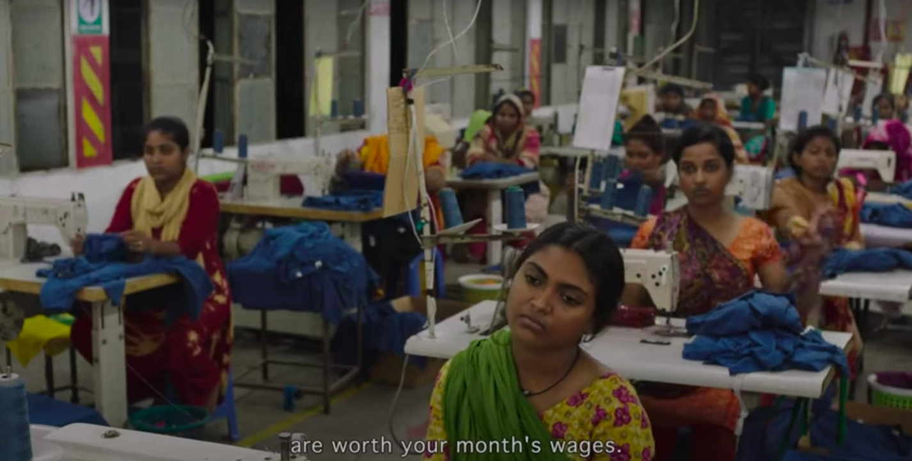
```

]

--

 Movie: *Made in Bangladesh (2019)* 
 
--

Model how wages are determined when there are conflicts of interest between employers and employees, and look at what this means for the sharing of the mutual gains that arise from cooperation in a firm.

---


# Unit 6. The firm: Owners, managers, and employees

--

- Firms are major actors in the economy.

--

- Analyse how firms differ from markets.

--

- Use a model of interactions within the firm to explain how wages are determined, and how this influences unemployment.

--

- Explore the problem of incomplete contracts and hidden actions.

--


```{r out.width="45%", fig.align='center'}
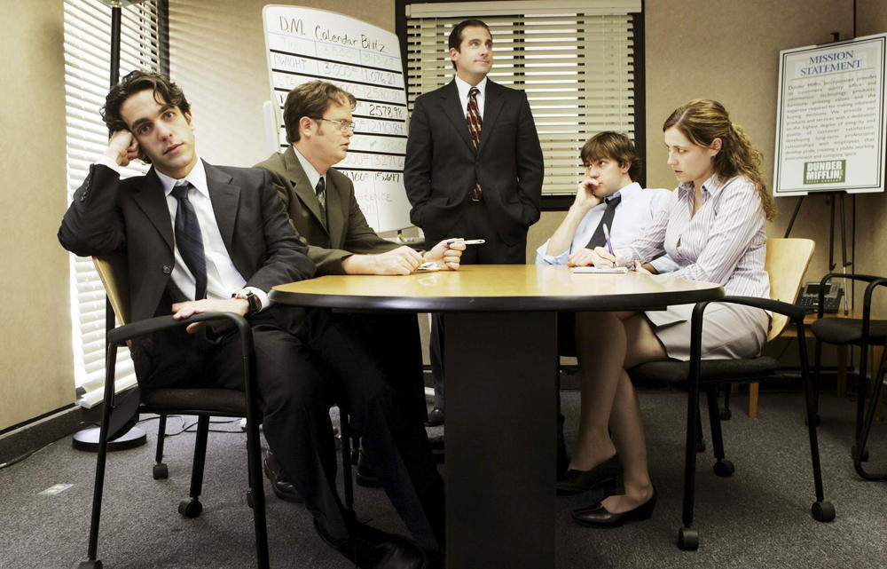
```


---
--

**Firm:**
--
 a business organization which

--

- Employs people

--

- Purchases inputs to produce market goods and services

--

- Sets prices greater than the cost of production

--

> “The firm in a capitalist economy is a miniature, privately owned, centrally planned economy.” R. Coase

--


```{r out.width="40%", fig.align='center'}
knitr::include_graphics("imgs/dunder-mifflin.webp")
```


---

# Firms vs. markets

--

In a capitalist economy, the division of labour is coordinated in two ways: firms and markets.

--

Coordination within firm differs from coordination via markets:

--

- concentration of economic power in the hands of the owners/managers allows them to issue commands to workers

--

- power is decentralized in markets, so decisions are autonomous and voluntary

--

--

.pull-left[

```{r out.width="40%", fig.align='center'}
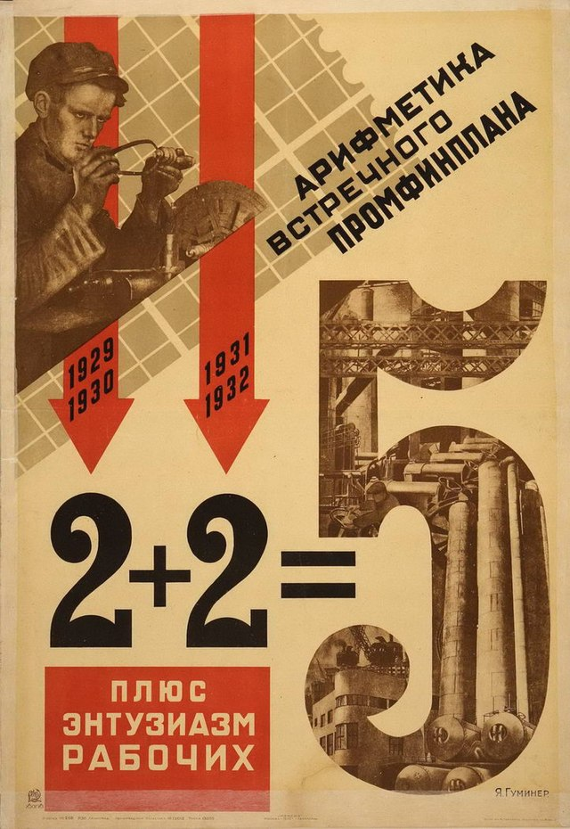
```

]

--

.pull-right[

```{r out.width="60%", fig.align='center'}
knitr::include_graphics("imgs/montorgueil.jpeg")
```

]

---

# Structure of a firm

--

- Owners decide on long-term strategy

--

- Managers implement their decisions by assigning tasks to workers and monitoring them

--

**Managers ≠ owners**

--

**Separation of ownership and control:** when managers decide on the use of other people’s funds.

--

```{r out.width="50%", fig.align='center'}
knitr::include_graphics("https://media.giphy.com/media/YwpylUojkfOZa/giphy.gif")
```

---

# Contracts

--

- Firms and markets differ in the contracts that form the basis of exchange.

--

**Contract:**
--
 a legal document or understanding that specifies a set of actions that parties to the contract must undertake.
 
--

- Contracts for **products** sold in markets **permanently transfer ownership** of the good from the seller to the buyer. 

--

- Contracts for **labour** **temporarily transfer authority** over a person’s activities from the employee to the manager or owner.


```{r out.width="35%", fig.align='center'}
knitr::include_graphics("https://media.giphy.com/media/3orif2JK8DsUSxMShW/giphy.gif")
```


---

# Relationships within a firm

--

Unlike in markets, relationships within a firm may extend over a long period of time.

--

- creation of network of colleagues
- acquisition of skills necessary for the job

--

These skills, networks, and friendships are firm-specific assets.
--
  They are valuable only while the worker remains employed in a particular firm.	
--
When the relationship ends, value is lost to both sides.

--

```{r out.width="50%", fig.align='center'}
knitr::include_graphics("https://media.giphy.com/media/l0MYt5jPR6QX5pnqM/giphy.gif")
```


---

# Asymmetric information

--

Owners or managers do not always know what their subordinates know or do, not all of their directions or commands are necessarily carried out.

--

```{r out.width="50%", fig.align='center'}
knitr::include_graphics("https://media.giphy.com/media/xZuccZKErssvcyNDOc/giphy.gif")
```


---

```{r out.width="100%", fig.align='center'}
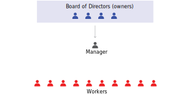
```

---

```{r out.width="100%", fig.align='center'}
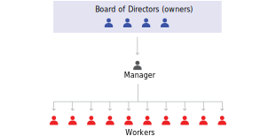
```


---

```{r out.width="100%", fig.align='center'}
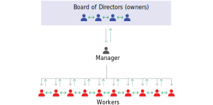
```


---

# Conflict and aligning interests

--

The firm’s profits legally belong to the people who own the firm’s assets.

--

- Managers’ actions have impact on profits

--

- but if profits increase thanks to managers’ work, they will not automatically benefit. 

--


This creates a conflict of interest between managers and owners.

```{r out.width="30%", fig.align='center'}
knitr::include_graphics("https://media.giphy.com/media/5zoHyCdbtm8feNkIxJ/giphy.gif")
```

--

To solve the conflict of interest between managers and owners:

- link the managers’ pay to the performance of the company’s share price

- monitor the managers’ performance

---

# Incomplete Contracts

--

Hiring employees is different from buying other goods and services. 
--
 The contract between a firm and its employees is incomplete:

--

- some tasks depend on future (unknown) events

--

- some aspects of the job are difficult to measure and base wages on e.g. effort

--

Incomplete contract does not specify, in an enforceable way, every aspect of the exchange that affects the interests of parties.

--


```{r out.width="35%", fig.align='center'}
knitr::include_graphics("https://media.giphy.com/media/S1YVlFY74PCs0CLGfK/giphy.gif")
```

--

**Piece rate work:** a type of employment in which the worker is paid a fixed amount for each product made.

---

# Workers’ effort

--

If firms can’t directly measure effort, why do workers work hard?

--

.pull-left[

- work ethic
- feelings of responsibility 
- to reciprocate a feeling of gratitude for good working conditions
- benefits for measurable output
- promotions
- fear of being fired

]

.pull-right[

```{r out.width="100%", fig.align='center'}
knitr::include_graphics("https://media.giphy.com/media/tGO5aBtHgBWI2ukToC/giphy.gif")
```


]

---
# Employment Rents

--

Employees fear getting fired when they are paid more than their **reservation option** = they receive employment rent.

--

**Employment rent** = cost of job loss,
--
  which includes:

--

- Lost income while searching for a job

--

- Costs required to start a new job e.g. relocation

--

- Loss of non-wage benefits e.g. medical insurance

--

- Social costs (stigma of being unemployed)

--

## Though exmaple

--

Maria, an employee earning $12 an hour for 35-hour working week.

--


$$\textit{net utility per hour} = wage -  \textit{disutility of effort per hour} = 10$$

---

```{r out.width="85%", fig.align='center'}
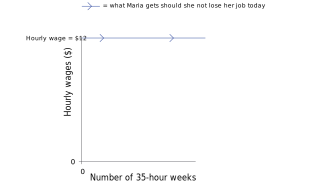
```

Maria’s hourly wage, is $12. Looking ahead from now (taken as time 0), she will continue to receive this wage for the foreseeable future if she keeps her job.

---

```{r out.width="85%", fig.align='center'}
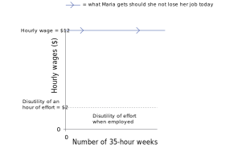
```

Maria’s current effort level is 0.5: she pursues non-work activities for half of the time on the job. Working this hard is equivalent to a cost of $2 per hour to Maria.

---

```{r out.width="85%", fig.align='center'}
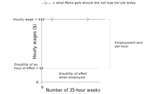
```

The difference between her wage and disutility of effort is the economic rent per hour that she receives while employed.

---

```{r out.width="85%", fig.align='center'}
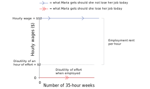
```

If instead Maria were to lose her job at time 0, she would no longer receive her wages. This unfortunate state would persist as long as she remains unemployed.

---

```{r out.width="85%", fig.align='center'}
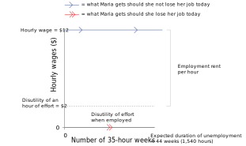
```

The expected duration of unemployment is 44 weeks, where she would have worked 35 hours per week. That is how long she will remain without pay (and without the disutility of working).

---

```{r out.width="85%", fig.align='center'}
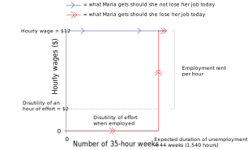
```

Maria expects to find another job at the same wage after 44 weeks.

$$\textit{total employment rent} = \textit{\$10 per hour} \times \textit{1,540 hours} = \textit{\$15,400}$$

---

```{r out.width="85%", fig.align='center'}
knitr::include_graphics("imgs/figure-06-02-g.svg")
```

The shaded area is her total cost of job loss from the spell of unemployment, that is, her employment rent.

---

What about unemployment benefits? How do they change reservation wages?

--

```{r out.width="80%", fig.align='center'}
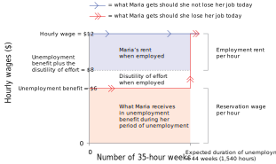
```

$$\textit{total employment rent} = \textit{\$4 per hour} \times \textit{1,540 hours} = \textit{\$6,160}$$

---

# Wages and Effort

--

The employer cannot directly measure the worker’s effort.

--

Large employment rent
--
 → large cost of job loss
--
 → 
worker puts in more effort to reduce chance of getting fired

--

One way to increase the cost of job loss is for the firm to raise wages.

--

## Labour Discipline Model

--

Model the social interaction in the firm played by owners (through managers) and the employees.

--

1. **The employer chooses a wage.** As long as the worker works hard enough, she will keep her job at the offered wage. 

--

2. **The worker chooses a level of work effort.**  Taking into account the costs of losing her job if she does not provide enough effort.

--

**Payoffs:**

--

- **Firm:** $profit = \textit{worker's output} – wage$
- **Worker:** $\textit{employment rent}$

---
### Employee’s best response curve:
--

```{r out.width="80%", fig.align='center'}
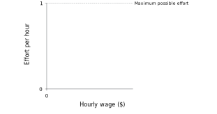
```

Effort per hour, measured on the vertical axis, varies between zero and one.


---

### Employee’s best response curve:

```{r out.width="80%", fig.align='center'}
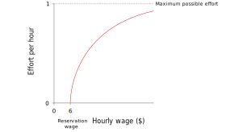
```

Maria does not provide effort at a $6 wage. If she is paid more, she provides more effort.

---

### Employee’s best response curve:

```{r out.width="80%", fig.align='center'}
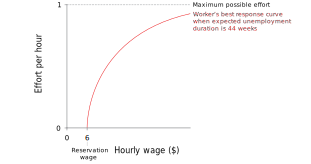
```

The upward-sloping curve shows how much effort she puts in for each value of the hourly wage on the horizontal axis.

---

### Employee’s best response curve:

```{r out.width="80%", fig.align='center'}
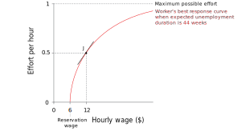
```

When the wage is low, the best response curve is steep: a small wage increase raises effort by a substantial amount.


---

### Employee’s best response curve:

```{r out.width="80%", fig.align='center'}
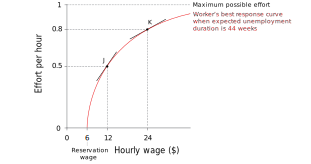
```

At higher levels of wages, however, increases in wages have a smaller effect on effort.

---

### Employee’s best response curve:

```{r out.width="80%", fig.align='center'}

```

The best response curve is the frontier of the employer’s feasible set of combinations of wages and effort that it gets from its employees.

---

### Employee’s best response curve:

```{r out.width="80%", fig.align='center'}
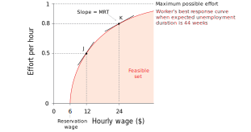
```

The slope of the best response curve is the employer’s marginal rate of transformation of higher wages into more worker effort.


---

### Firms’s best response: Isocost line

--

```{r out.width="80%", fig.align='center'}
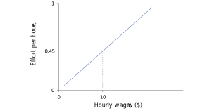
```

If w = 10 and e = 0.45, e/w = 0.045. At every point on this line the ratio of effort to wages is the same. The cost of a unit of effort is w/e = 22.22.


---

### Firms’s best response: Isocost line

```{r out.width="80%", fig.align='center'}
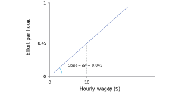
```

The line slopes upward because a higher effort level must be accompanied by a higher wage for the e/w ratio to remain unchanged. The slope is equal to e/w = 0.045, the number of units of effort per dollar.

---

### Firms’s best response: Isocost line

```{r out.width="80%", fig.align='center'}
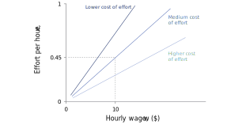
```

On an isocost line, the slope is e/w, but the cost of effort is w/e. The steeper line has a lower cost of effort, and the flatter line has a higher cost of effort.

---

### Firms’s best response: Isocost line

```{r out.width="80%", fig.align='center'}

```

A steeper line means lower cost of effort and hence higher profits for the employer. On the steepest isocost line he gets 0.7 units of effort for a wage of 10 (at B) so the cost of effort is 10/0.7 = 14.29 per unit. On the middle line he only gets 0.45 units of effort at this wage, so the cost of effort is 22.22, and profits are lower.

---

### Firms’s best response: Isocost line

```{r out.width="80%", fig.align='center'}
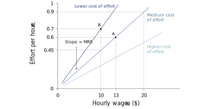
```

The employer is indifferent between points on an isocost line. Like other indifference curves, the slope of the effort isocost line is the marginal rate of substitution: the rate at which the employer is willing to increase wages to get higher effort.

---
### Determining wages:

--

```{r out.width="80%", fig.align='center'}

```

The owner wants to obtain effort at the lowest cost: seek to get onto the steepest isocost line possible. Since he cannot dictate the level of effort, he has to pick some point on the worker’s best response curve.

---
### Determining wages:

```{r out.width="80%", fig.align='center'}
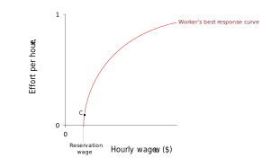
```

It is clear that by paying more the owner will benefit from a lower wage-effort ratio.

---
### Determining wages:

```{r out.width="80%", fig.align='center'}
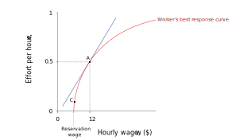
```

The best he can do is the isocost line that is just touching (tangent to) the worker’s best response curve.

---
### Determining wages:

```{r out.width="80%", fig.align='center'}
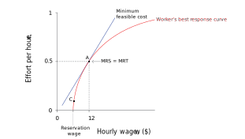
```

The MRS (the slope of the isocost line for effort) is equal to the MRT of higher wages into greater effort (the slope of the best response function)

---
### Determining wages:

```{r out.width="80%", fig.align='center'}

```

Points on steeper isocosts, such as Point B, would have lower costs for the employer but are infeasible.

---
### Determining wages:

```{r out.width="80%", fig.align='center'}
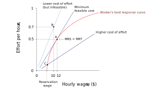
```

Therefore $12 is the hourly wage that the employer should set to minimize costs and maximize profits.

---

Profits are maximised at the steepest isocost line, subject to the worker’s best response curve.

--

### Mathematicallly

$H$ = hours per week; $\quad$ $e$ = effort; $\quad$ $N$ = hours of productive work

--

$N = eH$

--

.pull-left[

**Firm:** 

$$\Pi = p \cdot f(eH) - wH $$

]

.pull-right[

**Employee:** 

$$e = E(w) $$

where $E'(w) > 0$ and $E''(w) < 0$

]

--


$$\Pi = p \cdot f(N) - \frac{w}{e}N$$


Minimize $\frac{w}{e} = \frac{w}{E(w)}$

--

$$\frac{w}{dw} (\frac{w}{E(w)}) = \frac{E(w) - w E'(w)}{E(w)^2} = 0$$
--


$$E'(w*) = \frac{E(w*)}{w*} = \frac{e}{w} = \frac{de}{dw}$$

--


---

--

- **Efficiency wages:** wages set higher than the reservation wage so workers will care about losing the job and provide more effort. 

--

- **Involuntary unemployment:** being out of work, but preferring to have a job at the wages and working conditions that otherwise identical employed workers have. 

--

- Always involuntary unemployment in the labour discipline model.

--

  - In equilibrium, both wages and involuntary unemployment have to be high enough to ensure employment rent is high enough for workers to put in effort.
  
--

- **Employees' best response function will shift** in reaction to changes in:

--

  - the utility of the things that can be bought with the wage
  - the disutility of effort
  - the reservation wage
  - the probability of getting fired when working at each effort level
  - unemployment


---
### Factors shifting the equilibrium:

```{r out.width="75%", fig.align='center'}
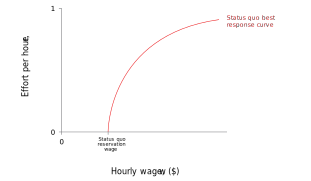
```

The position of the best response curve depends on the reservation wage. It crosses the horizontal axis at this point.

---
### Factors shifting the equilibrium:

```{r out.width="75%", fig.align='center'}
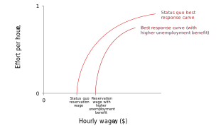
```

A rise in the unemployment benefit increases the reservation wage and shifts the worker’s best response curve to the right.

---
### Factors shifting the equilibrium:

```{r out.width="75%", fig.align='center'}
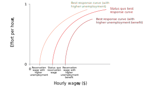
```

If unemployment rises, the expected duration of unemployment increases. So the worker’s reservation wage falls and the best response curve shifts to the left.

---
### Factors shifting the equilibrium:

```{r out.width="75%", fig.align='center'}
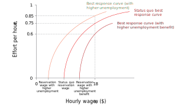
```

For a given hourly wage, say $18, workers put in different levels of effort when the levels of unemployment or unemployment benefit change.

---
# Incomplete contracts

--

In the relationship between Maria and her employer, Maria’s work effort matters to both parties but is not covered by the employment contract.
--
 All employment relationships are governed by incomplete contracts.

--

> Not everything in the contract is contractual. E. Durkheim

--

.pull-left[

Incomplete contracts arise when:

- information is not verifiable
- the relationship covers periods of time
- there is uncertainty
- there are difficulties with measurement
- judiciary is absent
- preferences for omitting some information

]

.pull-right[

```{r out.width="80%", fig.align='center'}
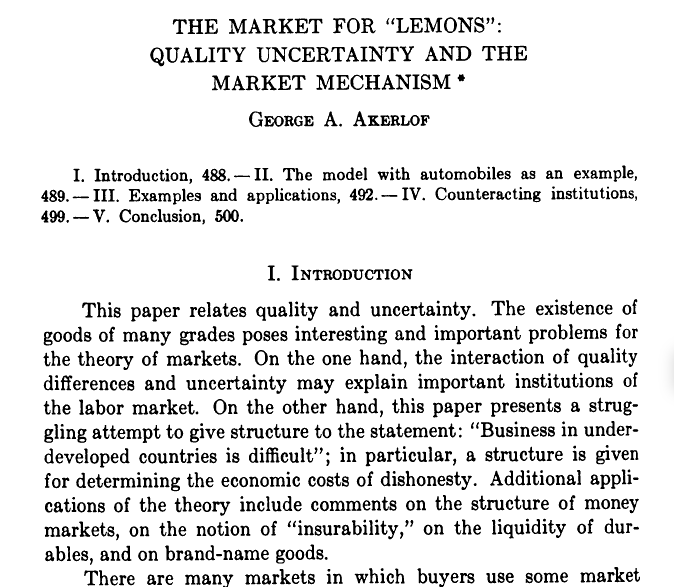
```

]


---

# Principal-agent models

--

Principal-agent models capture interactions under incomplete contracts
--
 (e.g. the firm is the principal and the worker is the agent)

--

Agent takes action that is hidden from the principal, which is why the principal cannot verify it.

--

A hidden action problem occurs when

  - there is a conflict of interest between the principal and the agent 
  - over some action that may be taken by the agent
  - and this action cannot be subjected to a complete contract.

--

The information about the action may be either asymmetric or unverifiable.	

---

# Summary

--

1. Firms: owners and managers have power over workers

--

  - Contracts are incomplete – do not cover worker effort
  
--

  - Employment rents motivate workers to exert effort
  
--

  - An example of a hidden action problem between a principal (firm) and an agent (worker)
  
--

2. Labour-discipline model of wage-setting within firms

--

  - Isocost curves = firm’s ‘indifference curves’
  
--

  - Best response curve = maximum feasible effort, given wages
  
--

  - Profit-maximising choice where MRS = MRT

--

  - Involuntary unemployment as a feature of the equilibrium

---

# Policy project

--

**Policy brief.** Write a policy brief related to the chapter which includes:

--

- A motivation based on contemporary, relevant issues to solve locally, in another loca-
tion, or globally.

--

- A detailed and delimited policy question.

--

- A brief literature review on the topic.

--

- The use of data to describe the problem and context.

--

- A policy proposal to tackle the problem.

--

- A research question proposal to further study in more depth the topic (only the re-search question).

---

## Example: Cooperatives

---

### Motivation

--

We've study firms with a clearly hierarchical structure (owners, managers, employees)
--
, where it is difficult to align the incentives of all agents in order to benefit all parties.

--

Moreover, such firm structure creates incentives to move production to places with lower wages
--
, which might in fact have detrimental impacts on workers' well-being.

--

> The relation of masters and work-people will be gradually superseded by partnership … perhaps finally in all, association of labourers among themselves. J.S. Mill (The Principles of Political Economy, 1848)

--

**Cooperative firm**

Workers are the owners of the capital goods and other assets of the company, and they select managers who run the company on a day-to-day basis.

--

.pull-left[

```{r out.width="60%", fig.align='center'}
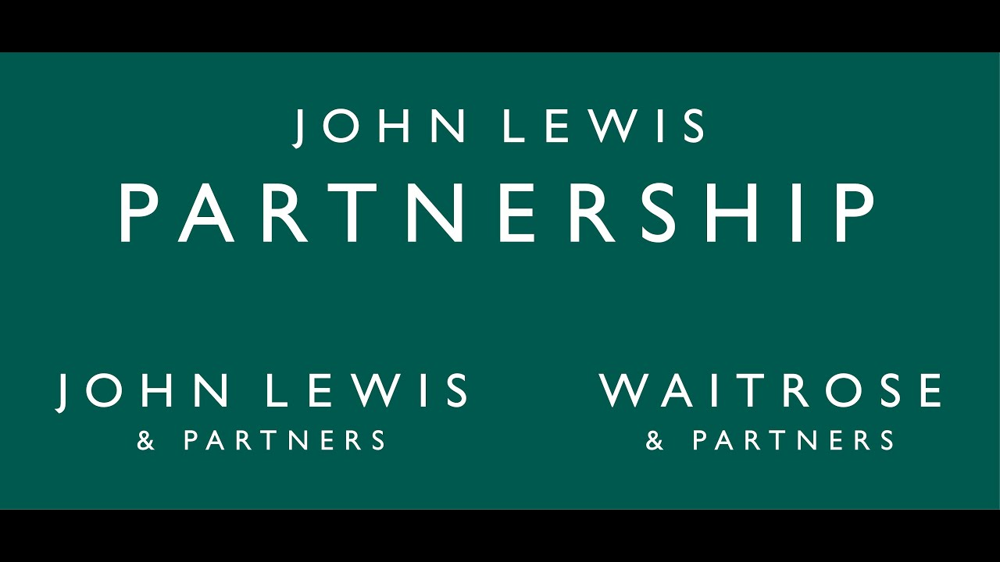
```

]

.pull-right[

```{r out.width="80%", fig.align='center'}

```

]

---

### Policy question: Why they are so few Coops in Latin America?

--

```{r out.width="60%", fig.align='center'}
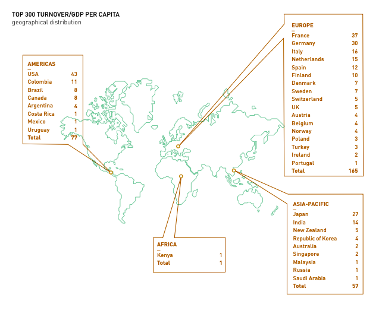
```

---

```{r out.width="60%", fig.align='center'}
knitr::include_graphics("imgs/ica-mx.png")
```


```{r out.width="60%", fig.align='center'}
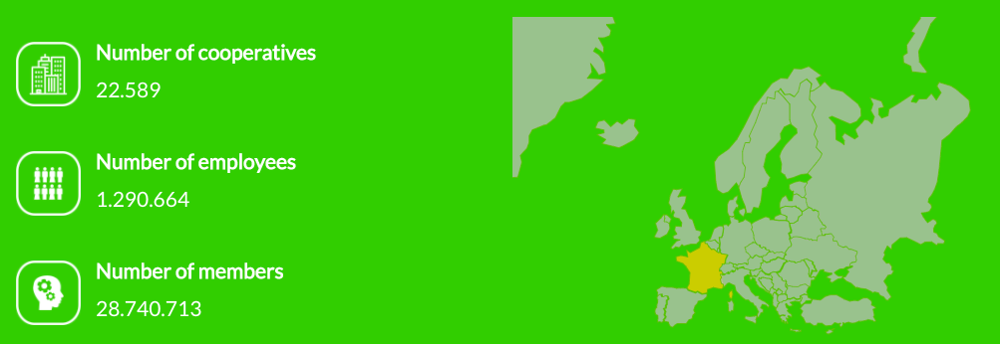
```


---

### Literature review

--

- World Cooperative Monitor 2021 (ICA)

--

- Zero articles in top journals in economics (?)


--

### Hypothesis

--

Few cooperatives since there are no incentives to the financial sector to lend them resources given they legal structure.

--

### Data 


### Policy proposal


### Future research


