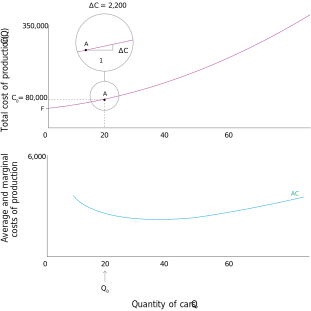

<style>

.center2 {
  margin: 0;
  position: absolute;
  top: 50%;
  left: 50%;
  -ms-transform: translate(-50%, -50%);
  transform: translate(-50%, -50%);
}

</style>

```{r setup, include = FALSE}
knitr::opts_chunk$set(echo = FALSE)
knitr::opts_chunk$set(out.width = "90%")
knitr::opts_chunk$set(fig.align="center")
options(htmltools.dir.version = FALSE)


options(htmltools.dir.version = FALSE)
library(knitr)
library(tidyverse)
library(xaringanExtra)
# set default options
opts_chunk$set(echo=FALSE,
               collapse = TRUE,
               fig.width = 7.252,
               fig.height = 4,
               dpi = 300)
# set engines
knitr::knit_engines$set("markdown")
xaringanExtra::use_tile_view()
xaringanExtra::use_panelset()
xaringanExtra::use_clipboard()
xaringanExtra::use_webcam()
xaringanExtra::use_broadcast()
xaringanExtra::use_share_again()
xaringanExtra::style_share_again(
  share_buttons = c("twitter", "linkedin", "pocket")
)
# uncomment the following lines if you want to use the NHS-R theme colours by default
# scale_fill_continuous <- partial(scale_fill_nhs, discrete = FALSE)
# scale_fill_discrete <- partial(scale_fill_nhs, discrete = TRUE)
# scale_colour_continuous <- partial(scale_colour_nhs, discrete = FALSE)
# scale_colour_discrete <- partial(scale_colour_nhs, discrete = TRUE)
```


.center2[
# Introduction 
]

---

### Do all supermarkets sell their goods at the same price?

--

.pull-left[
```{r out.width="100%", fig.align='center'}

```
]

--

.pull-right[
```{r out.width="100%", fig.align='center'}

```
]


--

From last class,
--
 interactions between firms and workers determine wages, which are part of a firm’s production costs.

--

Two other key decisions for firms: 

- choosing product prices  
- quantities to produce

---
## Unit 7. The firm and its customers

.pull-left[


```{r out.width="100%", fig.align='center'}

```

]

.pull-right[

- Model of interactions between customers and profit-maximising firms producing differentiated products.


- Factors that affect the firm’s choice of price and quantities produced (costs, price elasticity, market power)

]


---
.center2[
# Economies of scale and the cost advantages of large-scale production
]

---
## Production: Economies of Scale

- A firm’s costs depend on its scale of production and the type of production technology it has.

--

- Large firms can be more profitable than small firms because of technological and/or cost advantages.

--

Production function (technology): $Y = f(X) = X^{\alpha}$.
--
 Inputs increase in a given proportion: $\lambda > 0$

--

$$ \Rightarrow f(\lambda X) = (\lambda X)^{\alpha} = \lambda^{\alpha} X^{\alpha} = \lambda^{\alpha} f(X) $$

--

| Production | Technology | Homogeneity |
| -----------------------------------------|
| Increases more than proportionally | **Increasing returns to scale** | $f(\lambda X) > \lambda f(X) \quad \forall \alpha > 1$ |
| Increases proportionally | **Constant returns to scale** | $f(\lambda X) = \lambda f(X) \quad \alpha = 1$ |
| Increases less than proportionally | **Decreasing returns to scale** | $f(\lambda X) < \lambda f(X) \quad \forall \alpha < 1$ |

--

- Cost advantages – Large firms can purchase inputs on more favourable terms.

- Demand advantages - Network effects (value of output rises with number of users e.g. software application)

- Large firms can also suffer from diseconomies of scale, e.g. additional layers of bureaucracy due to too many employees.

---
.center2[
# Production: Cost functions
]

---
##  Cost functions

To make pricing and production decisions, managers need to know the costs of production.

--

How total production costs vary with quantity produced. 

--

- **Total cost**: Total cost for each level of output.

--

- **Average cost**: Average cost per unit produced.

--

- **Marginal cost**: the effect on total cost of producing one additional unit of output.

---
### Average cost

```{r out.width="45%", fig.align='center'}
knitr::include_graphics("imgs/figure-07-06-b.svg")
```

---
### Average cost

```{r out.width="45%", fig.align='center'}

```

---
### Average cost

```{r out.width="45%", fig.align='center'}

```

---
### Average cost

```{r out.width="45%", fig.align='center'}
knitr::include_graphics("imgs/figure-07-06-e.svg")
```

---
### Average cost

```{r out.width="45%", fig.align='center'}

```

---
### Average cost

```{r out.width="45%", fig.align='center'}

```

---
### Marginal cost

```{r out.width="45%", fig.align='center'}

```

---
### Marginal cost

```{r out.width="45%", fig.align='center'}

```

---
### Marginal cost

```{r out.width="45%", fig.align='center'}

```

---
### Marginal cost

```{r out.width="45%", fig.align='center'}

```

---
### Marginal cost

```{r out.width="45%", fig.align='center'}

```

---
### Marginal cost

```{r out.width="45%", fig.align='center'}

```

---
### Marginal cost

```{r out.width="45%", fig.align='center'}

```


---
### Average and Marginal cost

```{r out.width="75%", fig.align='center'}

```

---
### Average and Marginal cost

```{r out.width="75%", fig.align='center'}
knitr::include_graphics("imgs/figure-07-08-b.svg")
```

When Q = 20, the average cost is 4,000, but the marginal cost is only 2,200. So if 21 cars rather than 20 are produced, that will reduce the average cost. Average cost is lower at Q = 21.

---
### Average and Marginal cost

```{r out.width="75%", fig.align='center'}

```

At any point, like point A, where AC > MC, the average cost will fall if one more car is produced, so the AC curve slopes downward.

---
### Average and Marginal cost

```{r out.width="75%", fig.align='center'}

```

At point D where Q = 60, the average cost is 3,600, but the cost of producing the 61st car is 4,600. So the average cost of a car will rise if 61 cars are produced. When AC < MC, the average cost curve slopes upward.

---
### Average and Marginal cost

```{r out.width="75%", fig.align='center'}
knitr::include_graphics("imgs/figure-07-08-e.svg")
```

At point B, where the average cost is lowest, the average and marginal costs are equal. The two curves cross. When AC = MC, the AC curve doesn’t slope up or down: it is flat (the slope is zero).

---
.center2[
# Demand and isoprofit curves
]

---
## Demand curve

Quantity that consumers will buy at each price. 

--

```{r out.width="75%", fig.align='center'}

```

---
## Isoprofit curve

$$\textit{profit} = \textit{total revenue} -  \textit{total cost} = PQ - C(Q)$$

--


$$\textit{profit} = Q\cdot (P - \frac{C(Q)}{Q})$$
--


$$\textit{profit} = Q\cdot (P - AC)$$

--

 - Price-quantity combinations that give the same profit. 

--

- Shape of the isoprofit curves will depend on the shape of the average cost curve.

---
### Isoprofit curve

```{r out.width="80%", fig.align='center'}

```

The lightest blue curve is the firm’s average cost curve. If P = AC, the firm’s economic profit is zero. So the AC curve is also the zero-profit curve: it shows all the combinations of P and Q that give zero economic profit.

---
### Isoprofit curve

```{r out.width="80%", fig.align='center'}

```

Beautiful Cars has decreasing AC when Q < 40, and increasing AC when Q > 40. When Q is low, it needs a high price to break even. If Q = 40 it could break even with a price of $3,400. For Q > 40, it would need to raise the price again to avoid a loss.

---
### Isoprofit curve

```{r out.width="80%", fig.align='center'}

```

Beautiful Cars has increasing marginal costs: the upward-sloping line. Remember that the AC curve slopes down if AC > MC, and up if AC < MC. The two curves cross at B, where AC is lowest.

---
### Isoprofit curve

```{r out.width="80%", fig.align='center'}

```

The darker blue curves show the combinations of P and Q giving higher levels of profit, so points G and K give the same profit.

---
### Isoprofit curve

```{r out.width="80%", fig.align='center'}

```

At G where the firm makes 23 cars, the price is 6,820 and the average cost is 3,777. The firm makes a profit of 3,043 on each car, and its total profit is 70,000.

---
### Isoprofit curve

```{r out.width="80%", fig.align='center'}

```

Profit is higher on the curves closer to the top-right corner in the diagram. Point H has the same quantity as K, so the average cost is the same, but the price is higher at H.

---
.center2[
# Setting price and quantity to maximize profit
]

---
## Profit maximisation

What is the best choice of price and quantity for the manufacturer?

--
 $MRT = MRS$

--

```{r out.width="70%", fig.align='center'}

```

---
## Profit maximisation: Mathematically

.pull-left[
**Demand**

$$P=f (Q)$$

where $f′(Q)<0$

]

.pull-right[

**Firms profit**

$$\Pi = P\cdot Q - C(Q)$$

where $C′(Q)>0$


]

--

choose $Q$ and $P$ to maximize $\Pi$ subject to $P=f (Q)$

--

$$\Rightarrow \max_{Q} \Pi = f (Q) \cdot Q - C(Q)  $$
--

$$\Rightarrow \frac{d\Pi}{dQ} = f '(Q) \cdot Q + f (Q) - C'(Q) = 0 $$

--

$$\Rightarrow f '(Q) = \frac{C'(Q) - f (Q)}{Q}$$
--

$$\Rightarrow MRT = MRS$$

---
.center2[
# Looking at profit maximization as marginal revenue and marginal cost
]

---
## Marginal revenue and marginal cost

.pull-left[
```{r out.width="100%", fig.align='center'}

```
]

.pull-right[

| Quantity | Price | Revenue, $R = P \cdot Q$ |
| -----------------------------------------|
| $Q=20$ | $P=6,400$ | $R = 128,000$ |

]

---
## Marginal revenue and marginal cost

.pull-left[

```{r out.width="100%", fig.align='center'}

```

]

.pull-right[

| Quantity | Price | Revenue, $R = P \cdot Q$ |
| -----------------------------------------|
| $Q=20$ | $P=6,400$ | $R = 128,000$ |
| $Q = 21$ |	$P = 6,320$ |	$R = 132,720$ |
| $ΔQ = 1$ |	$ΔP = 80$ |	$MR = ΔR/ΔQ = 4,720$ |


]

---
## Marginal revenue and marginal cost

.pull-left[

```{r out.width="100%", fig.align='center'}

```

]

.pull-right[

| Quantity | Price | Revenue, $R = P \cdot Q$ |
| -----------------------------------------|
| $Q=20$ | $P=6,400$ | $R = 128,000$ |
| $Q = 21$ |	$P = 6,320$ |	$R = 132,720$ |
| $ΔQ = 1$ |	$ΔP = 80$ |	$MR = ΔR/ΔQ = 4,720$ |


- Gain in revenue (21st car): 6,320

- Loss of revenue (80 on each of the other 20 cars): −1,600

- Marginal revenue	4,720

]

--


- **Marginal revenue (MR)** change in revenue from selling an additional unit (net effect of decreasing price and increasing quantity sold)

- Firm maximizes profits by choosing 
point where $MR = MC$


---

```{r out.width="45%", fig.align='center'}

```

---

```{r out.width="45%", fig.align='center'}

```

---

```{r out.width="45%", fig.align='center'}

```

---

```{r out.width="45%", fig.align='center'}

```

---

```{r out.width="45%", fig.align='center'}

```

---

```{r out.width="45%", fig.align='center'}

```

---

```{r out.width="45%", fig.align='center'}

```

---

```{r out.width="45%", fig.align='center'}

```

---
.center2[
# The elasticity of demand
]

---
## Price Elasticity of Demand

Maximize profit by choosing the point where the slope of the isoprofit curve (MRS) is equal to the slope of the demand curve (MRT),
--
 which represents the trade-off that the firm is constrained to make between price and quantity.
 
--

So the firm’s decision depends on how steep the demand curve is:
--
 in other words, how much consumers’ demand for a good will change if the price changes.
 
--

$$\varepsilon = - \frac{\% \textit{change in demand}}{\%  \textit{change in price}} = - \frac{100 (\frac{\Delta Q}{Q})}{100 (\frac{\Delta P}{P})}$$

--

Which functional form for the demand function allow us to estimate price elasticity? 
--
 Logaritmic function.
 
--

$$ln(Q) = ln(P) \Rightarrow \frac{d ln (Q)}{d Q} = \frac{d ln (P)}{d P} \iff \frac{ \frac{1}{Q}}{d Q} = \frac{\frac{1}{P}}{d P} \iff \frac{d Q}{Q} = \frac{d P}{P}$$

---

```{r out.width="45%", fig.align='center'}

```


Price elasticity changes throughout the demand curve.


$$\varepsilon = - \frac{100 (\frac{\Delta Q}{Q})}{100 (\frac{\Delta P}{P})}$$

---

```{r out.width="45%", fig.align='center'}

```


|  | A |
| ------------ |
| $Q$ | 20 | 
| $P$ | 6400 | 


---

```{r out.width="45%", fig.align='center'}

```


|  | A |
| ------------ |
| $Q$ | 20 | 
| $P$ | 6400 | 
| $ΔQ$ | 1 |
| $ΔP$ | -80 | 

---

```{r out.width="45%", fig.align='center'}

```


|  | A |
| ------------ |
| $Q$ | 20 | 
| $P$ | 6400 | 
| $ΔQ$ | 1 |
| $ΔP$ | -80 | 
| % change in Q| $100 \cdot (1/20) = 5$ |
| % change in P| $100 \cdot (-80/6400) = −1.25$
| $\varepsilon$ | $5/-1.25 = -4$ | 

---

```{r out.width="45%", fig.align='center'}

```


|  | A | B |
| ------------ |
| $Q$ | 20 | 40 |
| $P$ | 6400 | 4800 |
| $ΔQ$ | 1 | 1 |
| $ΔP$ | -80 | -80 | 
| % change in Q| $5$ | $2.50$ |
| % change in P| $−1.25$ | $-1.67$ |
| $\varepsilon$ | $-4$ | $-1.5$ |

---

```{r out.width="45%", fig.align='center'}

```


|  | A | B | C |
| ------------ |
| $Q$ | 20 | 40 | 70 |
| $P$ | 6400 | 4800 | 2400 |
| $ΔQ$ | 1 | 1 | 1 |
| $ΔP$ | -80 | -80 | -80 |  
| % change in Q| $5$ | $2.50$ | $1.43$ |
| % change in P| $−1.25$ | $-1.67$ | $−3.33$ |
| $\varepsilon$ | $-4$ | $-1.5$ | $-0.43$ | 

---

```{r out.width="45%", fig.align='center'}

```


|  | A | B | C |
| ------------ |
| $Q$ | 20 | 40 | 70 |
| $P$ | 6400 | 4800 | 2400 |
| $ΔQ$ | 1 | 1 | 1 |
| $ΔP$ | -80 | -80 | -80 |  
| % change in Q| $5$ | $2.50$ | $1.43$ |
| % change in P| $−1.25$ | $-1.67$ | $−3.33$ |
| $\varepsilon$ | $4$ | $1.5$ | $0.43$ | 
| $MR = \Delta R / \Delta Q$ | $4,720$ | $1,520$ | $-3,280$ | 

---
## Price Elasticity and Profits

A firm’s **markup** (profit margin as a proportion of the price) is *inversely proportional* to price elasticity of demand.

--

.pull-left[
```{r out.width="100%", fig.align='center'}

```
]

.pull-right[
```{r out.width="100%", fig.align='center'}

```
]

---
## Price Elasticity and Profits

A firm’s **markup** (profit margin as a proportion of the price) is *inversely proportional* to price elasticity of demand.


$$\varepsilon = - \frac{\Delta Q}{\Delta P} \cdot \frac{P}{Q}$$

--

$$ \frac{\Delta P}{\Delta Q} = - \frac{1}{\varepsilon } \cdot \frac{P}{Q}$$

--

In optimiality, a firm must choose $MRT = MRS$, thus the slope of the demand should be equal to the slope of the isoprofit curve: $\frac{C'(Q) - f(Q)}{Q} = \frac{MC - P}{Q}$

--

$$\Rightarrow  - \frac{1}{\varepsilon } \cdot \frac{P}{Q} = \frac{MC - P}{Q}$$

--

$$\iff  - \frac{1}{\varepsilon } = \frac{MC - P}{P}$$
where $\frac{MC - P}{P}$ is the markup.

---
## Price Elasticity and Policy

.pull-left[

```{r out.width="100%", fig.align='center'}

```

]

.pull-right[

- The effect of good-specific taxes depends on the elasticity of demand for those goods. 

- Governments raise more tax revenue by levying taxes on price-inelastic goods. 

- Several countries e.g. Denmark and France have introduced taxes on unhealthy foods – to reduce consumption not to raise revenue. 

]

---
.center2[
# TD
]

---
### 4. Firm's cost curves

Choose the correct answer(s):

.pull-left[
```{r, out.width="350%"}

```
]

.pull-right[
a) The profit level at A is 500.

b) The profit level at B is 150.

c) The price at C is 50.

d) The price at B is 36.
]

---
### 4. Firm's cost curves

Choose the correct answer(s):

.pull-left[
```{r, out.width="350%"}

```
]

.pull-right[
a) The profit level at A is 500.

b) The profit level at B is 150.

<span style="color: #008ac4;">
c) The price at C is 50.
</span>

 - The profit level for the isoprofit curve going through C can be calculated at Q = 10, where AC = 20, and P = 70. So the profit is (70 − 20) × 10 = 500. At C, Q = 20, so profit per unit is (P − AC) = 25. Since AC is 25, P must be 50.

d) The price at B is 36.
]


---
### 5. Ealsticities

Choose the correct answer(s):

A shop sells 20 hats per week at 10 each. When it increases the price to 12, the number of hats sold falls to 15 per week. Which of the following statements are correct?

a) When the price increases from 10 to 12, demand increases by 25%.

b) A 20% increase in the price causes a 25% fall in demand.

c) The demand for hats is inelastic.

d) The elasticity of demand is approximately 1.25.

---
### 5. Ealsticities

Choose the correct answer(s):

A shop sells 20 hats per week at 10 each. When it increases the price to 12, the number of hats sold falls to 15 per week. Which of the following statements are correct?

a) When the price increases from 10 to 12, demand increases by 25%.

<span style="color: #008ac4;">
b) A 20% increase in the price causes a 25% fall in demand.
</span>
  - The percentage price increase is 100 × 2/10 = 20%. It causes a percentage decrease in demand of 100 × 5/20 = 25%.

c) The demand for hats is inelastic.

<span style="color: #008ac4;">
d) The elasticity of demand is approximately 1.25.
</span>

 - The elasticity can be estimated as 25/20 = 1.25.

---
## Profit maximization 

--

.pull-left[
**Total cost function:** $C(Q) = 50 + \frac{1}{2} Q^2$
]

.pull-right[
**Demand:** $Q(P) = 120 - P$
]

--

**G**: Graphical solution

**M**: Mathematical solution

--

a. What is the fixed cost? What is the variable cost? What is the marginal cost? What is the average cost? **G**, **M**

--

b. Graph the demand curve. What is the feasible set for the firm's profit maximization? **G**

--

c. Graph the AC and MC. At what quantity is AC at its minimum? Where AC and MC are equal? What would be the shape of the firms isoprofit curves? **G**

--

d. What is the condition to obtain the quantity and price equilibrium? Obtain the equilibrium quantity. Obtain the price quantity. **G**, **M**

--

e. How we could find the equilibrium graphically? **G**

--

e. What is the price elasticity at the equilibrium? **M**


---

We are gonna use R and `tidyverse` to solve graphically the exercise. 
--
 To learn more: https://www.tidyverse.org/learn/.
 
--

```{r echo = T}
# Load tidyverse and tidyr packages
# if it is your first time in using them first write: install.packages(tidyverse) and install.packages(tidyr)
library(tidyverse)
library(tidyr)

# We set a theme for the graphs
theme_set(theme_classic())

data <- 
  tibble(
    q = seq(1,120)
  )

head(data)
```


---

Given we've solved mathematically the model, we are going to use the ecuations:

--

```{r echo = T}
data <-  
  data %>% 
  mutate(
    # Average cost function
    ac = 50/q + (.5*q),
    # Marginal cost function
    mc = q,
    # (Inverse) Demand function
    p = 120 - q
  )

head(data)
```

---

Let's plot the demand curve:

--

```{r echo = T, out.width="65%"}
data %>% pivot_longer(!q) %>% 
  # We only wanna see the demand curve
  filter(name == "p") %>% 
  # We use ggplot canvas
  ggplot(aes(q, value, color = name)) + geom_line() + geom_point(size = .1) + labs(x = "Q", y = "P", color = "Curve")
```

---

Let's plot the average cost curve:

--

```{r echo = T, out.width="65%"}
data %>% pivot_longer(!q) %>% 
  # We only wanna see the AC curve
  filter(name == "ac") %>% 
  # We use ggplot canvas
  ggplot(aes(q, value, color = name)) + geom_line() + geom_point(size = .1) + labs(x = "Q", y = "P", color = "Curve")
```

---

Let's plot the average cost curve more closely:

```{r echo = T, out.width="65%"}
data %>% pivot_longer(!q) %>% 
  # We only wanna see the AC curve
  filter(name == "ac") %>% 
  # We only focus in Q values around AC shifts its slope
  filter(q %in% seq(5,20)) %>% 
  # We use ggplot canvas
  ggplot(aes(q, value, color = name)) + geom_line() + geom_point(size = .1) + labs(x = "Q", y = "P", color = "Curve") 
```

---

Let's plot the average cost and marginal cost curve:

--

```{r echo = T, out.width="65%"}
data %>% pivot_longer(!q) %>% 
  # We only wanna see the AC and MC curve
  filter(name != "p") %>% 
  # We use ggplot canvas
  ggplot(aes(q, value, color = name)) + geom_line() + geom_point(size = .1) + labs(x = "Q", y = "P", color = "Curve") 
```

---

Let's plot the average cost and marginal cost curve more closely:


```{r echo = T, out.width="65%"}
data %>% pivot_longer(!q) %>% 
  # We only wanna see the AC and MC curve
  filter(name != "p") %>% 
    # We only focus in Q values around AC shifts its slope
  filter(q %in% seq(5,20)) %>% 
  # We use ggplot canvas
  ggplot(aes(q, value, color = name)) + geom_line() + geom_point(size = .1) + labs(x = "Q", y = "P", color = "Curve") + coord_cartesian(ylim = c(8,12)) +
  geom_vline(xintercept = 10, linetype = "dashed") + geom_hline(yintercept = 10, linetype = "dashed") 
```

---

Let's compute the revenue and marginal revenue:

```{r echo = T}
data <-  
  data %>% 
  mutate(
    # Revenue or profit
    revenue = p * q,
    # Marginal revenue Δ R / Δ Q
    mr = (revenue - dplyr::lag(revenue))/(1)
  ) 

data
```

---

Let's plot everything together (but the total revenue)

```{r echo = T, out.width="65%", warning=FALSE}
data %>% select(-revenue) %>% pivot_longer(!q) %>% 
  # We use ggplot canvas
  ggplot(aes(q, value, color = name)) + geom_line() + geom_point(size = .1) + labs(x = "Q", y = "P", color = "Curve") + coord_cartesian(ylim = c(0,120))
```

---

Let's plot everything together (but the total revenue)

```{r echo = F, out.width="100%", warning=FALSE}
data %>% select(-revenue) %>% pivot_longer(!q) %>% 
  ggplot(aes(q, value, color = name)) + geom_line() + geom_point(size = .1) + labs(x = "Q", y = "P", color = "Curve") + 
  coord_cartesian(ylim = c(0,120)) + 
  geom_point(aes(x = 40, y = 40), color = "black", size = 2) + 
  annotate("text", label = "MR = MC", x = 47.5, y = 40, size = 3)
```

---

Let's plot everything together (but the total revenue)

```{r echo = F, out.width="100%", warning=FALSE}
data %>% select(-revenue) %>% pivot_longer(!q) %>% 
  ggplot(aes(q, value, color = name)) + geom_line() + geom_point(size = .1) + labs(x = "Q", y = "P", color = "Curve") + 
  coord_cartesian(ylim = c(0,120)) + 
  geom_point(aes(x = 40, y = 40), color = "black", size = 2) + 
  annotate("text", label = "MR = MC", x = 47.5, y = 40, size = 3) +
  geom_vline(xintercept = 40, linetype = "dashed")
```

---

Let's plot everything together (but the total revenue)

```{r echo = F, out.width="100%", warning=FALSE}
data %>% select(-revenue) %>% pivot_longer(!q) %>% 
  ggplot(aes(q, value, color = name)) + geom_line() + geom_point(size = .1) + labs(x = "Q", y = "P", color = "Curve") + 
  coord_cartesian(ylim = c(0,120)) + 
  geom_point(aes(x = 40, y = 40), color = "black", size = 2) + 
  annotate("text", label = "MR = MC", x = 47.5, y = 40, size = 3) +
  geom_vline(xintercept = 40, linetype = "dashed") +
  geom_point(aes(x = 40, y = 80), color = "black", size = 2) + 
  annotate("text", label = "P(Q*) = 80", x = 47.5, y = 84, size = 3) 
```

---

Let's plot everything together (but the total revenue)

```{r echo = F, out.width="100%", warning=FALSE}
data %>% select(-revenue) %>% pivot_longer(!q) %>% 
  ggplot(aes(q, value, color = name)) + geom_line() + geom_point(size = .1) + labs(x = "Q", y = "P", color = "Curve") + 
  coord_cartesian(ylim = c(0,120)) + 
  geom_point(aes(x = 40, y = 40), color = "black", size = 2) + 
  annotate("text", label = "MR = MC", x = 47.5, y = 40, size = 3) +
  geom_vline(xintercept = 40, linetype = "dashed") +
  geom_point(aes(x = 40, y = 80), color = "black", size = 2) + 
  annotate("text", label = "P(Q*) = 80", x = 47.5, y = 84, size = 3) +
  geom_hline(yintercept = 80, linetype = "dashed") 
```
