```{r meta, echo=FALSE}
library(metathis)
meta() %>%
  meta_general(
    description = "An Introduction to xaringan for Presentations: The Basics",
    generator = "xaringan and remark.js"
  ) %>% 
  meta_name("github-repo" = "spcanelon/xaringan-basics-and-beyond")
  # meta_social(
  #   title = "Sharing Your Work with xaringan &#8212; Day 1",
  #   url = "https://spcanelon.github.io/xaringan-basics-and-beyond/slides/day-01-basics.html#1",
  #   image = "https://raw.githubusercontent.com/spcanelon/xaringan-basics-and-beyond/main/slides/day-01-cover-image.png",
  #   image_alt = "Title slide for the day 1 slides of the Sharing Your Work with xaringan workshop series",
  #   og_type = "website",
  #   og_author = "Silvia Canelon",
  #   twitter_card_type = "summary_large_image",
  #   twitter_creator = "@spcanelon"
  # )
```

```{r setup, include = FALSE}
knitr::opts_chunk$set(echo = FALSE)
knitr::opts_chunk$set(out.width = "90%")
knitr::opts_chunk$set(fig.align="center")
options(htmltools.dir.version = FALSE)


options(htmltools.dir.version = FALSE)
library(knitr)
library(tidyverse)
library(xaringanExtra)
# set default options
opts_chunk$set(echo=FALSE,
               collapse = TRUE,
               fig.width = 7.252,
               fig.height = 4,
               dpi = 300)
# set engines
knitr::knit_engines$set("markdown")
xaringanExtra::use_tile_view()
xaringanExtra::use_panelset()
xaringanExtra::use_clipboard()
xaringanExtra::use_webcam()
xaringanExtra::use_broadcast()
xaringanExtra::use_share_again()
xaringanExtra::style_share_again(
  share_buttons = c("twitter", "linkedin", "pocket")
)
# uncomment the following lines if you want to use the NHS-R theme colours by default
# scale_fill_continuous <- partial(scale_fill_nhs, discrete = FALSE)
# scale_fill_discrete <- partial(scale_fill_nhs, discrete = TRUE)
# scale_colour_continuous <- partial(scale_colour_nhs, discrete = FALSE)
# scale_colour_discrete <- partial(scale_colour_nhs, discrete = TRUE)
```

<style>

.center2 {
  margin: 0;
  position: absolute;
  top: 50%;
  left: 50%;
  -ms-transform: translate(-50%, -50%);
  transform: translate(-50%, -50%);
}

</style>


.center[
### Why unemployment rates changes across countries?
]

```{r, out.width="75%"}
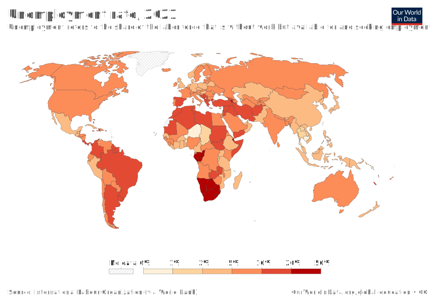
```

---
.center[
### Why unemployment rates changes across time?
]

```{r, out.width="75%"}
knitr::include_graphics("https://www.liberation.fr/resizer/L79dZlA73bQVBbR7-9yLbEhVkZQ=/1600x0/filters:format(jpg):quality(70)/cloudfront-eu-central-1.images.arcpublishing.com/liberation/4ZVMAYPNXRDCNDEHD5FDIG6TSI.PNG")
```


---

.center2[
> Aggregate—meaning added up to measure the whole, not just the parts—to describe economy-wide facts or variables

]

---
.center[
## This Unit
]

- Models price-setting and wage-setting behaviour of firms, which determines economy-wide unemployment rate and real wage

- Explains why unemployment exists even in equilibrium

- Shows how the government can affect wages and unemployment by its policies

- Analyses the role of labour unions

---
.center2[
# Measuring unemployment
]

---
.center[
## Measuring employment and unemployment
]

```{r}

```

--

The **unemployed** are the people who: 

--

- are not in paid employment or self-employment

- are available for work

- are actively seeking work

---

$$\textit{participation rate} = \frac{labour force}{\textit{population of working age}} = \frac{ employment + unemployed}{\textit{population of working age}} $$

--

$$\textit{unemployment rate} = \frac{unemployed}{labour force}$$
--

$$\textit{employment rate} = \frac{employed}{\textit{population of working age}}$$
--


|     | **Norway** | **Spain** |
| --- | --- | --- | 
| *No. of persons (millions)* |  |  |
| Population of working age	| 3.5 | 37.6 |
| Labour force | 2.5 | 21.6 |
| Out of labour force (inactive) | 1.0 | 16.0 |
| Employed | 2.4 | 18.1 |
| Employed | 0.1 | 3.5 |

---

$$\textit{participation rate} = \frac{labour force}{\textit{population of working age}} = \frac{ employment + unemployed}{\textit{population of working age}} $$

$$\textit{unemployment rate} = \frac{unemployed}{labour force}$$

$$\textit{employment rate} = \frac{employed}{\textit{population of working age}}$$


|     | **Norway** | **Spain** |
| --- | --- | --- | 
| *Rates (%)* |  |  |
| Participation rate | 2.5/3.5 = 71% | 21.6/37.6 = 58% |
| Employment rate | 2.4/3.5 = 69% | 18.1/37.6 = 48% |
| Unemployment rate	 | 0.1/2.5 = 4% | 3.5/21.6 = 16%  |

---

```{r, echo = FALSE, warning=FALSE, message=FALSE, out.width="100%"}
library(tidyverse)
library(countrycode)
library(ggrepel)
library(viridis)
library(ggthemes)

theme_set(ggthemes::theme_clean() +
            theme(legend.position = "bottom",
                  plot.background=element_blank(),
                  legend.background = element_rect(color = NA)))

working_age_pop <- 
  read_csv("data/POP_XWAP_SEX_AGE_NB_A.csv") %>% 
  filter(time %in% c(2010:2019)) %>% 
  filter(sex == "SEX_T") %>% 
  filter(classif1 == "AGE_YTHADULT_YGE25") %>% 
  mutate(
    countrycode = ref_area,
    working_age_pop = obs_value
  ) %>% 
  group_by(countrycode) %>% 
  summarise(
    working_age_pop = mean(working_age_pop, na.rm = T)
  ) %>% 
  ungroup()


unemp <- 
  read_csv("data/UNE_2UNE_SEX_AGE_NB_A.csv") %>% 
  filter(time %in% c(2010:2019)) %>% 
  filter(sex == "SEX_T") %>% 
  filter(classif1 == "AGE_YTHADULT_YGE25") %>% 
  mutate(
    countrycode = ref_area,
    unemp = obs_value
  ) %>% 
  group_by(countrycode) %>% 
  summarise(
    unemp = mean(unemp, na.rm = T)
  ) %>% 
  ungroup()

emp <- 
  read_csv("data/EMP_2EMP_SEX_AGE_NB_A.csv") %>% 
  filter(time %in% c(2010:2019)) %>% 
  filter(sex == "SEX_T") %>% 
  filter(classif1 == "AGE_YTHADULT_YGE25") %>% 
  mutate(
    countrycode = ref_area,
    emp = obs_value
  ) %>% 
  group_by(countrycode) %>% 
  summarise(
    emp = mean(emp, na.rm = T)
  ) %>% 
  ungroup()


ilostat <- 
  working_age_pop %>% 
  left_join(unemp) %>% 
  left_join(emp) %>% 
  left_join(
    countrycode::codelist %>% 
      select(continent, country.name.en, iso3c) %>% 
      rename(
        countrycode = iso3c,
        countryname = country.name.en
      )
  )

ilostat <- 
ilostat %>% 
  mutate(
    labour_force = unemp + emp,
    part_rate = 100*(labour_force/working_age_pop),
    unemp_rate = 100*(unemp/labour_force),
    emp_rate = 100*(emp/working_age_pop),
  ) %>% 
  drop_na()

ilostat_sample <- 
  ilostat %>% 
  slice_max(order_by = working_age_pop, n = 50) 

ilostat %>% 
  filter(emp_rate < 100) %>% 
  ggplot(aes(emp_rate, unemp_rate, color = continent)) +
  geom_point() +
  geom_label_repel(
    data = ilostat_sample,
    aes(emp_rate, unemp_rate, label = countrycode)
  ) +
  scale_color_viridis(discrete = T) +
  labs(x = "Employment rate (%)", y = "Unemployment rate (%)", color = "Continent") +
  theme(legend.position = "bottom") 

```

---
.center2[
# Price-setting and wage-setting
]

---

.center[
### Modelling the labour market
]

Model the labour market of an entire economy, which determines the amount of unemployment in the population as a whole. 

--

.pull-left[

- **Firms and employees (Unit 6)** 
  - motivate employees to work hard and well
  - set efficiency wages $\rightarrow$ **employment rent (a cost of job loss)**
  - wage-setting: human resources
  
```{r}
knitr::include_graphics("https://media.giphy.com/media/Mgd08v1esHvWg/giphy.gif")
```

]

.pull-right[

- **Firms and customers (Unit 7)**
  - trade-off between selling more goods and setting a higher price
  - profit-maximizing markup 
  - price-setting: marketing department
  
```{r}
knitr::include_graphics("https://media.giphy.com/media/BGbcAIX19N1Xa/giphy.gif")
```

]

---
.center[
## Employment and prices in the aggregate
]

--

**Real wage**: 
--
  nominal wage divided by the price level (a standard bundle of consumer goods)
  
--

How does the real wage and the level of employment **in the economy as a whole** are determined?

--

1. Each firm decides what wage to pay, what price to charge for its products, and how many people to hire.

--

 - The human resources department determines the nominal wage set by the firm.
 - Given the position of the demand curve, the marketing department then determines the amount of output the firm will sell.
 - The production department then calculates how many employees have to be hired to produce the output determined by the marketing department, based on the firm’s production function.

--

2. Considering the outcome of all the firms’ decisions added together.


---
.center[
## Recap: Employment rent
]

```{r, out.width="80%"}
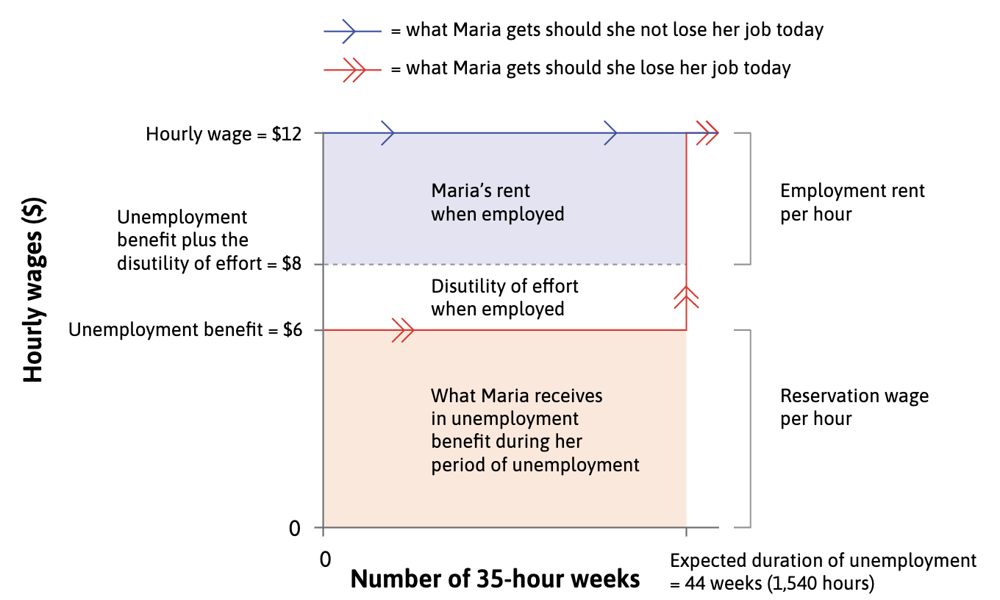
```

---
.center[
## Wage-setting curve
]

```{r, out.width="55%"}
knitr::include_graphics("imgs/f9-4-a.png")
```

The upward-sloping line is called the wage-setting curve.

---
.center[
## Wage-setting curve
]

```{r, out.width="55%"}
knitr::include_graphics("imgs/f9-4-b.png")
```

The labour force is the vertical line furthest to the right: it has a value less than 1, depending on the participation rate.

---
.center[
## Wage-setting curve
]

```{r, out.width="55%"}
knitr::include_graphics("imgs/f9-4-b.png")
```

Inactive workers are to the right of the labour force line.

---
.center[
## Wage-setting curve
]

```{r, out.width="55%"}
knitr::include_graphics("imgs/f9-4-b.png")
```

The employment rate is the vertical line to the left of the labour force, indicating the share of the population who are actually working.

---
.center[
## Wage-setting curve
]

```{r, out.width="55%"}
knitr::include_graphics("imgs/f9-4-b.png")
```

The unemployment rate is the proportion of those in the labour force who are not employed: that is, those workers in between the employment rate line and the labour force line.

---
.center[
## Wage-setting curve
]

```{r, out.width="55%"}
knitr::include_graphics("imgs/f9-4-b.png")
```

At 12% unemployment in the economy, the employee’s reservation wage is low and the worker will put in a high level of effort for a relatively low wage. The firm’s profit-maximizing wage is therefore low.


---
.center[
## Wage-setting curve
]

```{r, out.width="55%"}
knitr::include_graphics("imgs/f9-4-c.png")
```

At 5% unemployment in the economy, the employee’s reservation wage is high and they will not put in much effort unless the wage is high. The firm’s profit-maximizing wage is therefore higher.

---
.center[
## Wage-setting curve
]

```{r, out.width="55%"}
knitr::include_graphics("imgs/f9-4-c.png")
```

The wage-setting curve is a mathematical version of an ‘if-then’ statement: if the employment rate is *x*, then the Nash equilibrium wage will be *w*.

---
.center[
## Deriving the wage-setting curve
]

.pull-left[

```{r, out.width="100%"}
knitr::include_graphics("imgs/f9-5-a.png")
```

]

.pull-right[

```{r, out.width="100%"}
knitr::include_graphics("imgs/f9-5-b.png")
```

]


Higher U reduces the reservation wage, because a worker faces a longer expected period of unemployment if he or she loses a job.
--

This weakens the employees’ bargaining power and shifts the best response curve to the left.


---
.center[
## Deriving the wage-setting curve
]

.pull-left[

```{r, out.width="100%"}
knitr::include_graphics("imgs/f9-5-a.png")
```

]

.pull-right[

```{r, out.width="100%"}
knitr::include_graphics("imgs/f9-5-b.png")
```

]


With $U =  12\%$, the reservation wage is shown by point F. The employer’s profit-maximizing choice is point A with the low wage $(w_L)$.

---
.center[
## Deriving the wage-setting curve
]

.pull-left[

```{r, out.width="100%"}
knitr::include_graphics("imgs/f9-5-a.png")
```

]

.pull-right[

```{r, out.width="100%"}
knitr::include_graphics("imgs/f9-5-b.png")
```

]


With $U = 5\%$, the reservation wage is shown by point G. The employer’s profit-maximizing choice is point B with the high wage $(w_H)$.

---

```{r, out.width="90%"}
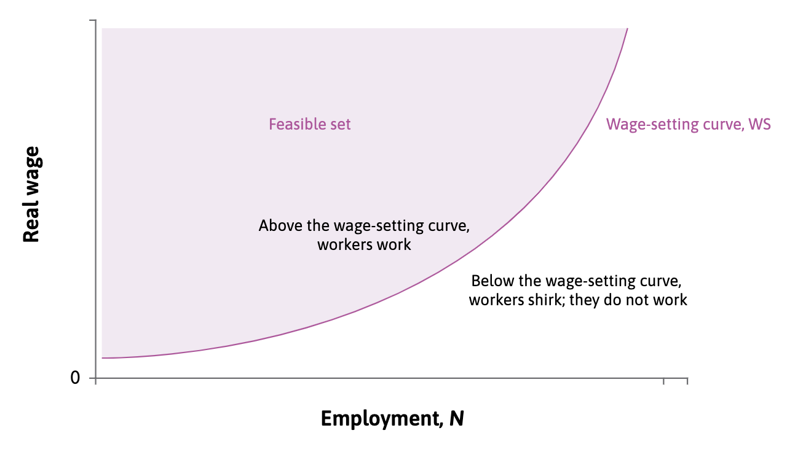
```

.center[
**The wage-setting curve: The wage level required to make employees work rather than shirk.**
]

---

```{r, out.width="80%"}

```

.center[
**A wage-setting curve estimated for the US economy (1979–2013)**
]


---
.center[
## Profit-maximizing price
]

The firm then hires a number of employees necessary to produce the quantity of output demanded at that price.

- labour $n$ is the only input
- nominal wage $W$ is the only cost
- $\lambda = 1 \Rightarrow$ one hour of labour produces one unit of output
- $q = n$

$$ \Pi = p \cdot q - W \cdot q = p \cdot n - W \cdot n $$

| **Department** | **... knows** | **… and on this basis sets the firm’s** |
| --- | --- | --- |
| Human resources (HR) | Prices, wages and employment in other firms | Nominal wage, *W* |
| Marketing | All of the above and firm’s demand function | Price of output, *p* |
| Production | All of the above, plus labour productivity and amount the firm can sell | Employment, *n* |


---
.center[
slope of demand = slope of isoprofit curve

$\frac{(p -W)}{q}$
]

```{r, out.width="70%"}
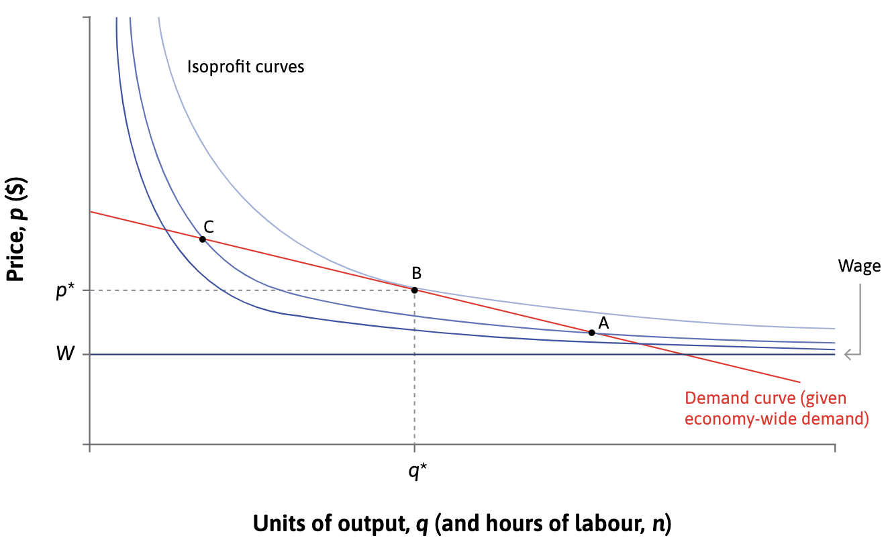
```

The maximum profits occur at point B where the firm’s demand curve is tangent to an isoprofit curve.

---
.center[
slope of isoprofit curve
$\frac{(p -W)}{q}$
]

```{r, out.width="75%"}
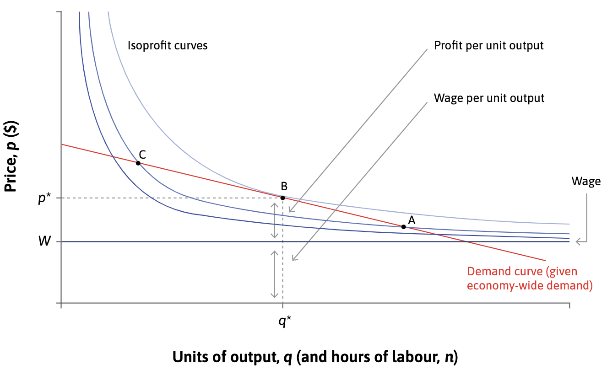
```

Notice from the figure that once the firm has set a price, it has determined the division of the total revenue between profits and wages.

---
.center[
slope of isoprofit curve
$\frac{(p -W)}{q}$
]

```{r, out.width="75%"}

```

The division of the total revenue between profits and wages is based on the markup $\frac{(p-W)}{p}$.

---
.center[
### Note: Elasticies and Markup
]

.pull-left[

#### Elastic 

$$ \varepsilon = - \frac{\Delta Q}{Q}/\frac{\Delta P}{P} > 1 $$

```{r, out.width="100%"}
knitr::include_graphics("imgs/d-elastic.png")
```

]

.pull-right[

#### Inelastic (or less elastic)

$$ \varepsilon = - \frac{\Delta Q}{Q}/\frac{\Delta P}{P} < 1 $$

```{r, out.width="100%"}

```

]


---
.center[
### Note: Elasticies and Markup
]

**Markup**: profit margin as a proportion of the price.

--

.pull-left[

**Demand: *Price Elasticity* **

$$ \varepsilon = - \frac{\frac{\Delta Q}{Q}}{\frac{\Delta P}{P}} = - \frac{P}{Q} \cdot \frac{\Delta Q}{\Delta P}$$
]

--
.pull-right[
**Firm: *Slope of isoprofit curve* **

$$ - \frac{(P-MC)}{Q} $$
]

--

Note that $slope_D = \frac{\Delta P}{\Delta Q}$ is the demand's slope
--
$$ \Rightarrow \varepsilon = - \frac{P}{Q} \cdot \frac{1}{slope_D} \iff slope_D = - \frac{P}{Q} \cdot \frac{1}{\varepsilon}$$

 and we know that the firm maximizes its profit when the both demand's and isporfit's slopes are equal.
 
--

$$ markup = -\frac{(P - MC)}{Q} = - \frac{P}{Q} \cdot \frac{1}{\varepsilon} \iff markup = \frac{(P - MC)}{P} = \frac{1}{\varepsilon}$$

---
.center[
## The price-setting curve
]

```{r, out.width="70%"}

```

Aggregate the decisions of all firms HR and MKT departments.

---
.center[
## The price-setting curve
]

```{r, out.width="70%"}

```

The figure shows the outcome of the price-setting decisions of firms in the whole economy and we use P to represent the economy-wide price level.

---
.center[
## The price-setting curve
]

```{r, out.width="70%"}

```

The top horizontal line shows firms’ revenues per worker in real terms: the average product of labour (output per worker, labour productivity, called lambda, $\lambda$)

---
.center[
## The price-setting curve
]

```{r, out.width="70%"}

```

Price-setting (not really much of a) curve: a single number that gives the value of the real wage that is consistent with the markup over costs. 

---
.center[
## The price-setting curve
]

```{r, out.width="70%"}

```

The value of the real wage consistent with the markup does not depend on the level of employment in the economy, so it is a horizontal line at the height of $w^{PS}$.


---
.center[
## The price-setting curve
]

```{r, out.width="70%"}

```

Output per worker ( $\lambda$ ) is split into real profit per worker $\Pi/P$ and the real wage $W/P$.


---
.center[
## The price-setting curve
]

```{r, out.width="70%"}

```

Point B on the price-setting curve shows the outcome of profit-maximizing price-setting behaviour of firms for the economy as a whole.

---
.center[
## The price-setting curve
]

```{r, out.width="60%"}

```

Point B on the price-setting curve shows the outcome of profit-maximizing price-setting behaviour of firms for the economy as a whole.

---
.center[
## The price-setting curve
]

```{r, out.width="70%"}
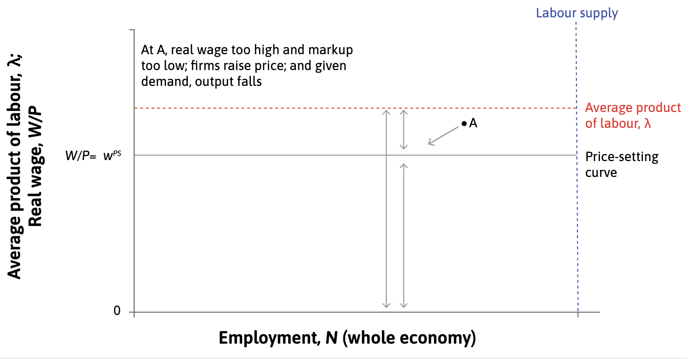
```

Point A is above the price-setting curve, which means that the real wage is higher than is consistent with a firm’s profit maximizing markup. If the real wage is too high, it means the markup is too low.

---
.center[
## The price-setting curve
]

```{r, out.width="70%"}
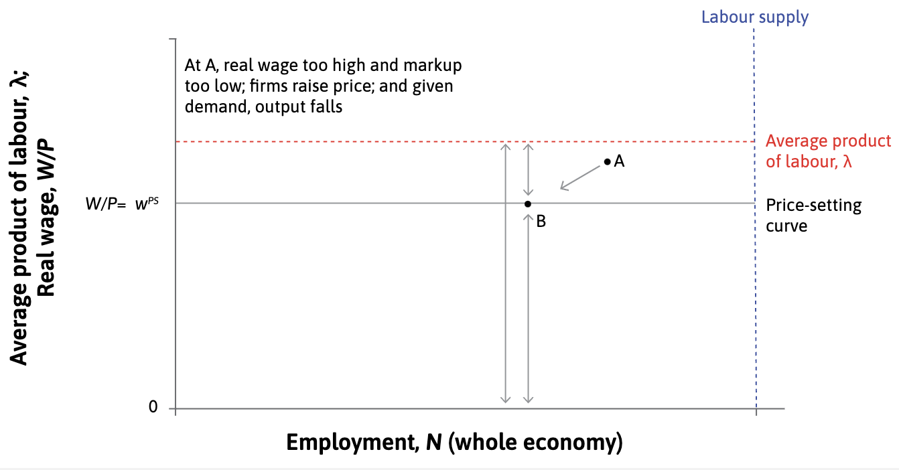
```

The firm will raise its price so as to move towards higher profits at point B. The increased price will mean that fewer goods are sold, and as this is true of all firms, total employment falls.

---
.center[
## The price-setting curve
]

```{r, out.width="60%"}

```

The firm will raise its price so as to move towards higher profits at point B. The increased price will mean that fewer goods are sold, and as this is true of all firms, total employment falls.

---
.center[
## The price-setting curve
]

```{r, out.width="70%"}
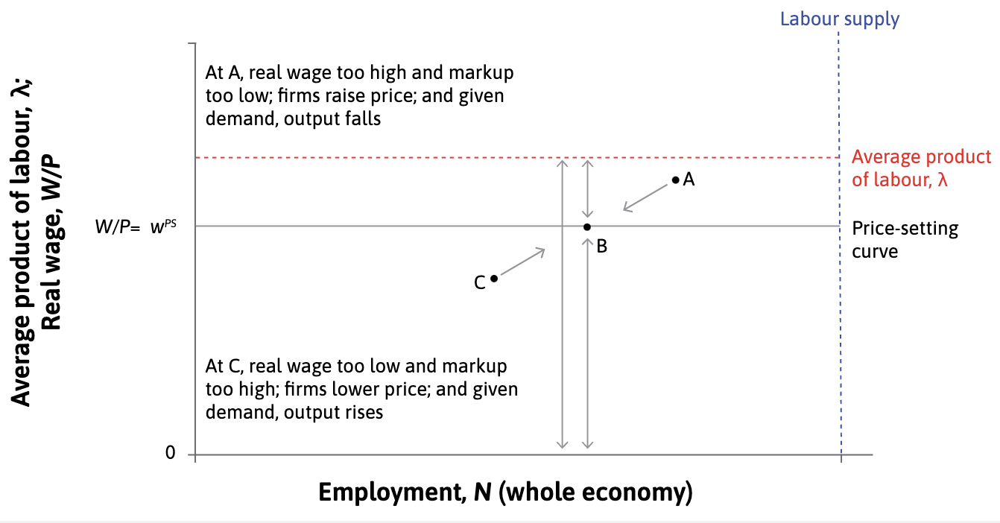
```

Below the price-setting curve, at a point like C, firms lower their prices and hire more people.

---
.center[
## The price-setting curve
]

```{r, out.width="70%"}
knitr::include_graphics("imgs/f9-11d.png")
```

Point B is the firm’s profit-maximizing price and profit margin. Given economy-wide demand, total profits are lower at A and C for firms.

---
.center[
## The price-setting curve
]

```{r, out.width="60%"}

```

Point B is the firm’s profit-maximizing price and profit margin. Given economy-wide demand, total profits are lower at A and C for firms.

---
.center[
### Deriving the price-setting curve
]

--
In our setting, MC is the unit labour cost:

$$\textit{unit labour cost} = \frac{\textit{nominal wage}}{\textit{labour productivity}} = \frac{W}{\lambda}$$

--

Firm choices prices so that the markup ( $\mu$ ) is inversely proportional to the elasticity of the demand curve

$$\mu = \frac{1}{\varepsilon} = \frac{(P-MC)}{P} = \frac{\textit{Profit per unit}}{\textit{Price per unit}}$$
--

$$\mu = \frac{(P- W/\lambda)}{P} = 1 - \frac{W/\lambda}{P}$$

--

Rearrenging 

$$\frac{W/\lambda}{P} = 1 - \mu \iff \frac{W/P}{\lambda} = 1 - \mu$$

$$\iff \frac{W}{P} = \lambda (1 - \mu) = \lambda  - \lambda \mu $$

--


$$\textit{real wage} = \textit{output per worker} - \textit{real profit per worker}$$
---
.center[
## The price-setting curve
]

```{r, out.width="80%"}

```

---
.center2[
# Labour market equilibrium
]

---
.center[
## The labour market equilibrium
]

```{r, out.width="70%"}

```

The **Nash equilibrium** of the labour market is where the wage- and price-setting curves intersect. 

---
.center[
## The labour market equilibrium
]

```{r, out.width="70%"}

```

**There will always be unemployment in labour market equilibrium**. Also called **equilibrium unemployment.**

---
.center[
## Involuntary unemployment
]

.pull-left[
```{r, out.width="100%"}

```
]

.pull-right[
**Unemployment** excess supply in the labour market.

**Involuntarily unemployed**: The state of being out of work, but preferring to have a job at the wages and working conditions that otherwise identical employed workers have.

Why there is always unemployment?

- No unemployment → zero cost of job loss → no effort
- Unemployment motivates workers
- These are the involuntarily unemployed

]

---
.center[
## Unemployment and aggregate demand

]

The firm’s demand for labour depends on the demand for their goods and services (derived demand for labour).

--

**Aggregate demand** = sum of the demand for all of the goods and services produced in the economy.

--

The increase in unemployment caused by the fall in aggregate demand is called **demand-deficient unemployment**.

```{r, out.width="50%"}
knitr::include_graphics("https://www.liberation.fr/resizer/72XWVdKtG5MwXuoH9SflpUlxok0=/768x0/filters:format(jpg):quality(70):focal(1727x824:1737x834)/cloudfront-eu-central-1.images.arcpublishing.com/liberation/HPFL5OPTYJGBBER3HHCWKBLW34.jpg")
```


---
.center[
## Demand-deficient unemployment
]

```{r, out.width="70%"}

```

At X, unemployment is at its labour market equilibrium level. Someone losing a job at X is not indifferent between being employed and unemployed because they experience a cost of losing the job.

---
.center[
## Demand-deficient unemployment
]

```{r, out.width="70%"}
knitr::include_graphics("imgs/f9-13-b.png")
```

At B, there are additional people looking for work who are also involuntarily unemployed. The additional unemployment at B is due to low aggregate demand and is called demand-deficient, or cyclical, unemployment.


---
.center[
## Demand-deficient unemployment
]

```{r, out.width="70%"}
knitr::include_graphics("imgs/f9-13-c.png")
```

At point B, total involuntary unemployment is given by the sum of cyclical and equilibrium unemployment. Point X is the Nash equilibrium of the labour market, which means that all actors are doing the best they can, given the actions of the other actors. No worker or firm can improve their position by changing their actions.


---
.center[
## Automatic adjustment 
]


.left-column[

Point B is not a Nash equilibrium:

- Firms could lower wages without lowering workers’ effort
- Lower wages allow them to cut their prices 

]

.right-column[

```{r, out.width="80%"}
knitr::include_graphics("imgs/f9-14-a.png")
```


The new (lower wage) isoprofit curve passing through the original point B is now steeper than the demand curve, so the firm can do better by lowering its price and moving down the demand curve, selling more.

]


---
.center[
## Automatic adjustment 
]


.left-column[

Point B is not a Nash equilibrium:

- Firms could lower wages without lowering workers’ effort
- Lower wages allow them to cut their prices 
- Lower prices stimulate demand $\rightarrow$ output rises
- Firms hire more workers to produce more


]

.right-column[

```{r, out.width="80%"}
knitr::include_graphics("imgs/f9-14-b.png")
```


It will continue doing this until it reaches a point on the demand curve where one of the new darker blue isoprofit curves is tangent to the demand curve. The firm maximizes profits at point X.

]

---
.center[
## Automatic adjustment?

]


.left-column[

Real economies don't function so smoothly:

- Workers resist cuts to their nominal wage (strikes)

- Lower wages means people spend less → aggregate demand falls further    

- Falling prices across the economy may lead consumers to postpone their purchases

]

.right-column[

```{r, out.width="85%"}
knitr::include_graphics("https://img.lemde.fr/2019/03/18/0/0/5900/3933/664/0/75/0/01ed661_i8O1BFWx1FSiiBD9LpDhgZIt.jpg")
```

]

---
.center[
## What can be done?
]

```{r, out.width="80%"}
knitr::include_graphics("imgs/f9-13-c.png")
```

---
.center[
## Government intervention
]

.left-column[

The government could increase its own spending to expand aggregate demand.

- **fiscal policy** (Unit 14)
- **monetary policy** (Unit 15)

]

.right-column[

```{r, out.width="80%"}
knitr::include_graphics("imgs/f9-15-a.png")
```

As before, the firm begins at point B.

]

---
.center[
## Government intervention
]

.left-column[

The government could increase its own spending to expand aggregate demand.

- **fiscal policy** (Unit 14)
- **monetary policy** (Unit 15)

]


.right-column[

```{r, out.width="80%"}
knitr::include_graphics("imgs/f9-15-b.png")
```

Remember, the isoprofit curves do not shift when the demand curve shifts. The firm moves on to a new higher isoprofit curve if demand rises as a result of higher economy-wide demand following monetary or fiscal policy actions.

]

---
.center[
## Labour supply
]

The supply of labour is another important determinant of labour market equilibrium.

--

An increase in labour supply shifts the wage-setting curve downward. Thus, in the short-run:

- greater pool of unemployed
- higher employment rents
- lower cost of effort 

--

Does this sustaines in the medium-run? 


.pull-left[
```{r, out.width="65%"}
knitr::include_graphics("https://are.berkeley.edu/~howardrr/pubs/lmd/html/winterspring_93/pics_ws93/01.gif")
```
]

.pull-right[
```{r, out.width="65%"}
knitr::include_graphics("https://opb-opb-prod.cdn.arcpublishing.com/resizer/vyDxuKYLzgn3GZDaKTo76PLkwaY=/767x0/smart/cloudfront-us-east-1.images.arcpublishing.com/opb/E4LLOGB5JNBZTFQ2FXSFPAQ7YI.jpg")
```
]

---
.center[
## Labour supply
]

```{r, out.width="65%"}

```

The economy starts at point A, employing 4 million workers at a wage of $20 per hour and a labour force of 5 million.

---
.center[
## Labour supply
]

```{r, out.width="65%"}
knitr::include_graphics("imgs/f9-19-b.png")
```


U = One million.

---
.center[
## Labour supply
]

```{r, out.width="65%"}

```

Immigrant workers join the labour force. This increases the labour force from 5 million to 5.5 million workers.

---
.center[
## Labour supply
]

```{r, out.width="65%"}
knitr::include_graphics("imgs/f9-19-d.png")
```

At any level of employment there are now more unemployed workers. The rise in unemployment to 1.5 million is shown by distance U′. The threat of job loss is greater and firms can secure effort from the workforce at a lower wage.

---
.center[
## Labour supply
]

```{r, out.width="65%"}

```

The wage is now set at point B on the wage-setting curve in the figure, with the wage at $13 an hour and employment still at 4 million.

---
.center[
## Labour supply
]

```{r, out.width="65%"}

```

This causes firms to hire more workers, which requires rising wages along the wage-setting curve. The labour market moves from point B to point C.

---
.center[
## Labour supply
]

```{r, out.width="65%"}
knitr::include_graphics("imgs/f9-19-g.png")
```

Employment and wages rise until they reach the price-setting curve, meaning profits are consistent with market competition again. At point C, employment is 4.5 million workers, the wage is $20, and unemployment has fallen back to 1 million workers, as shown by distance U''

---
.center[
## Labour supply: Immigration effects 
]

```{r, out.width="90%"}
knitr::include_graphics("imgs/card1990.png")
```


---
.center2[
# Division of output and labour unions
]

---
.center[
## Labour market equilibrium and income distribution
]

```{r, out.width="90%"}
knitr::include_graphics("imgs/f9-18-a.png")
```

---
.center[
## Labour market equilibrium and income distribution
]

Inequality changes with: unemployment rate, real wage, markup, productivity


```{r, out.width="90%"}
knitr::include_graphics("imgs/f9-18-b.png")
```

---
.center[
## Labour market equilibrium and income distribution
]

Inequality changes with: unemployment rate, real wage, markup, productivity

```{r, out.width="90%"}

```

---
.center[
## Labour unions
]

An organization consisting predominantly of employees. 

Its main activities include the negotiation of rates of pay and conditions of employment for its members.

```{r, out.width="60%"}
knitr::include_graphics("https://images.squarespace-cdn.com/content/v1/62923f4f74bc7d0c025784fc/e13e5585-2e6c-4e82-95d2-b8dd8954bb92/ED+DSC05916.jpg?format=1500w")
```

---
.center[
## Labour unions
]

An organization consisting predominantly of employees. 

Its main activities include the negotiation of rates of pay and conditions of employment for its members.

```{r, out.width="60%"}
knitr::include_graphics("imgs/share-of-employees-whose-wages-are-covered-by-collective-bargaining-agreements.svg")
```

---
.center[
## Wage bargaining
]

Where workers are organized into trade unions, the wage is not set by the employer but instead is negotiated between union and firm. 

--

```{r, out.width="55%"}
knitr::include_graphics("imgs/f9-21-a.png")
```

At point A, the employer sets the wage that maximizes profits at the point of tangency of the isocost line and the best response function.

---
.center[
## Wage bargaining
]

Where workers are organized into trade unions, the wage is not set by the employer but instead is negotiated between union and firm. 

```{r, out.width="55%"}
knitr::include_graphics("imgs/f9-21-b.png")
```

If the union sets the wage, it will be higher than that preferred by the employer, and effort levels correspondingly higher...

---
.center[
## Wage bargaining
]

Where workers are organized into trade unions, the wage is not set by the employer but instead is negotiated between union and firm. 

```{r, out.width="55%"}

```

... but profits would be lower (indicated by the flatter isocost line passing through C).

---
.center[
## Bargained wage setting curve
]

Its position above the wage-setting curve depends on the relative bargaining power of the union and the employer.

```{r, out.width="60%"}
knitr::include_graphics("imgs/f9-22.png")
```

The bargained wage can be above the wage-setting curve, and, paradoxically, it seems that the union’s success in bargaining would harm workers.

---
.center[
## Labour unions and unemployment
]

```{r, out.width="60%"}
knitr::include_graphics("imgs/collective-wage-bargaining-coverage-and-unemployment-across-the-oecd.svg")
```

No relation between union adherence and unemployment.

---
.center[
## The union voice effect
]

Providing employees with a voice in how decisions are made may induce them to provide more effort for the same wage. 

```{r, out.width="45%"}
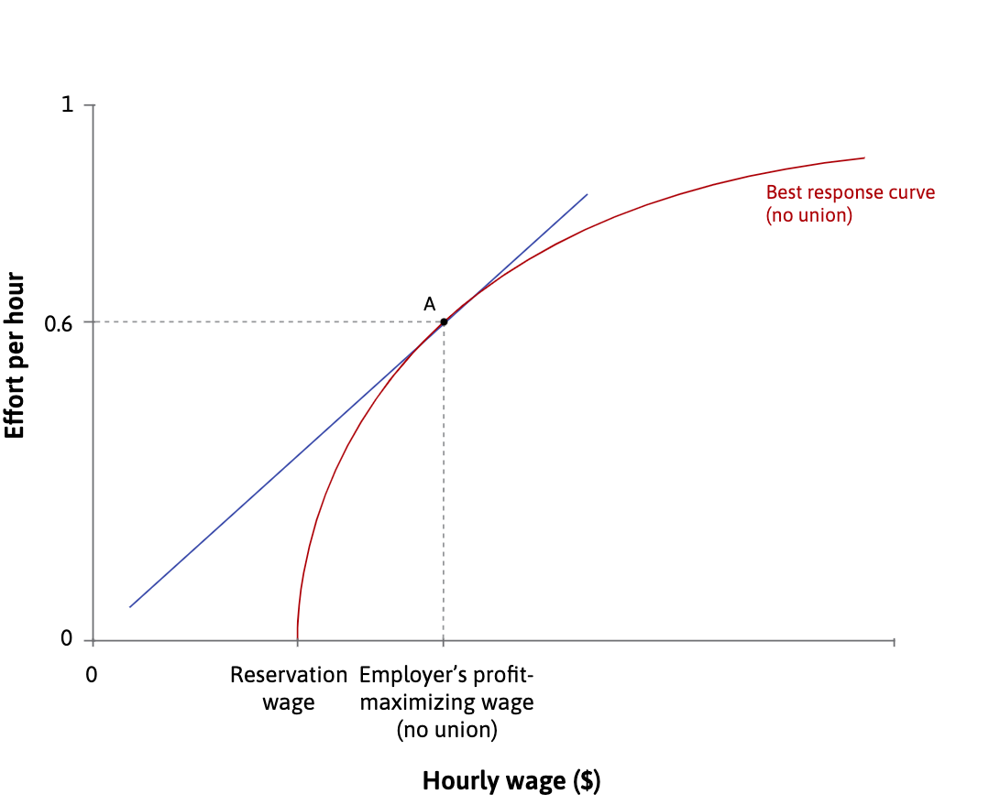
```

At point A, the employer sets the wage that maximizes profits at the point of tangency of the isocost line and the best response curve.

---
.center[
## The union voice effect
]

Providing employees with a voice in how decisions are made may induce them to provide more effort for the same wage. 

```{r, out.width="45%"}
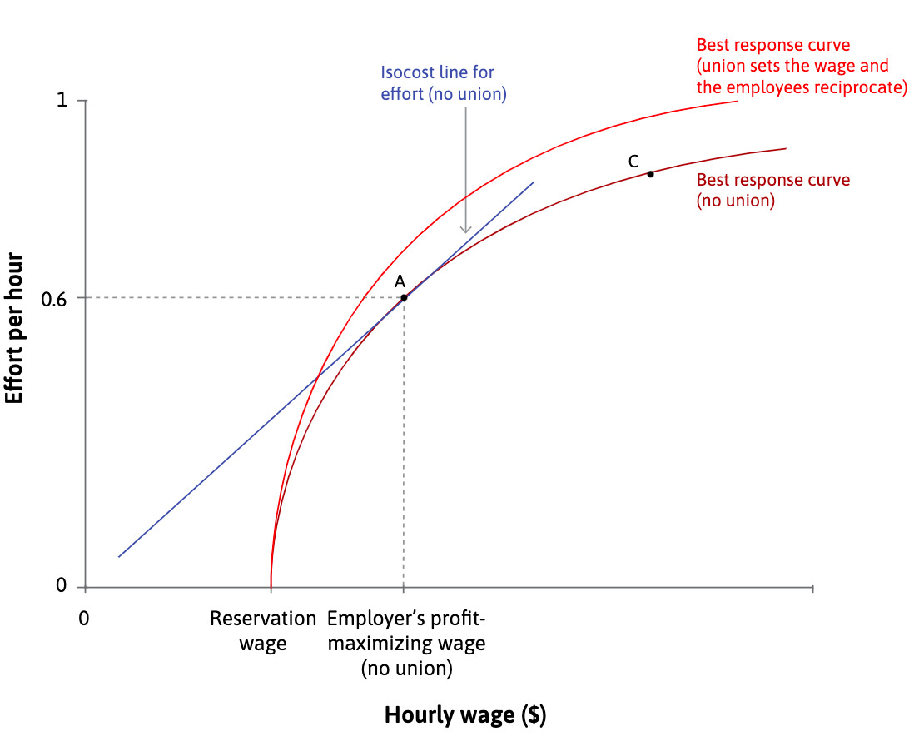
```

If the employees interpret the employer’s recognition of the trade union, and its willingness to compromise with them over a higher wage, as a sign of goodwill, the best response curve shifts up.

---
.center[
## The union voice effect
]

Providing employees with a voice in how decisions are made may induce them to provide more effort for the same wage. 

```{r, out.width="45%"}
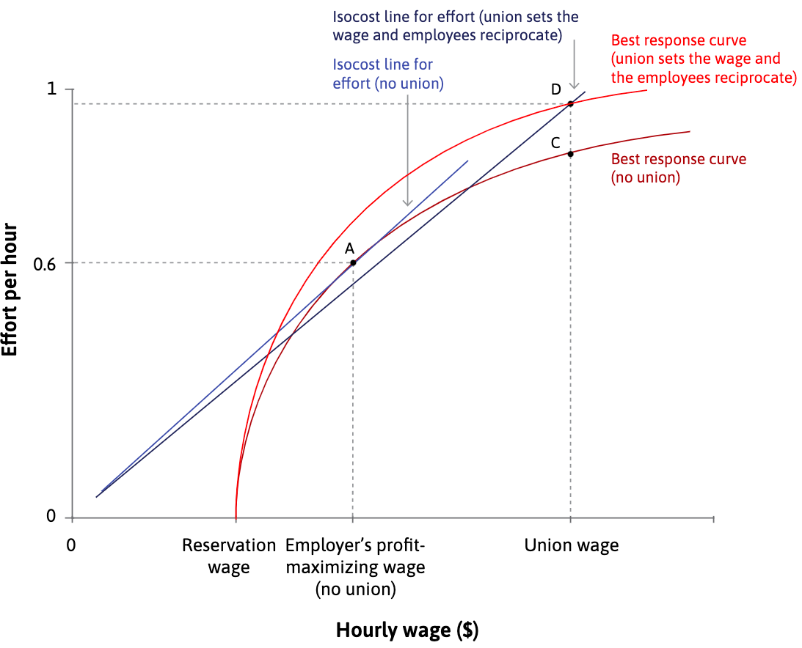
```

The result of the greater bargaining power of the workers, and their reciprocation of the company’s worker-friendly policy, is shown as point D.


---
.center[
## The union voice effect
]

- The bargained wage curve shifts downward.
- The overall effect of labour unions on employment is ambiguous.

```{r, out.width="70%"}

```

---
.center2[
## Labour market policies
]

---
.center[
## Labour market policies
]

--

**Shifts in the price-setting curve:**

- Education & training: labour productivity ↑
- Wage subsidy: Production costs and prices ↓

--

**Shifts in the wage-setting curve:**

- Lower unemployment benefit: reservation wage ↓

--

**Shifts in labour supply curve:**

- immigration policies: labour supply ↑
- childcare provision: female labour participation ↑

---
.center[
## Summary
]

--

1. Behaviour of firms sets wages and employment in an economy 

  - The wage-setting curve tracks the combinations of wages and unemployment feasible with workers’ effort
  - The price-setting curve determines the real wage corresponding to profit-maximising price

--

2. There will always be involuntary unemployment 

  - Incomplete contracts
  - Deficient demand 

--

3. Labour unions bargain over wages with firms, which affects employment

  - Voice to workers may improve their effort and productivity

