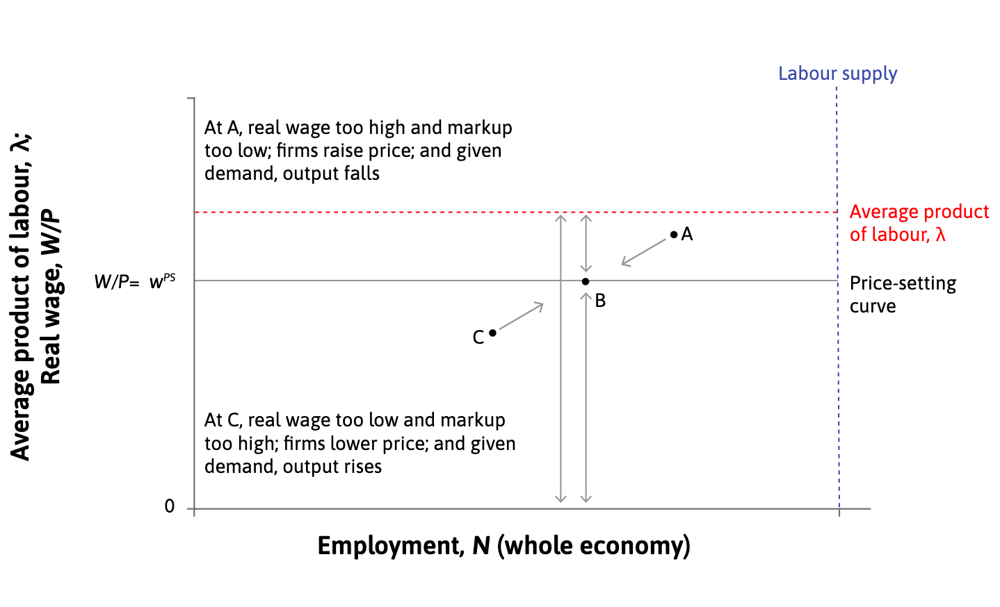

```{r meta, echo=FALSE}
library(metathis)
meta() %>%
  meta_general(
    description = "An Introduction to xaringan for Presentations: The Basics",
    generator = "xaringan and remark.js"
  ) %>% 
  meta_name("github-repo" = "spcanelon/xaringan-basics-and-beyond")
  # meta_social(
  #   title = "Sharing Your Work with xaringan &#8212; Day 1",
  #   url = "https://spcanelon.github.io/xaringan-basics-and-beyond/slides/day-01-basics.html#1",
  #   image = "https://raw.githubusercontent.com/spcanelon/xaringan-basics-and-beyond/main/slides/day-01-cover-image.png",
  #   image_alt = "Title slide for the day 1 slides of the Sharing Your Work with xaringan workshop series",
  #   og_type = "website",
  #   og_author = "Silvia Canelon",
  #   twitter_card_type = "summary_large_image",
  #   twitter_creator = "@spcanelon"
  # )
```

```{r setup, include = FALSE}
knitr::opts_chunk$set(echo = FALSE)
knitr::opts_chunk$set(out.width = "90%")
knitr::opts_chunk$set(fig.align="center")
options(htmltools.dir.version = FALSE)


options(htmltools.dir.version = FALSE)
library(knitr)
library(tidyverse)
library(xaringanExtra)
# set default options
opts_chunk$set(echo=FALSE,
               collapse = TRUE,
               fig.width = 7.252,
               fig.height = 4,
               dpi = 300)
# set engines
knitr::knit_engines$set("markdown")
xaringanExtra::use_tile_view()
xaringanExtra::use_panelset()
xaringanExtra::use_clipboard()
xaringanExtra::use_webcam()
xaringanExtra::use_broadcast()
xaringanExtra::use_share_again()
xaringanExtra::style_share_again(
  share_buttons = c("twitter", "linkedin", "pocket")
)
# uncomment the following lines if you want to use the NHS-R theme colours by default
# scale_fill_continuous <- partial(scale_fill_nhs, discrete = FALSE)
# scale_fill_discrete <- partial(scale_fill_nhs, discrete = TRUE)
# scale_colour_continuous <- partial(scale_colour_nhs, discrete = FALSE)
# scale_colour_discrete <- partial(scale_colour_nhs, discrete = TRUE)
```


The labour market brings together two earlier topics:

--

.pull-left[

- **Firms and employees (Unit 6)** 
  - motivate employees to work hard and well
  - set efficiency wages $\rightarrow$ **employment rent (a cost of job loss)**
  - wage-setting: human resources

]

--

.pull-right[

- **Firms and customers (Unit 7)**
  - trade-off between selling more goods and setting a higher price
  - profit-maximizing markup 
  - price-setting: marketing department

]


--

.pull-left[

```{r}
knitr::include_graphics("https://media.giphy.com/media/Mgd08v1esHvWg/giphy.gif")
```

]

.pull-right[

```{r}
knitr::include_graphics("https://media.giphy.com/media/BGbcAIX19N1Xa/giphy.gif")
```

]

---
## Employment and prices in the aggregate

--

**Real wage**: 
--
  nominal wage divided by the price level (a standard bundle of consumer goods)
  
--

How does the real wage and the level of employment **in the economy as a whole** are determined?

--

1. Each firm decides what wage to pay, what price to charge for its products, and how many people to hire.

--

 - The human resources department determines the nominal wage set by the firm.
 - Given the position of the demand curve, the marketing department then determines the amount of output the firm will sell.
 - The production department then calculates how many employees have to be hired to produce the output determined by the marketing department, based on the firm’s production function.

--

2. Considering the outcome of all the firms’ decisions added together.

---
## Measuring employment and unemployment

--

```{r}
knitr::include_graphics("imgs/employment-structure.png")
```

--

The **unemployed** are the people who: 

--

- are not in paid employment or self-employment

- are available for work

- are actively seeking work

---

$$\textit{participation rate} = \frac{labour force}{\textit{population of working age}} = \frac{ employment + unemployed}{\textit{population of working age}} $$

--

$$\textit{unemployment rate} = \frac{unemployed}{labour force}$$
--

$$\textit{employment rate} = \frac{employed}{\textit{population of working age}}$$

--


```{r, echo = FALSE, warning=FALSE, message=FALSE, out.width="70%"}
library(tidyverse)
library(countrycode)
library(ggrepel)
library(viridis)
library(ggthemes)

theme_set(ggthemes::theme_clean() +
            theme(legend.position = "bottom",
                  plot.background=element_blank(),
                  legend.background = element_rect(color = NA)))

working_age_pop <- 
  read_csv("data/POP_XWAP_SEX_AGE_NB_A.csv") %>% 
  filter(time %in% c(2010:2019)) %>% 
  filter(sex == "SEX_T") %>% 
  filter(classif1 == "AGE_YTHADULT_YGE25") %>% 
  mutate(
    countrycode = ref_area,
    working_age_pop = obs_value
  ) %>% 
  group_by(countrycode) %>% 
  summarise(
    working_age_pop = mean(working_age_pop, na.rm = T)
  ) %>% 
  ungroup()


unemp <- 
  read_csv("data/UNE_2UNE_SEX_AGE_NB_A.csv") %>% 
  filter(time %in% c(2010:2019)) %>% 
  filter(sex == "SEX_T") %>% 
  filter(classif1 == "AGE_YTHADULT_YGE25") %>% 
  mutate(
    countrycode = ref_area,
    unemp = obs_value
  ) %>% 
  group_by(countrycode) %>% 
  summarise(
    unemp = mean(unemp, na.rm = T)
  ) %>% 
  ungroup()

emp <- 
  read_csv("data/EMP_2EMP_SEX_AGE_NB_A.csv") %>% 
  filter(time %in% c(2010:2019)) %>% 
  filter(sex == "SEX_T") %>% 
  filter(classif1 == "AGE_YTHADULT_YGE25") %>% 
  mutate(
    countrycode = ref_area,
    emp = obs_value
  ) %>% 
  group_by(countrycode) %>% 
  summarise(
    emp = mean(emp, na.rm = T)
  ) %>% 
  ungroup()


ilostat <- 
  working_age_pop %>% 
  left_join(unemp) %>% 
  left_join(emp) %>% 
  left_join(
    countrycode::codelist %>% 
      select(continent, country.name.en, iso3c) %>% 
      rename(
        countrycode = iso3c,
        countryname = country.name.en
      )
  )

ilostat <- 
ilostat %>% 
  mutate(
    labour_force = unemp + emp,
    part_rate = 100*(labour_force/working_age_pop),
    unemp_rate = 100*(unemp/labour_force),
    emp_rate = 100*(emp/working_age_pop),
  ) %>% 
  drop_na()

ilostat_sample <- 
  ilostat %>% 
  slice_max(order_by = working_age_pop, n = 50) 

ilostat %>% 
  filter(emp_rate < 100) %>% 
  ggplot(aes(emp_rate, unemp_rate, color = continent)) +
  geom_point() +
  geom_label_repel(
    data = ilostat_sample,
    aes(emp_rate, unemp_rate, label = countrycode)
  ) +
  scale_color_viridis(discrete = T) +
  labs(x = "Employment rate (%)", y = "Unemployment rate (%)", color = "Continent") +
  theme(legend.position = "bottom") 

```

---
## Wage setting curve

```{r, out.width="65%"}

```

---
## Wage setting curve

```{r, out.width="65%"}

```

---
## Wage setting curve

```{r, out.width="65%"}

```


---
## Wage setting curve

.pull-left[

```{r, out.width="100%"}

```

]

.pull-right[

```{r, out.width="100%"}

```

]


Higher U reduces the reservation wage, because a worker faces a longer expected period of unemployment if he or she loses a job.
--

This weakens the employees’ bargaining power and shifts the best response curve to the left.


---
## Wage setting curve

.pull-left[

```{r, out.width="100%"}

```

]

.pull-right[

```{r, out.width="100%"}

```

]


With $U =  12\%$, the reservation wage is shown by point F. The employer’s profit-maximizing choice is point A with the low wage $(w_L)$.

---
## Wage setting curve

.pull-left[

```{r, out.width="100%"}

```

]

.pull-right[

```{r, out.width="100%"}

```

]


With $U = 5\%$, the reservation wage is shown by point G. The employer’s profit-maximizing choice is point B with the high wage $(w_H)$.

---
**A wage-setting curve estimated for the US economy (1979–2013)**

```{r, out.width="80%"}
knitr::include_graphics("imgs/f9-6.png")
```


---
### Note: Elasticies and Markup


.pull-left[

#### Elastic 

$$ \varepsilon = - \frac{\Delta Q}{Q}/\frac{\Delta P}{P} > 1 $$

```{r, out.width="100%"}

```

]

.pull-right[

#### Inelastic (or less elastic)

$$ \varepsilon = - \frac{\Delta Q}{Q}/\frac{\Delta P}{P} < 1 $$

```{r, out.width="100%"}
knitr::include_graphics("imgs/d-inelastic.png")
```

]


---
## Note: Elasticies and Markup

--

**Markup**: profit margin as a proportion of the price.

--

.pull-left[

**Demand: *Price Elasticity* **

$$ \varepsilon = - \frac{\frac{\Delta Q}{Q}}{\frac{\Delta P}{P}} = - \frac{P}{Q} \cdot \frac{\Delta Q}{\Delta P}$$
]

--
.pull-right[
**Firm: *Slope of isoprofit curve* **

$$ - \frac{(P-MC)}{Q} $$
]

--

Note that $slope_D = \frac{\Delta P}{\Delta Q}$ is the demand's slope
--
$$ \Rightarrow \varepsilon = - \frac{P}{Q} \cdot \frac{1}{slope_D} \iff slope_D = - \frac{P}{Q} \cdot \frac{1}{\varepsilon}$$

 and we know that the firm maximizes its profit when the both demand's and isporfit's slopes are equal.
 
--

$$ markup = -\frac{(P - MC)}{Q} = - \frac{P}{Q} \cdot \frac{1}{\varepsilon} \iff markup = \frac{(P - MC)}{P} = \frac{1}{\varepsilon}$$

---
## Profit-maximizing price

.left-column[

- labour $n$ is the only input
- nominal wage $W$ is the only cost
- $\lambda = 1 \Rightarrow$ one hour of labour produces one unit of output
- $q = n$

The firm then hires a number of employees necessary to produce the quantity of output demanded at that price.

slope of isoprofit curve
$\frac{(p -W)}{q}$

]

.right-column[

```{r, out.width="100%"}

```

]

---
## The price-setting curve

--

Aggregate the decisions of all firms HR and MKT departments.

--

```{r, out.width="70%"}
knitr::include_graphics("imgs/f9-10.png")
```

---
## The price-setting curve


Aggregate the decisions of all firms HR and MKT departments.


```{r, out.width="70%"}

```


---
## Deriving the price-setting curve

--

$$\textit{unit labour cost} = \frac{\textit{nominal wage}}{\textit{labour productivity}} = \frac{W}{\lambda}$$

--

Firm choices prices so that the markup ($\mu$) is inversely proportional to the elasticity of the demand curve

$$\mu = \frac{1}{\varepsilon} = \frac{(P-MC)}{P} = \frac{\textit{Profit per unit}}{\textit{Price per unit}}$$
--

$$\mu = \frac{(P- W/\lambda)}{P} = 1 - \frac{W/\lambda}{P}$$

--

Rearrenging 

$$\frac{W/\lambda}{P} = 1 - \mu \iff \frac{W/P}{\lambda} = 1 - \mu$$

$$\iff \frac{W}{P} = \lambda (1 - \mu) = \lambda  - \lambda \mu $$

--


$$\textit{real wage} = \textit{output per worker} - \textit{real profit per worker}$$

---
## The labour market equilibrium

--

The wage-setting and price-setting curves are two sides of the economy. 

--


```{r, out.width="80%"}
knitr::include_graphics("imgs/f9-12.png")
```

---
## The labour market equilibrium

The Nash equilibrium of the labour market is where the wage- and price-setting curves intersect. 

--

All parties are doing the best they can, given what everyone else is doing:

--

- The firms are offering the least wage to ensure workers’ effort  

--
 
- Employment is the highest it can be, given the wage

--

- Those who have jobs cannot improve their situation by asking for higher pay or working less hard

--

- Those who do not have jobs would like to work, but cannot persuade firms to hire them by accepting lower wage (labour discipline concerns)

---

## Involuntary unemployment

**Unemployment** excess supply in the labour market.

--

**There will always be unemployment in labour market equilibrium**

--

- No unemployment → zero cost of job loss → no effort
- Therefore some unemployment is necessary to motivate workers
- These are the involuntarily unemployed


--
## Unemployment and aggregate demand

--

The firm’s demand for labour depends on the demand for their goods and services (derived demand for labour).

--

**Aggregate demand** = sum of the demand for all of the goods and services produced in the economy.

--

The increase in unemployment caused by the fall in aggregate demand is called demand-deficient unemployment.

---
## Demand-deficient unemployment

```{r, out.width="90%"}
knitr::include_graphics("imgs/f9-13-a.png")
```

---
## Demand-deficient unemployment

```{r, out.width="90%"}

```

---
## Demand-deficient unemployment

```{r, out.width="90%"}
knitr::include_graphics("imgs/f9-13-c.png")
```

---
## Automatic adjustment 

Point B is not a Nash equilibrium:


.left-column[

- Firms could lower wages without lowering workers’ effort
- Lower wages allow them to cut their prices 


]

.right-column[

```{r, out.width="90%"}

```

]

---
## Automatic adjustment 

Point B is not a Nash equilibrium:


.left-column[

- Firms could lower wages without lowering workers’ effort
- Lower wages allow them to cut their prices 
- Lower prices stimulate demand $\rightarrow$ output rises
- Firms hire more workers to produce more


]

.right-column[

```{r, out.width="90%"}

```

]

---
## Automatic adjustment?

Real economies do not function so smoothly:


.pull-left[


- Workers resist cuts to their nominal wage (lower morale, strikes)
- Lower wages means people spend less → aggregate demand falls further    
- Falling prices across the economy may lead consumers to postpone their purchases in hope to get even better bargain later


]

--

.pull-right[

```{r, out.width="100%"}
knitr::include_graphics("https://img.lemde.fr/2019/03/18/0/0/5900/3933/664/0/75/0/01ed661_i8O1BFWx1FSiiBD9LpDhgZIt.jpg")
```

]

---
## Government intervention

.left-column[

The government could increase its own spending to expand aggregate demand.

- monetary policy
- fiscal policy

]

.right-column[

```{r, out.width="90%"}

```

]

---
## Government intervention

.left-column[

The government could increase its own spending to expand aggregate demand.

- monetary policy
- fiscal policy

]

.right-column[

```{r, out.width="90%"}

```

]

---
## Labour supply

--

```{r, out.width="65%"}
knitr::include_graphics("imgs/f9-19-a.png")
```

--

The economy starts at point A, employing 4 million workers at a wage of $20 per hour and a labour force of 5 million.

---
## Labour supply


```{r, out.width="65%"}

```


U = One million.

---
## Labour supply

```{r, out.width="65%"}
knitr::include_graphics("imgs/f9-19-c.png")
```

Immigrant workers join the labour force. This increases the labour force from 5 million to 5.5 million workers.

---
## Labour supply

```{r, out.width="65%"}

```

At any level of employment there are now more unemployed workers. The rise in unemployment to 1.5 million is shown by distance U′. The threat of job loss is greater and firms can secure effort from the workforce at a lower wage.

---
## Labour supply

```{r, out.width="65%"}
knitr::include_graphics("imgs/f9-19-e.png")
```

The wage is now set at point B on the wage-setting curve in the figure, with the wage at $13 an hour and employment still at 4 million.

---
## Labour supply

```{r, out.width="65%"}
knitr::include_graphics("imgs/f9-19-f.png")
```

This causes firms to hire more workers, which requires rising wages along the wage-setting curve. The labour market moves from point B to point C.

---
## Labour supply

```{r, out.width="65%"}
knitr::include_graphics("imgs/f9-19-g.png")
```

Employment and wages rise until they reach the price-setting curve, meaning profits are consistent with market competition again. At point C, employment is 4.5 million workers, the wage is $20, and unemployment has fallen back to 1 million workers, as shown by distance U''

---
## Labour supply: Immigration effects 

```{r, out.width="90%"}

```

---
## Labour market equilibrium and income distribution 

```{r, out.width="90%"}
knitr::include_graphics("imgs/f9-18-a.png")
```

---
## Labour market equilibrium and income distribution 


Inequality changes with: unemployment rate, real wage, markup, productivity

--

```{r, out.width="90%"}

```

---
## Labour market equilibrium and income distribution 

Inequality changes with: unemployment rate, real wage, markup, productivity

```{r, out.width="90%"}
knitr::include_graphics("imgs/f9-18-c.png")
```

---
## Labour unions

An organization consisting predominantly of employees. Its main activities include the negotiation of rates of pay and conditions of employment for its members. 

--


```{r, out.width="70%"}
knitr::include_graphics("https://www.amazonlaborunion.org/content/images/2021/12/Moore---comic---Make-History_0.jpg")
```

---
## Labour unions

An organization consisting predominantly of employees. Its main activities include the negotiation of rates of pay and conditions of employment for its members. 


```{r, out.width="70%"}

```


---
## Wage bargaining

Where workers are organized into trade unions, the wage is not set by the employer but instead is negotiated between union and firm. 

```{r, out.width="80%"}

```

---
## Wage bargaining

Where workers are organized into trade unions, the wage is not set by the employer but instead is negotiated between union and firm. 

```{r, out.width="80%"}

```

---
## Wage bargaining

Where workers are organized into trade unions, the wage is not set by the employer but instead is negotiated between union and firm. 

```{r, out.width="80%"}
knitr::include_graphics("imgs/f9-21-c.png")
```

---
## Bargained wage setting curve

Its position above the wage-setting curve depends on the relative bargaining power of the union and the employer.


```{r, out.width="60%"}

```


The bargained wage can be above the wage-setting curve
- the wage-setting curve is about the employer’s threat of firing a worker
- the union can threaten to “dismiss” the employer by going on strike


---
## Labour unions and unemployment

```{r, out.width="70%"}

```

---
## The union voice effect

Providing employees with a voice in how decisions are made may induce them to provide more effort for the same wage. 

--

- The bargained wage curve shifts downward.
- The overall effect of labour unions on employment is ambiguous.

```{r, out.width="60%"}
knitr::include_graphics("imgs/f9-24.png")
```

---
## Labour market policies

--

**Shifts in the price-setting curve:**

- Education & training: labour productivity ↑
- Wage subsidy: Production costs and prices ↓

--

**Shifts in the wage-setting curve:**

- Lower unemployment benefit: reservation wage ↓

--

**Shifts in labour supply curve:**

- immigration policies: labour supply ↑
- childcare provision: female labour participation ↑

---
## Summary
--

1. Behaviour of firms sets wages and employment in an economy 

  - The wage-setting curve tracks the combinations of wages and unemployment feasible with workers’ effort
  - The price-setting curve determines the real wage corresponding to profit-maximising price

--

2. There will always be involuntary unemployment 

  - Incomplete contracts
  - Deficient demand 

--

3. Labour unions bargain over wages with firms, which affects employment

  - Voice to workers may improve their effort and productivity

