```{r meta, echo=FALSE}
library(metathis)
meta() %>%
  meta_general(
    description = "An Introduction to xaringan for Presentations: The Basics",
    generator = "xaringan and remark.js"
  ) %>% 
  meta_name("github-repo" = "spcanelon/xaringan-basics-and-beyond")
  # meta_social(
  #   title = "Sharing Your Work with xaringan &#8212; Day 1",
  #   url = "https://spcanelon.github.io/xaringan-basics-and-beyond/slides/day-01-basics.html#1",
  #   image = "https://raw.githubusercontent.com/spcanelon/xaringan-basics-and-beyond/main/slides/day-01-cover-image.png",
  #   image_alt = "Title slide for the day 1 slides of the Sharing Your Work with xaringan workshop series",
  #   og_type = "website",
  #   og_author = "Silvia Canelon",
  #   twitter_card_type = "summary_large_image",
  #   twitter_creator = "@spcanelon"
  # )
```

```{r setup, include = FALSE}
knitr::opts_chunk$set(echo = FALSE)
knitr::opts_chunk$set(out.width = "90%")
knitr::opts_chunk$set(fig.align="center")

options(htmltools.dir.version = FALSE)
library(knitr)
library(tidyverse)
library(xaringanExtra)
# set default options
opts_chunk$set(echo=FALSE,
               collapse = TRUE,
               fig.width = 7.252,
               fig.height = 4,
               dpi = 300)
# set engines
knitr::knit_engines$set("markdown")
xaringanExtra::use_tile_view()
xaringanExtra::use_panelset()
xaringanExtra::use_clipboard()
xaringanExtra::use_webcam()
xaringanExtra::use_broadcast()
xaringanExtra::use_share_again()
xaringanExtra::style_share_again(
  share_buttons = c("twitter", "linkedin", "pocket")
)
# uncomment the following lines if you want to use the NHS-R theme colours by default
# scale_fill_continuous <- partial(scale_fill_nhs, discrete = FALSE)
# scale_fill_discrete <- partial(scale_fill_nhs, discrete = TRUE)
# scale_colour_continuous <- partial(scale_colour_nhs, discrete = FALSE)
# scale_colour_discrete <- partial(scale_colour_nhs, discrete = TRUE)
```


# Countries Better-Off than GB in 1800

Koyama and Rubin, 2022

```{r}

knitr::include_graphics("imgs/fig_1_2_koyama_rubin.png")

```

---

# Countries Better-Off than US in 1900

Koyama and Rubin, 2022

```{r}

knitr::include_graphics("imgs/fig_1_1_koyama_rubin.png")

```

---

```{r, out.width="80%"}
knitr::include_graphics("imgs/gdp-per-capita-maddison-2020-grate.svg")
```

---

```{r, out.width="90%"}
knitr::include_graphics("imgs/global_inequality.gif")
```


---

# What explain modern economic differences?

--

- The best predictor of a region’s relative
income in a period is its income in the years
prior

--

- The richest countries in the
world are about 42 times as rich as the poorest


--

- We have studied mainly short- and medium-run changes that explain differences in economic growth

--

- We underlined modern technology and policy

--

> **The causes of the wealth and poverty of nations [were] the grand object of all enquiries in Political Economy** (Thomas Malthus to David Ricardo)

--

> **An Inquiry into the Nature and Causes of the Wealth of Nations** (Adam Smith)

---

```{r, out.width="90%"}
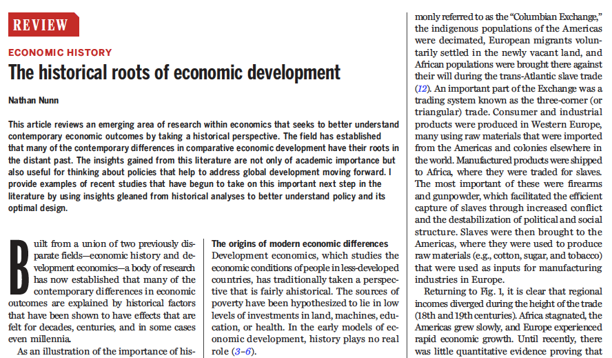
```


---

.pull-left[

## Development economics

- Studies the economic conditions of people in less-developed countries
- The sources of poverty have been hypothesized to lie in low levels of investments in land, machines, education, or health
- Ahistorical

]


.pull-right[

## Economic history

- Focus on important but historically specific
questions
- Connections between disparate time periods were infrequently made

]

--

.center[
## Historical and cultural economics
]

- Focus on historical events shaping contemporary outcomes

  - Institutions
  - Geography
  - Culture
  
- Explore hypothesis of historians, anthropologist, or sociologist.

- Extensive evidence on what mechanisms explain such persistence


---

# The Columbian Exchange

```{r, out.width="90%"}
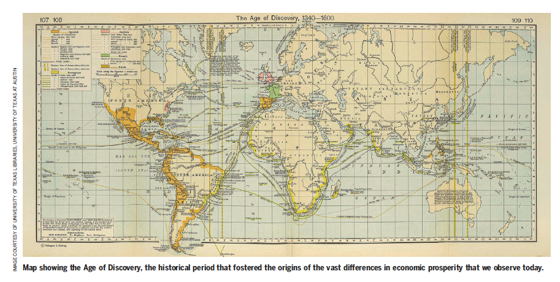
```

Regional incomes diverged during the height of the trade (18th and 19th centuries).


---
# Atlantic trade (Acemoglu et al. 2005)

```{r, out.width="70%"}
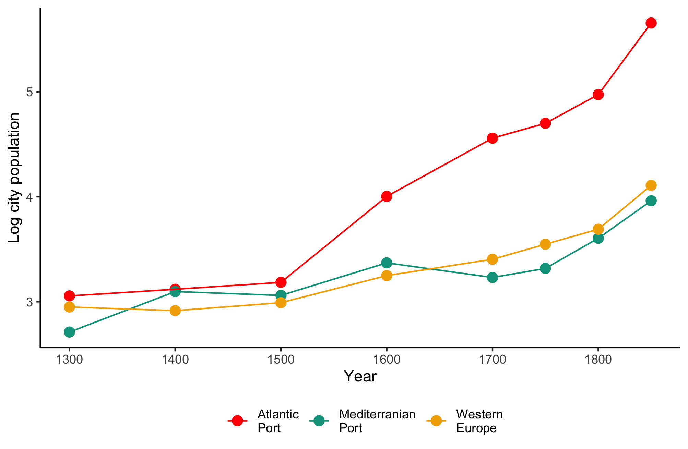
```

---

# Africa’s slave trades (Nunn 2008)

```{r, out.width="65%"}
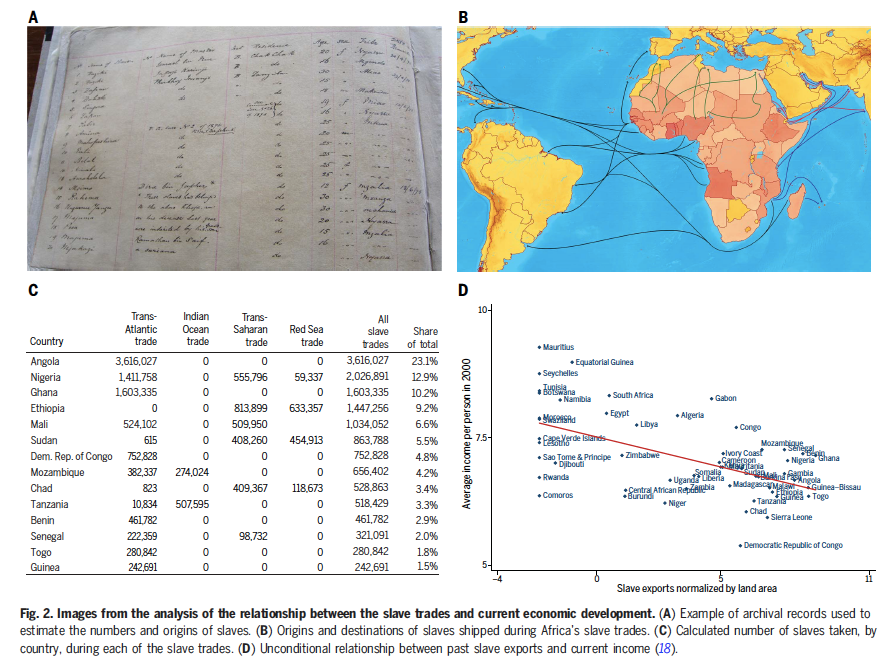
```

---
# Peru's Mita (Dell 2010)

```{r, out.width="60%"}
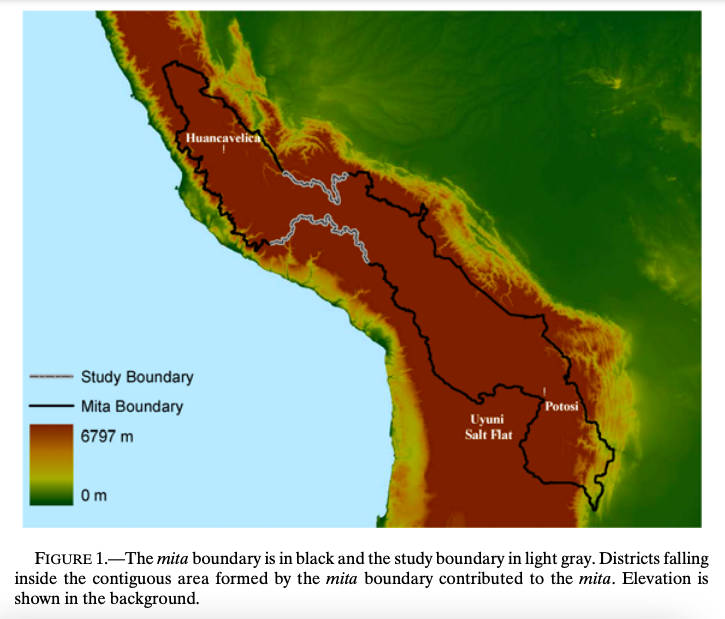
```

---
# Peru's Mita (Dell 2010)

```{r, out.width="90%"}
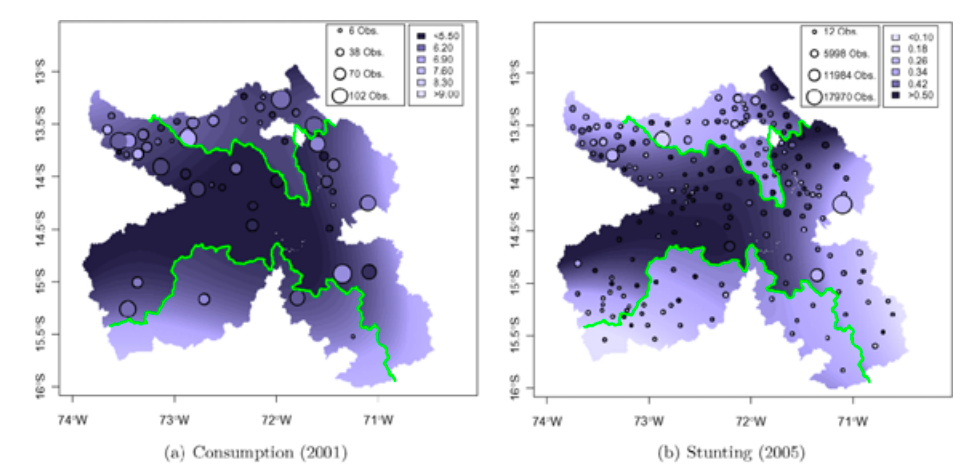
```

---
# Origins of gender roles (Alesina et al 2013)

```{r, out.width="90%"}
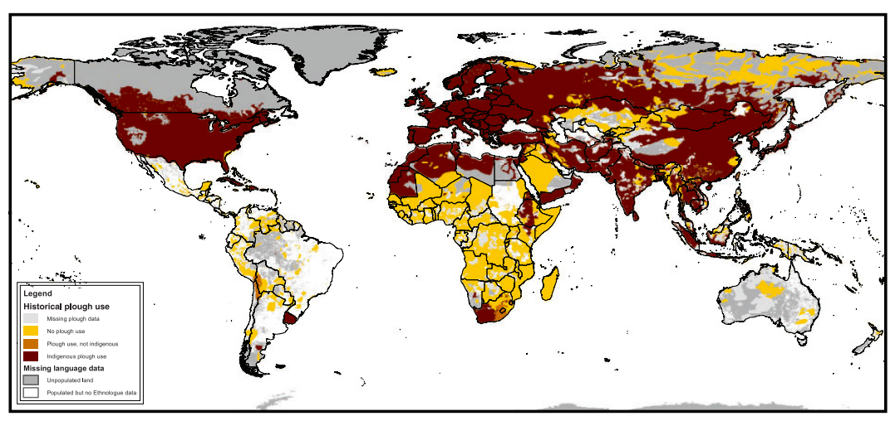
```

---
# Origins of gender roles (Alesina et al 2013)

```{r, out.width="70%"}
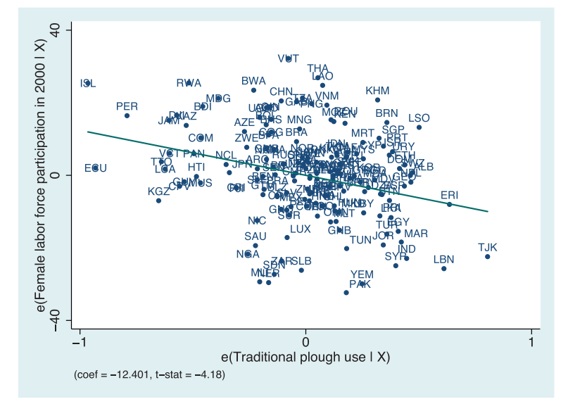
```

---
# Religion and kinship (Schulz et al 2019)

```{r, out.width="55%"}
knitr::include_graphics("imgs/Schulz2019.png")
```

---
## Broad and increasing research area 


.pull-left[

- Effects of missionaries
- Culture of honor
- How geography affects agricultural patterns and conflict
- How religiosity shapes political institutions 
- Long term effects of slavery

```{r, out.width="80%"}
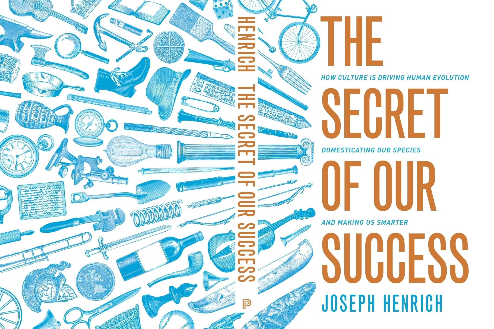
```

]

.pull-right[
```{r, out.width="60%"}
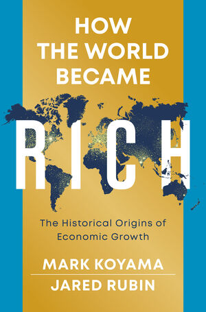
```
]

---
## How can we explain persistence beyond countries and regions?

--

```{r, out.width="32.5%"}
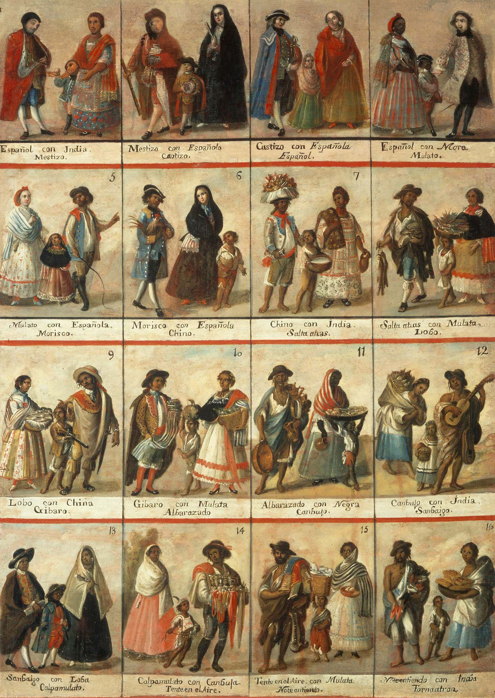
```


---
## How can we explain persistence beyond countries and regions?

```{r, out.width="37.5%"}
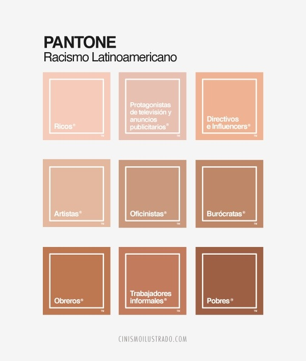
```

---
## Persistence in racial disparities

```{r, out.width="100%"}
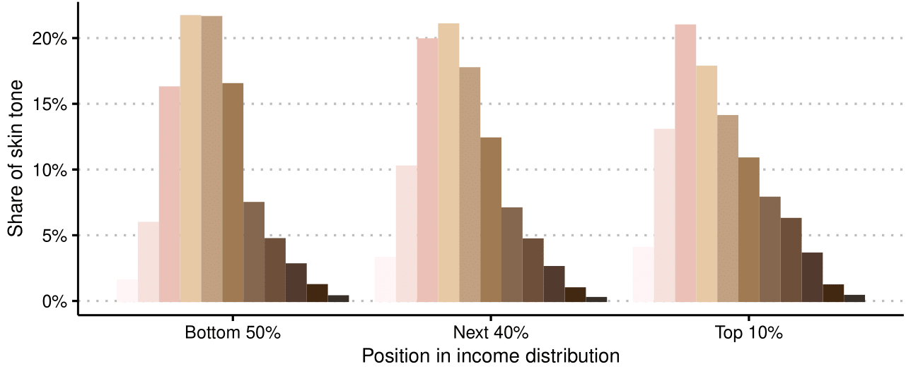
```

---
## Consequences for economic development

```{r, out.width="70%"}
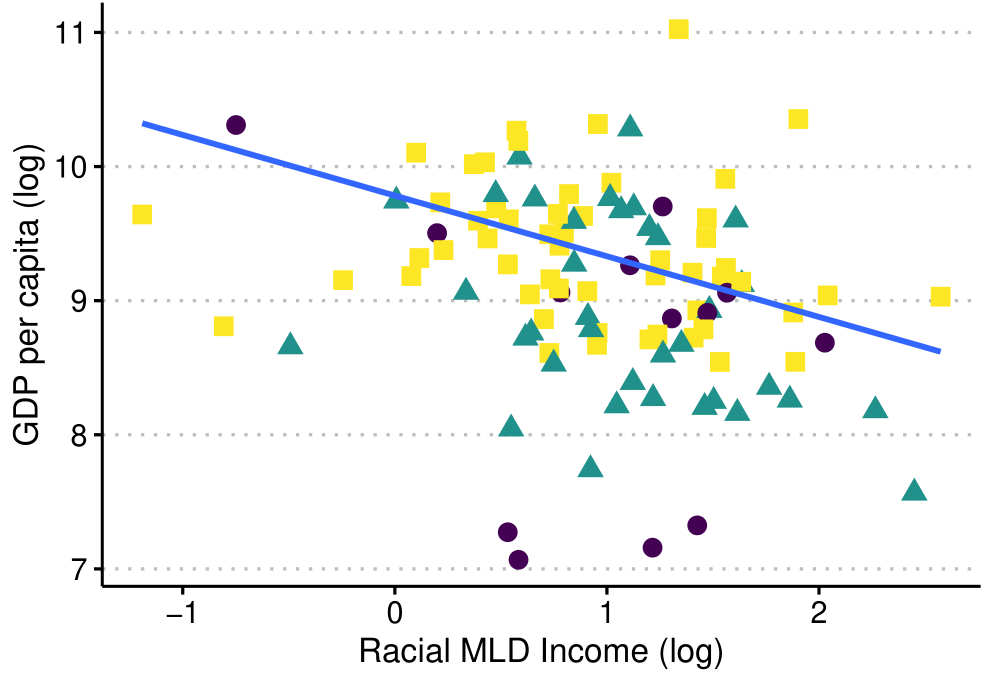
```

---
## How does colonial ethno-racial institutions shape economic differences?

--

- Colonial segregation policies: *Pueblos de Indios*

--

- Focus on one city: Guadalajara, Mexico. Division between *Pueblos de Indios* and Spaniard settlement by a creek

```{r, out.width="60%"}
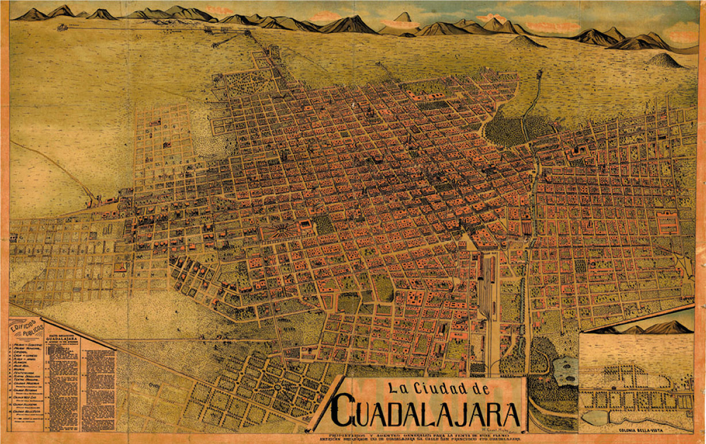
```

---

--

```{r, out.width="70%"}
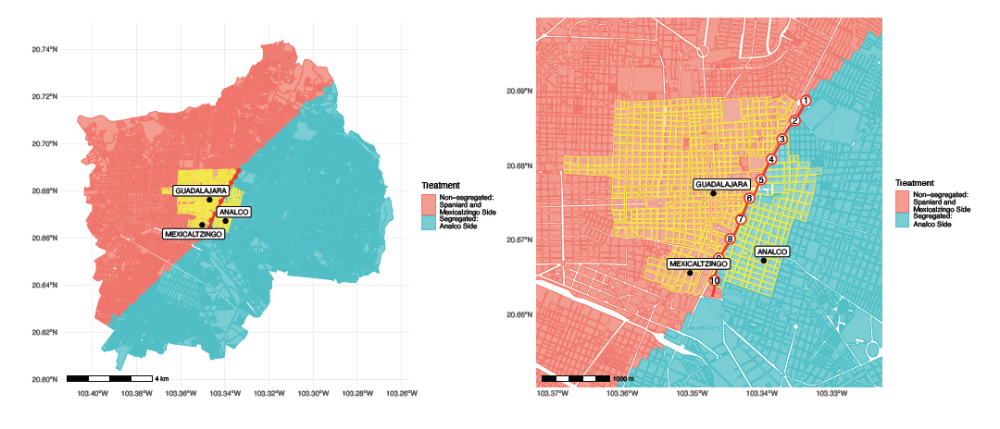
```

--

.pull-left[
```{r, out.width="80%"}
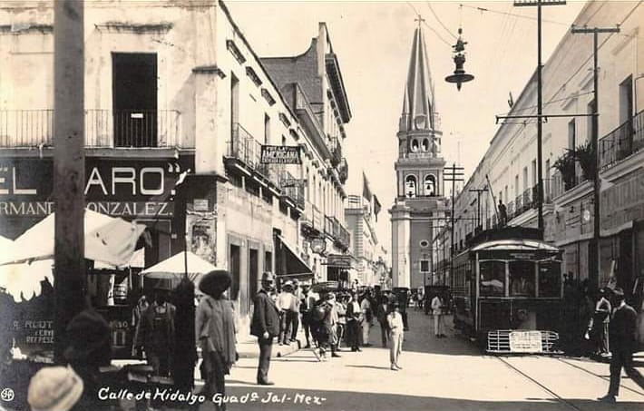
```
]

--

.pull-right[
```{r, out.width="80%"}
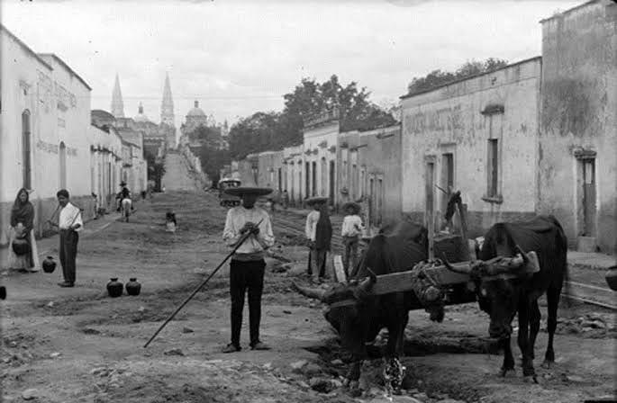
```
]

---

```{r, out.width="80%"}
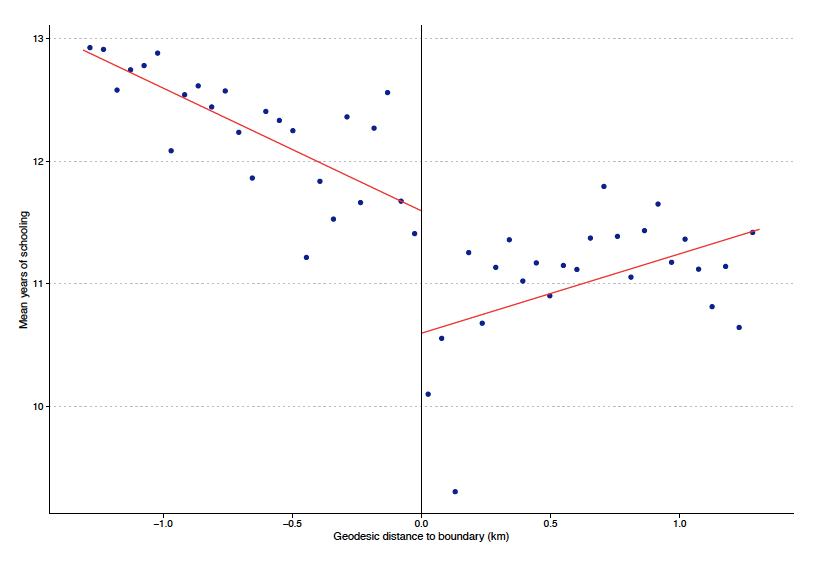
```

---

```{r, out.width="95%"}
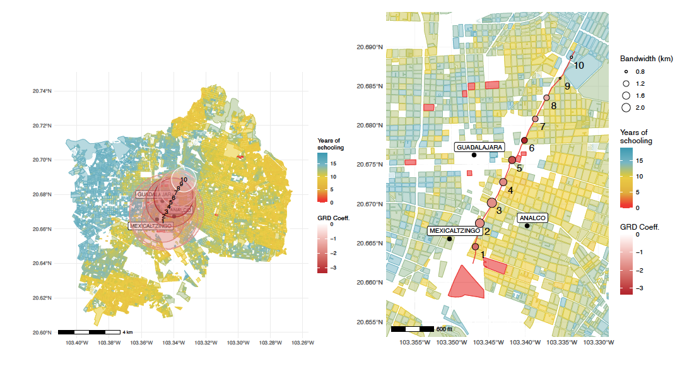
```

---

```{r, out.width="95%"}
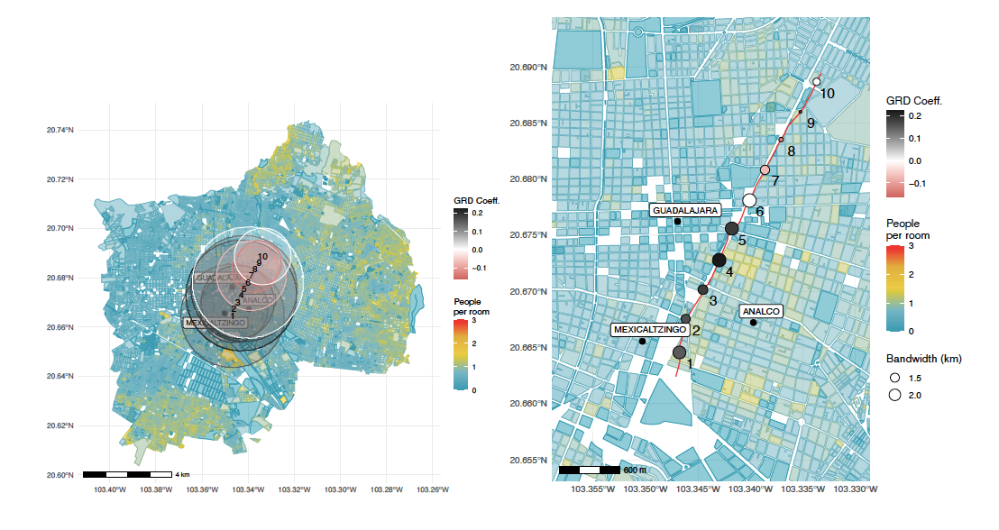
```

---
## Mechanisms

- Cultural stigmatization towards those who live in the segregated side 

> ‘It is far away: on the other side of the Calzada’
> ‘There is nothing there’
> ‘It is people who do not pay taxes. How do they want to be taken into account by the government?’ 
(Jaramillo and Saucedo 2016)

```{r, out.width="80%"}
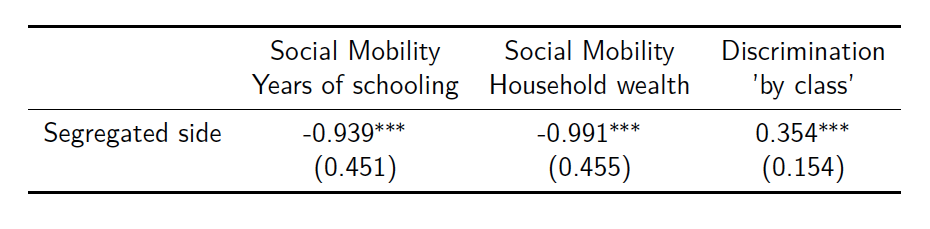
```

---
## Policy proposal

--

### Heavy investment in public goods in the segregated side

--

Why it is relevant?

- Try to counter historical persistence
- Bring more economic opportunities to those who 'loose' in the birth lottery

--

How?

1. Investment in public transport
2. Investment in public goods (parks, plazas, public markets)
3. Financed it through taxes to the richest households who live in the non-segregated side (*tax foncière*)

--
## Research question proposal

Does this phenomena happens in other Mexican cities?

